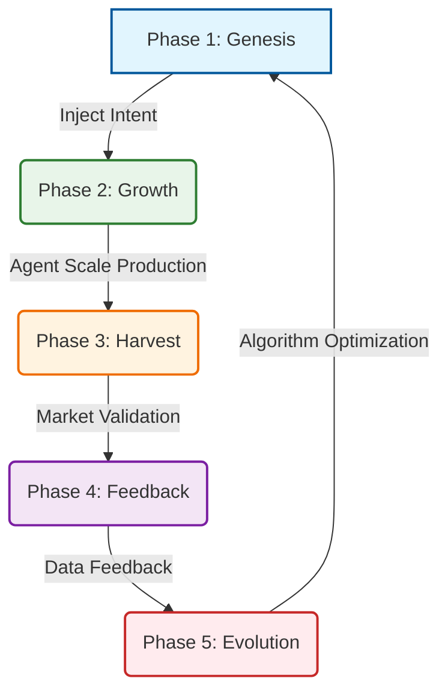
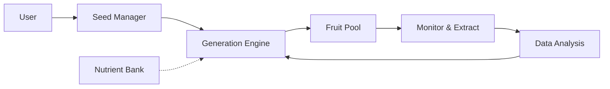

  <h1>🌲 Content Forest</h1>
  <h3>Building an automated content ecosystem using Evolution as the algorithm and AI as the workers.</h3>

  

    <a href="./README.en.md">English</a> | 
    <a href="./README.md">简体中文</a>
  

  

    
    
    
    
  

---

## 🌟 Vision

**Leverage code to leverage media, creating a zero marginal cost automated content factory.**

Content Forest is not just a content generation tool; it is an **AI-based self-evolving content system**. It simulates natural selection by cycling through "Generation-Distribution-Feedback-Iteration", allowing content to optimize itself based on real market feedback (user attention), ultimately selecting the "super species" with the highest vitality and virality.

> "Only content tested by the market (user attention) is good content."

## 🚀 Core Logic

This project is built upon the following first principles:

1.  **Evolution**: Survival of the fittest.
2.  **Compounding**: Iteration based on success leads to exponential quality improvement.
3.  **Code Leverage**: AI Agents reduce marginal costs to near zero.
4.  **Media Leverage**: Content is an asset that can be distributed infinitely without permission.

## 🔄 The 5-Step Loop

The process of content incubation is like the growth of a tree, spiraling upwards.

### 1. Genesis 🌱
Define the core intent and metadata (The Seed). This is the only part requiring deep human involvement.
- **Input**: Product selling points, brand values, target audience.

### 2. Growth 🌿
AI Agents act as gardeners, generating diverse content variants based on the seed.
- **Fission**: One core idea, 10 different title styles.
- **Cross-Modal**: Text script -> Short video script -> Podcast outline.
- **Mutation**: Introduce 10% randomness to avoid local optima.

### 3. Harvest 🌾
Distribute the "fruits" (actual content) to the market (TikTok, Twitter, etc.) to test their survival capability.

### 4. Feedback 📊
Collect platform feedback (views, likes, comments) as the objective truth of the market.

### 5. Evolution 🧬
Modify growth strategies based on data feedback.
- **Natural Selection**: Prune poor-performing content.
- **Gene Extraction**: Solidify viral features into the Gene Bank.
- **Crossover**: "Hybridize" successful genes from different platforms.

## 🧬 Key Features

### 🧪 Mutation Mechanism
To prevent the system from getting stuck in a "local optimum", the Agent autonomously decides whether to introduce mutation:
- **Style Mutation**: Rational ↔ Emotional, Serious ↔ Humorous.
- **Element Remix**: Title structure of Viral A + Visual style of Viral B.
- **Anti-Logic Probe**: Deliberately violating rules to explore blue ocean traffic.

### 🖐️ Human-in-the-loop
- **Pick Up**: Inject human judgment between "Generation" and "Distribution".
- **Nutrient Extraction**: Users manually extract success factors from high-conversion fruits to feed the system.

### 🌳 Iteration Tree
Records the complete evolutionary path of content:
`Seed → Fruit A → Fruit A1 (Optimized) → Fruit A1-1 (Video Version)`

## 🏗️ Architecture

### Logical View

### Domain Language (DDD)
- **Seed**: The source of creativity.
- **Nutrient**: Accumulated knowledge (Platform/Domain/Seed).
- **Generator**: Agent + Skills.
- **Fruit**: Generated content ready for publishing.

## 🛠️ Tech Stack

- **Frontend**: React / Vue + TypeScript + Tailwind CSS
- **Backend**: Python / Node.js
- **AI Core**: LLM APIs (OpenAI, Claude), LangChain / AutoGPT
- **Storage**: Markdown (Content), JSON (Data)

## 🤝 Contributing

PRs and Issues are welcome! We are building an open content evolution ecosystem.

## 📄 License

MIT License &copy; 2026 Content Forest Team
