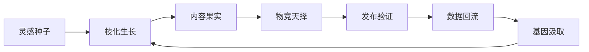
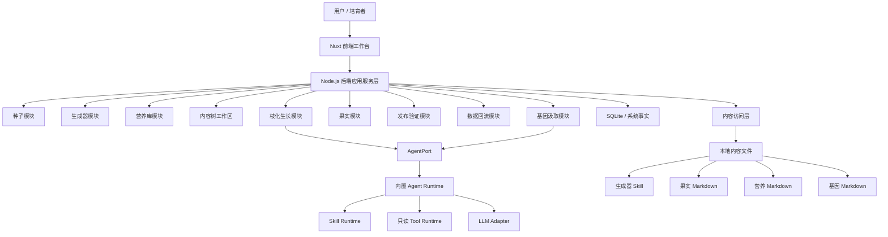

  

  # 内容森林

  > 把一粒灵感交给 AI，不是请它写完一篇文案。  
  > 是把它种进一座会学习、会淘汰、会长出下一代内容的异界森林。

  
  
  
  
  

---

## 产品：给灵感建一座会呼吸的森林

内容森林是一套 **AI 内容进化引擎**。它服务的不是“今天帮我写一篇”，而是“让一个灵感长期繁殖、筛选、验证、继承，最终形成一套可复用的内容生命谱系”。

在这里，灵感不是输入框里的一次性燃料，而是一颗种子。AI 不是代写机，而是森林里的生长术式。用户也不是被自动化替代的人，而是负责选择方向、校准审美、确认基因的培育者。

它适合这些不想把脑洞交给流水线处理的人：

| 角色 | 想要什么 | 内容森林给什么 |
| --- | --- | --- |
| 创作者 / 自媒体运营者 | 一个灵感扩散成多平台内容 | 从种子长出多个果实，再筛选、发布、迭代 |
| 独立开发者 / 产品团队 | 围绕产品持续产出传播资产 | 把卖点、案例、用户反馈沉淀成可继承内容基因 |
| AI Agent 实践者 | 把 Prompt 调用升级为可复盘流程 | 用生成器、营养库、基因库组织 Agent 的创作边界 |

---

## 价值：不是高产，而是会进化

普通内容工具追求“更多输出”。内容森林追求的是 **更高适应度**。

它把内容生产从线性链路改造成一个闭环：

这条闭环的价值不在于让 AI 更吵，而在于让每一次内容试错都留下痕迹：

- **灵感复利**：一个种子可以分裂出多个叙事角度、平台版本和表达模板。
- **经验复用**：爆款特征、失败教训、平台偏好不再散落在脑子、表格和聊天记录里。
- **人机共育**：AI 负责放大探索，人负责选择、淘汰、命名与确认。
- **反馈成基因**：发布后的表现数据会反哺下一代内容，而不是死在上一条链接里。
- **策略可迭代**：生成方法、选择规则、生长策略都可以持续升级，而不是固化为某个神秘公式。

---

## 特点：这不是内容工厂，是一套生态系统

| 森林器官 | 产品含义 | 它解决的问题 |
| --- | --- | --- |
| **种子 Seed** | 灵感、观点、洞察、产品卖点或创作冲动 | 让创作从“写一篇”改为“培育一条内容生命线” |
| **枝化生长 Branch Growth** | 围绕种子生成多个方向、模板和平台版本 | 避免 AI 只给出单一路径，扩大探索半径 |
| **果实 Fruit** | 具体内容成品，如图文、短文案、脚本、标题方案 | 让候选内容可阅读、可比较、可选择 |
| **物竞天择 Selection** | 人、AI、规则或数据共同参与筛选 | 在自动化规模里保留人的判断力 |
| **营养库 Nutrient Library** | 平台知识、案例、资料、参考文本、研究卡片 | 让 AI 有资料可吃，不靠空泛幻想硬编 |
| **基因库 Gene Library** | 成功表达特征、失败教训、适用场景和内容谱系 | 把内容经验沉淀为下一轮生成可继承的资产 |
| **发布验证 Publication** | 记录发布平台、链接、修改说明和表现数据 | 让外部世界的反馈回到系统内部 |

它的非大众化之处在于：内容森林不迷信“全自动爆款”。它更像一个二次元炼金工房，左边是 AI 召唤阵，右边是传播数据显微镜，中间坐着一个人类监督员，负责决定哪些果实可以升格成基因。

---

## 创意：把内容生产改写成遗传叙事

内容森林的核心脑洞是：**内容也可以像生命一样进化**。

一篇内容不再只是“成品”，而是一次变异尝试。标题结构、情绪钩子、叙事节奏、受众切口、平台格式、发布时间、CTA 都可以被视为可继承、可组合、可淘汰的内容基因。

当一个果实表现好，它不只是“这篇不错”，而是会被拆解成可复用的成功假设；当一个果实表现差，它也不是垃圾，而是一块写着“此路不通”的化石标本。

于是内容森林里的创作不是流水线，而是这样的异界循环：

1. 人类投下一粒灵感种子。
2. AI 根据生成器、营养和历史基因生成多个果实。
3. 用户选择、保留或淘汰果实。
4. 果实被发布到真实平台接受环境压力。
5. 数据和观察回流，形成成功基因或失败教训。
6. 下一代内容带着上一代的记忆继续生长。

这是一套介于 Agent 工作流、创作者工具和内容进化游戏之间的东西。它不太像 SaaS，更像一座给创意生物做生态实验的观测站。

---

## 架构：轻量单体，文件为肉身，数据库为年轮

内容森林第一期采用 **轻量化模块化单体架构**。它不追求一上来就分布式登神，而是先把内容进化闭环跑通，并为后续 SaaS 化、存储替换和 Agent 替换留下边界。

架构的几个关键判断：

- **前端是工作台**：基于 Nuxt 与 Vue，承载种子库、内容树画布、生成器、营养库、果实详情、发布验证与基因确认体验。
- **后端是事实入口**：所有状态流转、内容树关系、果实状态、发布反馈和基因沉淀都经过后端应用服务层。
- **内容本体文件化**：生成器、果实、营养和基因以 Markdown / Skill 文件形式保存，保持可读、可迁移、可外部编辑。
- **系统事实数据库化**：身份、状态、关系、索引和数据快照由 SQLite 等数据库维护，避免 Markdown 承担系统元数据。
- **Agent 能力端口化**：业务模块只依赖 AgentPort，不绑定特定模型供应商或 Agent 框架。
- **Agent 只给建议，不直接落地**：候选果实和基因建议必须经过后端校验与用户确认，才会进入系统事实。

第一期的技术目标很克制：让“种子 -> 果实 -> 选择 -> 发布 -> 回流 -> 基因 -> 再生长”真正闭合。等森林先活起来，再考虑给它扩建天空城。
