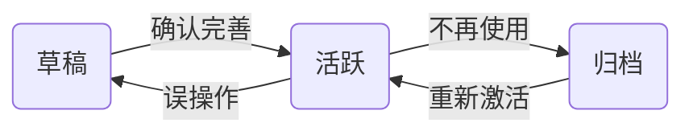

# 内容森林 - 种子库模块 (Seed Repository) 详细设计

> 版本：v1.2 (MVP - Final)
> 日期：2026-03-11
> 状态：已确认

## 1. 核心语义与定义

在内容森林体系中，**种子 (Seed)** 被定义为**创意的源头**与**人类意图的载体**。

*   **定位**：种子是“想法 (Idea)”或“核心观点 (Core Insight)”。它不包含平台属性，也不包含具体的表达形式。
*   **特性**：
    *   **平台无关性 (Platform Agnostic)**：一个种子可以衍生出小红书笔记、推特短文或 TikTok 脚本，种子本身不绑定任何平台。
    *   **高纯度 (High Purity)**：仅保留最核心的文本内容，不包含生成参数（基因）或辅助知识（营养）。
    *   **人机边界**：种子是人类智慧的结晶，是系统中唯一必须由人类（或人类确认）输入的环节。

---

## 2. 种子生命周期 (Seed Lifecycle)

引入生命周期管理是为了**降低用户认知负载**并**控制 AI 的工作范围**。

### 2.1 状态定义

| 状态 | 英文 | 定义与产品价值 |
| :--- | :--- | :--- |
| **草稿** | `Draft` | **"灵感捕捉"**。仅作为备忘录存在。Agent **不会**主动对其进行扫描或生成操作。用户可以在此随意记录碎片化想法。 |
| **活跃** | `Active` | **"生产中"**。种子已成熟，准备好被生成器使用。Web UI 默认展示列表。Agent 可读取此状态的种子进行批量生成。 |
| **归档** | `Archived` | **"博物馆"**。该种子已充分利用或过时。不再出现在日常列表中，但保留数据以供未来分析（如：分析哪些种子产出了爆款）。 |

### 2.2 状态流转图



---

## 3. 数据结构设计 (Data Schema) - User Isolated

遵循“动静分离”原则，且严格执行 **User ID 隔离**，为未来多租户/SaaS 化做准备。

### 3.1 核心实体 (Seed Entity) - Markdown (Cold Storage)

存储在文件系统中。**路径必须包含 User ID**。

*   **文件路径模式**：`/cf/data/{user_id}/seeds/{year}/{seed_id}.md`
*   **文件格式**：Markdown + YAML Frontmatter

**内容示例**：

```markdown
---
id: "seed_20260311_abc123"
title: "AI 时代的个人护城河"
created_at: 1741680000000
updated_at: 1741680000000
creator_id: "user_001" # 冗余字段，便于单文件自解释
---

# 核心意图 (Core Intent)

这里记录我关于“个人护城河”的思考。
...
```

### 3.2 元数据与状态 (Seed Metadata) - Redis (Hot Data)

存储在 Redis 中。**Key 必须包含 User ID**。

*   **Key 结构**：`cf:u:{user_id}:s:{seed_id}:meta`
    *   *注：使用简写 `u` (user) 和 `s` (seed) 节省 Redis 内存空间*
*   **数据字段 (Hash Structure)**：

| 字段 | 类型 | 说明 |
| :--- | :--- | :--- |
| `id` | `String` | 种子 ID |
| `title` | `String` | 标题（用于列表快速展示） |
| `tags` | `List<String>` | 标签列表 (JSON String) |
| `status` | `String` | `draft` \| `active` \| `archived` |
| `created_at` | `Timestamp` | 创建时间 |
| `fruit_count` | `Integer` | 已生成果实数量 |

---

## 4. 接口定义 (TypeScript Interface)

```typescript
// 领域模型
export type SeedStatus = 'draft' | 'active' | 'archived';

export interface Seed {
  id: string;
  userId: string; // 核心隔离字段
  title: string;
  content: string; // Markdown Body
  status: SeedStatus;
  tags: string[];
  createdAt: number;
  updatedAt: number;
}

// 仓储接口
export interface SeedRepository {
  // 创建种子
  create(userId: string, seed: Omit<Seed, 'id' | 'createdAt' | 'updatedAt'>): Promise<Seed>;
  
  // 更新种子 (支持部分更新)
  update(userId: string, seedId: string, updates: Partial<Seed>): Promise<Seed>;
  
  // 获取详情
  findById(userId: string, seedId: string): Promise<Seed | null>;
  
  // 列表查询 (支持分页与过滤)
  list(userId: string, filter?: { status?: SeedStatus; tags?: string[] }): Promise<Seed[]>;
  
  // 归档/删除
  archive(userId: string, seedId: string): Promise<void>;
  delete(userId: string, seedId: string): Promise<void>;
}
```

---

## 5. 核心功能逻辑

### 5.1 创建种子 (Create Seed)

**场景**：用户捕捉到一个新想法。

**API 定义**:
- **URL**: `POST /api/seeds`
- **Headers**: `X-User-Id: {userId}`
- **Body**:
  ```json
  {
    "title": "AI 时代的个人护城河",
    "content": "# 核心观点..."
  }
  ```
- **Response**:
  ```json
  {
    "code": 0,
    "data": { "id": "seed_20260311_abc123" }
  }
  ```

**处理流程**：
1.  **ID 生成**：生成 UUID (e.g., `seed_20260311_abc123`)。
2.  **文件存储 (Cold)**：
    *   构建路径：`/cf/data/{userId}/seeds/{YYYY}/{seed_id}.md`。
    *   写入 Markdown 文件，包含 Frontmatter (id, title, created_at) 和 Content。
3.  **索引存储 (Hot)**：
    *   写入 Redis Hash `cf:u:{userId}:s:{seed_id}:meta`。
    *   字段：`id`, `title`, `status='draft'`, `created_at`, `fruit_count=0`。
4.  **列表缓存 (List)**：
    *   写入 Redis ZSet `cf:u:{userId}:seeds:list`，Score 为 `created_at`。

### 5.2 查询种子列表 (List Seeds)

**场景**：用户浏览自己的创意库，或 Agent 扫描活跃种子。

**API 定义**:
- **URL**: `GET /api/seeds`
- **Headers**: `X-User-Id: {userId}`
- **Query**: `page=1&size=20&status=active&tags=AI`
- **Response**:
  ```json
  {
    "code": 0,
    "data": {
      "list": [
        { "id": "...", "title": "...", "status": "active", "tags": ["AI"], "createdAt": 1741680000000 }
      ],
      "total": 100
    }
  }
  ```

**处理流程**：
1.  **快速筛选**：
    *   如果是全量查询：直接读 ZSet `cf:u:{userId}:seeds:list` 分页获取 ID 列表。
    *   如果带 Status/Tag 过滤：
        *   (MVP 方案) 获取全量 ID 后，MGET 批量获取 Meta，在内存中过滤（种子数量 < 1000 时性能可忽略）。
        *   (进阶方案) 维护 `cf:u:{userId}:seeds:status:{status}` 的 Set 索引。
2.  **数据组装**：
    *   仅返回 Meta 数据 (ID, Title, Status, Tags, Stats)。**不读取 Markdown 内容**。
3.  **返回结果**：`List<SeedMeta>`。

### 5.3 种子详情 (Seed Detail)

**场景**：用户点击列表查看详情，或 Agent 准备生成内容。

**API 定义**:
- **URL**: `GET /api/seeds/{seedId}`
- **Headers**: `X-User-Id: {userId}`
- **Response**:
  ```json
  {
    "code": 0,
    "data": {
      "id": "...",
      "title": "...",
      "content": "# Markdown Content...",
      "status": "active",
      "tags": ["AI"],
      "createdAt": 1741680000000
    }
  }
  ```

**处理流程**：
1.  **读取元数据**：从 Redis 获取 Meta。
2.  **读取内容**：
    *   根据 ID 和时间戳（或直接查找）定位文件路径。
    *   读取 Markdown 文件内容。
3.  **组装返回**：将 Meta 和 Content 合并为完整 `Seed` 对象。

### 5.4 更新种子信息 (Update Seed)

**场景**：用户完善想法，或修改状态。

**API 定义**:
- **URL**: `PATCH /api/seeds/{seedId}`
- **Headers**: `X-User-Id: {userId}`
- **Body**:
  ```json
  {
    "title": "New Title",
    "content": "New Content...",
    "status": "active",
    "tags": ["AI", "NewTag"]
  }
  ```
- **Response**:
  ```json
  { "code": 0, "data": { "success": true } }
  ```

**处理流程**：
1.  **区分更新类型**：
    *   **仅更新 Meta (Tags, Status)**：只更新 Redis Hash。**速度极快**。
    *   **仅更新 Content**：只更新 Markdown 文件。
    *   **更新 Title**：同时更新 Redis Hash 和 Markdown Frontmatter。
2.  **文件同步 (如果涉及 Content/Title)**：
    *   读取原文件 -> 修改 Frontmatter/Content -> 写入新文件。
3.  **索引同步 (如果涉及 Meta/Title)**：
    *   更新 Redis Hash。
4.  **状态变更处理**：
    *   如果 Status 变为 `archived`，可选从 ZSet `active` 列表中移除（视索引策略而定）。
