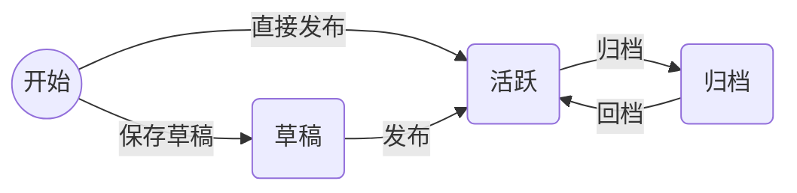

# 内容森林 - 种子库模块 (Seed Repository) 详细设计

> 版本：v1.2 (MVP - Final)
> 日期：2026-03-11
> 状态：已确认

## 1. 核心语义与定义

在内容森林体系中，**种子 (Seed)** 被定义为**创意的源头**与**人类意图的载体**。

*   **定位**：种子是“想法 (Idea)”或“核心观点 (Core Insight)”。它不包含平台属性，也不包含具体的表达形式。
*   **特性**：
    *   **平台无关性 (Platform Agnostic)**：一个种子可以衍生出小红书笔记、推特短文或 TikTok 脚本，种子本身不绑定任何平台。
    *   **高纯度 (High Purity)**：仅保留最核心的文本内容，不包含生成参数（基因）或辅助知识（营养）。
    *   **人机边界**：种子是人类智慧的结晶，是系统中唯一必须由人类（或人类确认）输入的环节。

---

## 2. 种子生命周期 (Seed Lifecycle)

引入生命周期管理是为了**降低用户认知负载**并**控制 AI 的工作范围**。

### 2.1 状态定义

| 状态 | 英文 | 定义与产品价值 |
| :--- | :--- | :--- |
| **草稿** | `Draft` | **"灵感捕捉"**。仅作为备忘录存在。Agent **不会**主动对其进行扫描或生成操作。用户可以在此随意记录碎片化想法。 |
| **活跃** | `Active` | **"生产中"**。种子已成熟，准备好被生成器使用。Web UI 默认展示列表。Agent 可读取此状态的种子进行批量生成。 |
| **归档** | `Archived` | **"博物馆"**。该种子已充分利用或过时。不再出现在日常列表中，但保留数据以供未来分析（如：分析哪些种子产出了爆款）。 |

### 2.2 状态流转图



**关键约束**：
- **状态变更不可逆**（除归档/回档外）：草稿发布后不能退回草稿（除非删除重建）。
- **更新接口限制**：常规更新接口（Update）仅允许修改内容/标题/标签，**禁止**修改状态。状态变更必须通过专用接口（Publish/Archive）。

---

## 3. 数据结构设计 (Data Schema) - User Isolated

遵循“动静分离”原则，且严格执行 **User ID 隔离**。

### 3.1 核心实体 (Seed Entity) - Markdown (Cold Storage)

存储在文件系统中。**路径必须包含 User ID**。

*   **文件路径模式**：`/cf/data/{user_id}/seeds/{year}/{seed_id}.md`
*   **文件格式**：Markdown + YAML Frontmatter

**内容示例**：

```markdown
---
id: "seed_20260311_abc123"
title: "AI 时代的个人护城河"
created_at: 1741680000000
updated_at: 1741680000000
creator_id: "user_001" # 冗余字段，便于单文件自解释
---

# 核心意图 (Core Intent)

这里记录我关于“个人护城河”的思考。
...
```

### 3.2 元数据与状态 (Seed Metadata) - Redis (Hot Data)

存储在 Redis 中。**Key 必须包含 User ID**。

*   **Key 结构**：`cf:u:{user_id}:s:{seed_id}:meta`
    *   *注：使用简写 `u` (user) 和 `s` (seed) 节省 Redis 内存空间*
*   **数据字段 (Hash Structure)**：

| 字段 | 类型 | 说明 |
| :--- | :--- | :--- |
| `id` | `String` | 种子 ID |
| `title` | `String` | 标题（用于列表快速展示） |
| `tags` | `List<String>` | 标签列表 (JSON String) |
| `status` | `String` | `draft` \| `active` \| `archived` |
| `created_at` | `Timestamp` | 创建时间 |
| `fruit_count` | `Integer` | 已生成果实数量 |

### 3.3 标签库 (Tag Registry) - Redis Set

全局标签管理，用于自动补全和统一规范。

*   **Key 结构**：`cf:u:{user_id}:tags`
*   **数据类型**：`Set<String>`

---

## 4. 接口定义 (TypeScript Interface)

```typescript
// 领域模型
export type SeedStatus = 'draft' | 'active' | 'archived';

export interface Seed {
  id: string;
  userId: string;
  title: string;
  content: string;
  status: SeedStatus;
  tags: string[];
  createdAt: number;
  updatedAt: number;
}

// 仓储接口
export interface SeedRepository {
  // 保存草稿 (创建或更新草稿内容)
  saveDraft(userId: string, seed: Omit<Seed, 'id' | 'createdAt' | 'updatedAt' | 'status'>): Promise<Seed>;
  
  // 发布种子 (创建新活跃种子 或 将草稿转为活跃)
  publish(userId: string, seedIdOrData: string | Omit<Seed, 'id' | 'createdAt' | 'updatedAt' | 'status'>): Promise<Seed>;
  
  // 归档/回档
  archive(userId: string, seedId: string): Promise<void>;
  restore(userId: string, seedId: string): Promise<void>;
  
  // 更新信息 (仅限 Title, Content, Tags - 禁止状态变更)
  updateInfo(userId: string, seedId: string, updates: Partial<Pick<Seed, 'title' | 'content' | 'tags'>>): Promise<Seed>;
  
  // 查询
  findById(userId: string, seedId: string): Promise<Seed | null>;
  list(userId: string, filter?: { status?: SeedStatus; tags?: string[] }): Promise<Seed[]>;
  
  // 删除 (物理删除)
  delete(userId: string, seedId: string): Promise<void>;
}

export interface TagRepository {
  add(userId: string, tags: string[]): Promise<void>;
  list(userId: string): Promise<string[]>;
  remove(userId: string, tag: string): Promise<void>;
}
```

---

## 5. 核心功能逻辑

### 5.1 保存草稿 (Save Draft)

**场景**：用户捕捉到一个新想法，或者更新已有的草稿。

**API 定义**:
- **URL**: `POST /api/seeds/draft`
- **Headers**: `X-User-Id: {userId}`
- **Body**:
  ```json
  {
    "id": "optional_existing_id",
    "title": "AI 时代的个人护城河",
    "content": "# 核心观点...",
    "tags": ["AI"]
  }
  ```
- **Response**:
  ```json
  { "code": 0, "data": { "id": "seed_20260311_abc123", "status": "draft" } }
  ```

**处理流程**：
1.  **ID 检查**：
    *   如果有 `id`，检查是否存在且状态为 `draft`。如果状态不是 `draft`，报错（已发布种子不可退回草稿）。
    *   如果没有 `id`，生成新 UUID。
2.  **数据写入**：
    *   写入 Markdown 文件。
    *   写入/更新 Redis Hash，设置 `status='draft'`。
    *   (如果包含 tags) 将 tags 添加到 Tag Registry。
3.  **列表更新**：
    *   如果是新建，写入 Redis ZSet。

### 5.2 发布种子 (Publish Seed)

**场景**：用户认为想法成熟，发布给 Agent 使用。

**API 定义**:
- **URL**: `POST /api/seeds/publish`
- **Headers**: `X-User-Id: {userId}`
- **Body**:
  ```json
  {
    "id": "optional_existing_draft_id",
    "title": "...",
    "content": "...",
    "tags": ["..."]
  }
  ```
- **Response**:
  ```json
  { "code": 0, "data": { "id": "...", "status": "active" } }
  ```

**处理流程**：
1.  **ID 检查**：
    *   如果有 `id`，获取现有种子。
    *   如果没有 `id`，生成新 ID。
2.  **状态流转**：
    *   强制设置 `status='active'`。
3.  **数据持久化**：
    *   更新 Markdown 和 Redis。
    *   确保 Tags 写入 Registry。

### 5.3 种子详情 (Seed Detail)

**API 定义**:
- **URL**: `GET /api/seeds/{seedId}`
- **Response**: `{ "code": 0, "data": { ... } }`

**处理流程**：同原设计（合并 Redis Meta + Markdown Content）。

### 5.4 查询种子列表 (List Seeds)

**API 定义**:
- **URL**: `GET /api/seeds`
- **Query**: `page=1&size=20&status=active&tags=AI`
- **Response**: `{ "code": 0, "data": { "list": [...], "total": 100 } }`

**处理流程**：同原设计（Redis ZSet + Hash）。

### 5.5 归档与回档 (Archive / Restore)

**场景**：管理种子的生命周期终态。

**API 定义**:
- **URL**: `PUT /api/seeds/{seedId}/archive` (归档)
- **URL**: `PUT /api/seeds/{seedId}/restore` (回档 -> Active)
- **Headers**: `X-User-Id: {userId}`

**处理流程**：
1.  **更新状态**：修改 Redis Hash 中的 `status` 为 `archived` 或 `active`。
2.  **索引维护**：
    *   (可选) 维护 `active` 专用 ZSet 以优化 Agent 扫描性能。

### 5.6 更新种子信息 (Update Info)

**场景**：修改已发布种子的内容，**不改变状态**。

**API 定义**:
- **URL**: `PATCH /api/seeds/{seedId}`
- **Headers**: `X-User-Id: {userId}`
- **Body**: `{ "title": "...", "content": "...", "tags": [...] }` (禁止包含 status)

**处理流程**：
1.  **校验**：确保 Body 中不包含 `status` 字段，或忽略之。
2.  **执行更新**：同步更新 Markdown 和 Redis。

### 5.7 标签管理 (Tag Management)

**API 定义**:
- `GET /api/tags` -> 返回所有标签列表 (用于自动补全)
- `DELETE /api/tags/{tagName}` -> 删除标签 (仅从 Registry 删除，不清洗种子数据)

**处理流程**：
- 直接操作 Redis Set `cf:u:{userId}:tags`。
