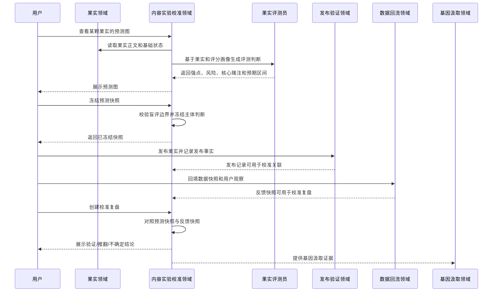
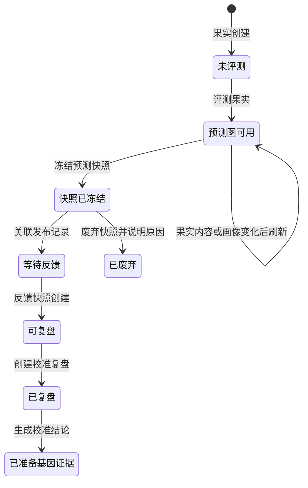

# 内容实验校准领域设计 (Domain Design)

## 1. 顶层共识与统一语言 (Ubiquitous Language)

### 1.1 模块职责边界 (Bounded Context)

- **包含**：为内容果实提供发布前或选择前的评测视图，维护果实预测图，生成和冻结可复盘的预测快照，记录预测判断、核心赌注、反事实场景和置信度；在数据回流后对照真实反馈形成校准复盘，识别被验证或被推翻的判断，并将可分析结论作为基因汲取的证据来源。
- **不包含**：不创建果实，不替代人工物竞天择，不执行发布验证，不采集平台表现数据，不直接确认基因，不自动改写生成器，不模拟真实平台算法，不构造虚拟用户群，不承诺预测一定命中，不把评测结论直接写成正式基因经验。

内容实验校准领域负责把“我觉得这颗果实可能有效”变成“这颗果实正在验证什么传播假设”。它不是一个单纯评分器，而是连接果实、发布验证、数据回流和基因汲取之间的校准上下文。

该领域的核心产品形态是 **果实预测图**。用户可以在任何果实上查看预测图，用来理解强点、风险、预期表现和核心赌注；当果实进入真实发布验证前，系统可以将当前预测图冻结为 **预测快照**，作为后续复盘和校准样本的基线。

### 1.2 核心业务词汇表 (Glossary)

- **内容实验校准 (Content Experiment Calibration)**：围绕一个果实建立发布前判断、发布后对照和长期评分画像演进的过程。
- **果实评测员 (Fruit Evaluator)**：面向用户的评测能力，用于分析某颗果实的传播强点、风险、预期表现、核心赌注和建议观察指标。它可以由 Agent 能力支撑，但领域语义不等于 Agent 本身。
- **预测图 (Prediction Map)**：展示某颗果实当前评测结果的用户可见视图，包含果实类型、内容强点、内容风险、预期表现区间、核心赌注、反事实场景、推荐观察指标、历史锚点和置信度。
- **预测快照 (Prediction Snapshot)**：某一时刻被冻结的预测图版本，用于后续与真实反馈对照。预测快照一旦冻结，不允许修改主体判断，只允许追加复盘结果或完整废弃后新建快照。
- **评测判断 (Evaluation Judgment)**：果实评测员给出的结构化判断，例如“稳妥型”“实验型”“高风险高收益”“低信心样本”等。
- **内容强点 (Content Strength)**：预测该果实可能有效的表达特征，例如开头钩子、情绪共鸣、可转发自嘲感、金句密度、平台语境适配、评论区可接话点。
- **内容风险 (Content Risk)**：预测该果实可能失效或表现受限的因素，例如过度抽象、受众过窄、转发暴露成本高、信息密度过高、平台语境不匹配。
- **预期表现区间 (Expected Performance Range)**：对发布表现的区间化判断，可以是平台指标档位、相对基础盘、或同类历史果实的表现带，不表达精确承诺。
- **核心赌注 (Core Bet)**：本次预测最想验证的传播机制假设，例如“这条内容会因为可挪用句式触发评论区二次传播”。
- **反事实场景 (Counterfactual Scenario)**：如果内容表现好、普通或差时分别意味着什么，用来避免复盘退化为“准/不准”的简单判断。
- **推荐观察指标 (Recommended Observation Metric)**：预测阶段建议发布后重点观察的指标或信号，例如完播、收藏、转发、评论关键词、高赞评论类型、私信反馈。
- **校准复盘 (Calibration Review)**：数据回流后，将预测快照与反馈快照对照，判断哪些评测判断被验证、推翻或仍不确定。
- **校准样本 (Calibration Sample)**：完成预测快照冻结，并且至少拥有一个可对照反馈快照的果实发布案例。
- **评分画像 (Evaluation Profile)**：面向某个种子、平台、内容形态或账号阶段的评测规则集合，描述系统当前如何判断果实的传播适应度。
- **画像版本 (Profile Version)**：评分画像的版本标识。预测快照必须记录所使用的画像版本，避免后续规则变化污染历史判断。
- **历史锚点 (Historical Anchor)**：与当前果实相似或可对照的历史果实及其表现，用于帮助用户理解当前预测判断的依据和置信度边界。
- **盲评边界 (Blind Evaluation Boundary)**：果实评测员在生成预测快照时不能读取发布后数据、反馈快照、复盘结论或会泄漏真实表现的资料。
- **校准结论 (Calibration Finding)**：复盘后产生的结构化结论，例如“强点被验证”“风险被推翻”“评论区真实信号偏离预测”。
- **基因汲取证据 (Gene Extraction Evidence)**：可交给基因汲取领域分析的校准结论。它不是正式基因，必须经过基因汲取和用户确认后才可能进入基因库。

## 2. 领域模型与聚合关系 (Domain Models & Aggregates)

```mermaid
graph TD
    EvaluationProfile["评分画像 / EvaluationProfile<br/>聚合根"] --> ProfileScope["画像作用域 / ProfileScope<br/>值对象"]
    EvaluationProfile --> ProfileVersion["画像版本 / ProfileVersion<br/>值对象"]
    EvaluationProfile --> Criteria["评测维度 / EvaluationCriteria<br/>值对象集合"]
    EvaluationProfile --> BucketPolicy["表现区间策略 / PerformanceRangePolicy<br/>值对象"]

    PredictionMap["预测图 / PredictionMap<br/>聚合根"] --> FruitRef["果实引用 / FruitRef<br/>外部引用"]
    PredictionMap --> Judgment["评测判断 / EvaluationJudgment<br/>值对象"]
    PredictionMap --> Strengths["内容强点 / ContentStrengths<br/>值对象集合"]
    PredictionMap --> Risks["内容风险 / ContentRisks<br/>值对象集合"]
    PredictionMap --> CoreBet["核心赌注 / CoreBet<br/>值对象"]
    PredictionMap --> Counterfactuals["反事实场景 / CounterfactualScenarios<br/>值对象集合"]
    PredictionMap --> ObservationPlan["观察计划 / ObservationPlan<br/>值对象"]
    PredictionMap --> Anchors["历史锚点 / HistoricalAnchors<br/>值对象集合"]
    PredictionMap --> Confidence["置信度 / Confidence<br/>值对象"]
    PredictionMap --> Snapshot["预测快照 / PredictionSnapshot<br/>实体"]

    Snapshot --> FrozenJudgment["冻结判断 / FrozenPredictionBody<br/>值对象"]
    Snapshot --> ProfileVersionRef["画像版本引用 / ProfileVersionRef<br/>值对象"]
    Snapshot --> BlindState["盲评状态 / BlindEvaluationState<br/>值对象"]

    CalibrationReview["校准复盘 / CalibrationReview<br/>聚合根"] --> SnapshotRef["预测快照引用 / PredictionSnapshotRef<br/>外部引用"]
    CalibrationReview --> PublicationRef["发布记录引用 / PublicationRecordRef<br/>外部引用"]
    CalibrationReview --> FeedbackRef["反馈快照引用 / FeedbackSnapshotRef<br/>外部引用"]
    CalibrationReview --> Findings["校准结论 / CalibrationFindings<br/>实体集合"]
    CalibrationReview --> Evidence["基因汲取证据 / GeneExtractionEvidence<br/>交付对象"]

    FruitDomain["果实领域"] -.提供果实正文与状态.-> PredictionMap
    PublicationDomain["发布验证领域"] -.提供发布事实.-> CalibrationReview
    FeedbackDomain["数据回流领域"] -.提供真实反馈.-> CalibrationReview
    GeneDomain["基因汲取领域"] -.消费校准证据.-> Evidence
```

内容实验校准领域有三个核心聚合根：

- **评分画像 (EvaluationProfile)**：表达系统当前如何评测某类内容果实。画像可以按种子、平台、内容形态或账号阶段建立作用域。画像不是固定爆款公式，而是可演进的阶段性判断框架。
- **预测图 (PredictionMap)**：围绕单颗果实形成用户可见的评测视图。预测图可以随着果实内容修改或评分画像更新而刷新，但刷新只影响当前视图，不改写已冻结的预测快照。
- **校准复盘 (CalibrationReview)**：围绕一个预测快照和真实反馈形成对照结论。它识别判断是否被验证、推翻或仍不确定，并为基因汲取领域提供证据。

预测快照是预测图内部的冻结实体。它的业务意义类似实验基线：一旦果实进入真实发布验证，系统必须能保留当时对果实的判断，后续不能因为真实数据出现而改写当初判断。

## 3. 核心业务约束 (Invariants & Business Rules)

- **果实依附约束**：预测图必须关联一个明确果实；没有果实不能生成预测图。
- **预测图可刷新约束**：未冻结的预测图可以随果实内容、评分画像或用户要求重新生成，用于辅助理解和选择。
- **快照冻结约束**：预测快照一旦冻结，其主体判断、核心赌注、预期表现区间、反事实场景、画像版本和盲评状态不得修改。
- **快照追加约束**：预测快照冻结后，只能追加校准复盘、完整废弃说明或新建后续快照，不允许覆盖原判断。
- **盲评边界约束**：冻结预测快照时，果实评测员不得读取该果实的发布后表现、反馈快照、复盘结论或任何会泄漏真实数据的资料。
- **画像版本约束**：每个预测快照必须记录使用的评分画像版本；后续画像升级不能重写历史预测快照。
- **非承诺约束**：预期表现区间是判断和实验假设，不是平台结果承诺；系统不得向用户保证某颗果实必然达到某个表现。
- **平台模拟边界约束**：果实评测员不得宣称模拟真实平台算法或虚拟用户群；它只能基于评分画像、果实内容和历史锚点给出可校准判断。
- **选择非强制约束**：预测图可以辅助物竞天择，但不能替代用户选择；用户可以选择低评分果实作为实验样本。
- **发布非前置约束**：查看预测图不要求果实已被选中，也不要求即将发布；任意候选果实都可以被评测。
- **发布基线约束**：如果用户希望一次发布进入后续校准闭环，该发布必须关联一个已冻结预测快照；没有快照的发布只能参与普通数据回流，不能成为完整校准样本。
- **反馈对照约束**：校准复盘必须基于已冻结预测快照和至少一个反馈快照；没有真实反馈不能生成校准复盘。
- **结论分级约束**：校准结论必须区分“验证”“推翻”“不确定”和“证据不足”，不得把一次弱信号直接包装成稳定规律。
- **基因边界约束**：校准复盘只产出基因汲取证据，不直接创建正式基因经验；正式基因仍由基因汲取领域和用户确认负责。
- **多平台约束**：同一果实可以拥有多个发布记录和多个校准复盘；不同平台的预测快照和复盘不得混为一个校准样本。
- **多快照约束**：同一果实可以存在多个预测快照，例如重大改稿后重新冻结；校准复盘必须明确使用哪一个快照作为基线。
- **历史锚点诚实约束**：历史锚点不足时，预测图必须明确标记锚点不足和低置信度，不得伪造对照样本。
- **评分画像演进约束**：评分画像可以基于多个校准样本提出升级建议，但升级建议不应由单次复盘自动落地。
- **Agent 边界约束**：果实评测员可以调用 Agent 能力生成评测建议，但 Agent 输出必须经领域服务校验后才成为预测图、预测快照或校准复盘。

## 4. 核心用例与行为流转 (Core Behaviors)

### 4.1 用户故事 (User Stories)

- **用户故事 1**：作为内容创作者，我希望点击任意果实后查看预测图，以便于理解这颗果实可能在平台上表现如何，以及它到底强在哪里、风险在哪里。
  - **验收标准 (AC)**：候选果实、已选择果实和已淘汰果实都可以查看预测图；预测图必须展示评测判断、强点、风险、核心赌注、预期表现区间和置信度。

- **用户故事 2**：作为内容创作者，我希望比较多个果实的预测图，以便于在物竞天择时不只靠主观阅读，而是知道哪颗果实更稳妥，哪颗果实更适合作为实验。
  - **验收标准 (AC)**：系统能够区分稳妥型、实验型、高风险高收益和低信心样本；用户仍可以选择任意果实，不被评测结果强制限制。

- **用户故事 3**：作为内容创作者，我希望在准备发布果实时冻结当前预测图，以便于后续数据回来后能准确复盘当时的判断。
  - **验收标准 (AC)**：冻结后的预测快照不可修改主体判断；系统必须记录评分画像版本、盲评状态、核心赌注、预期表现区间和反事实场景。

- **用户故事 4**：作为内容创作者，我希望发布后系统能把真实反馈叠加到预测图上，以便于知道哪些判断被验证、哪些判断被推翻。
  - **验收标准 (AC)**：校准复盘必须引用一个预测快照和一个反馈快照；复盘结果必须区分验证、推翻、不确定和证据不足。

- **用户故事 5**：作为内容创作者，我希望校准复盘能进入基因汲取流程，以便于把真实有效的表达机制沉淀成下一轮可继承的内容经验。
  - **验收标准 (AC)**：校准复盘只能生成基因汲取证据；正式基因经验必须仍由基因汲取领域生成建议并经过用户确认。

- **用户故事 6**：作为内容创作者，我希望系统逐渐形成适合我账号和平台的评分画像，以便于新果实评测越来越接近我的真实内容生态。
  - **验收标准 (AC)**：每个校准样本必须保留画像版本和复盘结论；系统可以基于多个样本提示评分画像可能存在系统性偏差，但不能自动改写历史快照。

- **用户故事 7**：作为内容创作者，我希望系统诚实告诉我预测的可信度，以便于在样本很少时不把评测结果误当成绝对答案。
  - **验收标准 (AC)**：历史锚点不足、校准样本不足或评分画像不匹配时，预测图必须明确提示低置信度和使用边界。

### 4.2 核心领域事件/命令 (Commands & Events)

- **命令 (Command)**：`EvaluateFruit`（评测果实）
- **命令 (Command)**：`RefreshPredictionMap`（刷新预测图）
- **命令 (Command)**：`FreezePredictionSnapshot`（冻结预测快照）
- **命令 (Command)**：`CreateCalibrationReview`（创建校准复盘）
- **命令 (Command)**：`DismissPredictionSnapshot`（废弃预测快照）
- **命令 (Command)**：`ProposeEvaluationProfileRevision`（提出评分画像修订建议）
- **事件 (Event)**：`FruitEvaluated`（果实已评测）
- **事件 (Event)**：`PredictionMapRefreshed`（预测图已刷新）
- **事件 (Event)**：`PredictionSnapshotFrozen`（预测快照已冻结）
- **事件 (Event)**：`CalibrationReviewCreated`（校准复盘已创建）
- **事件 (Event)**：`CalibrationFindingProduced`（校准结论已产生）
- **事件 (Event)**：`GeneExtractionEvidencePrepared`（基因汲取证据已准备）
- **事件 (Event)**：`EvaluationProfileRevisionSuggested`（评分画像修订已建议）

### 4.3 核心业务流图 (Behavior Flow)

