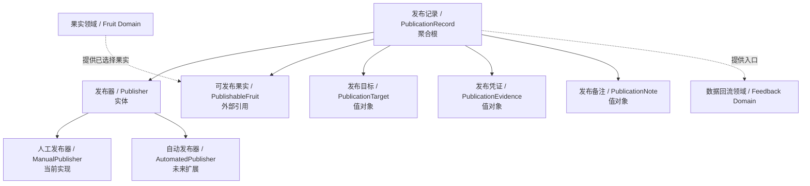
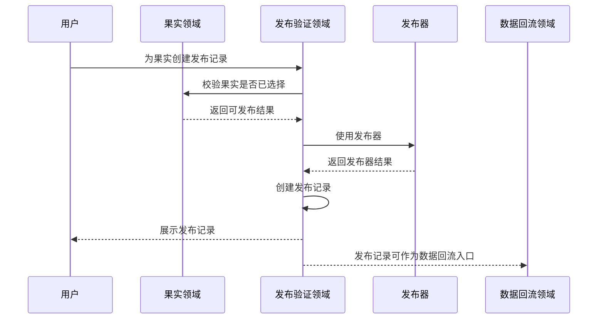
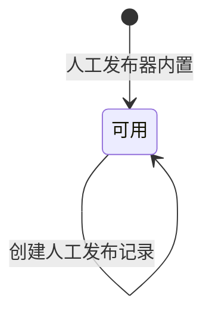

# 发布验证领域设计 (Domain Design)

## 1. 顶层共识与统一语言 (Ubiquitous Language)

### 1.1 模块职责边界 (Bounded Context)

- **包含**：管理发布验证过程，提供发布器选择，使用发布器为已选择果实创建发布记录，记录发布目标、发布凭证、发布时间和发布备注，并为数据回流领域提供发布记录入口。
- **不包含**：不管理果实选择状态，不编辑果实正文，不判断发布效果，不录入平台表现数据，不做数据快照，不做基因汲取，第一期不集成自动平台发布 API，不做发布器管理页面。

发布验证领域负责将已选择果实送入外部环境进行真实验证。第一期只支持人工发布器，但领域模型需要允许后续接入小红书、推特、抖音等自动发布器，而不改变发布验证的上层语义。

### 1.2 核心业务词汇表 (Glossary)

- **发布验证 (Publication Verification)**：将某个已选择果实通过发布器发布到外部平台或渠道，用真实环境验证内容表现的过程。
- **发布器 (Publisher)**：执行或承载发布动作的能力提供者，可以是人工发布器，也可以是未来的自动发布器。
- **人工发布器 (Manual Publisher)**：第一期唯一支持的发布器。它不直接执行平台发布，而是记录用户已经在外部平台完成发布的事实。
- **自动发布器 (Automated Publisher)**：后续版本可能接入的发布器，由系统调用外部平台能力完成发布。
- **发布记录 (Publication Record)**：一次发布验证的历史事实，说明哪个果实通过哪个发布器发布到了哪个外部目标。
- **发布目标 (Publication Target)**：外部平台或渠道，由用户在发布时描述，不在第一期做固定枚举。
- **发布凭证 (Publication Evidence)**：用于证明内容已经发布的外部链接、截图、页面地址或其他可追溯信息。
- **发布备注 (Publication Note)**：用户对本次发布的说明，例如是否人工改稿、是否换标题、是否改封面。
- **可发布果实 (Publishable Fruit)**：已被果实领域标记为已选择、具备进入发布验证资格的果实。
- **发布上下文 (Publication Context)**：创建发布记录时所需的果实、发布器、发布目标和发布说明等上下文组合。

## 2. 领域模型与聚合关系 (Domain Models & Aggregates)

发布验证领域的聚合根是 **发布记录 (PublicationRecord)**。一条发布记录代表一次真实发布验证事实。

发布器是发布验证领域的核心实体。第一期内置人工发布器，用户在外部平台完成发布后，回到内容森林中记录发布结果。后续自动发布器接入时，也应通过同一发布器抽象创建发布记录。

发布记录不拥有果实。果实属于果实领域，发布验证领域只引用已选择果实作为可发布对象。发布记录也不拥有数据表现，数据快照属于数据回流领域。

## 3. 核心业务约束 (Invariants & Business Rules)

- **已选择果实约束**：只有已选择果实才能创建发布记录。
- **果实关联约束**：每条发布记录必须关联一个明确果实。
- **发布器必备约束**：每条发布记录必须通过一个发布器创建。
- **第一期发布器约束**：第一期只支持人工发布器，不集成自动平台发布能力。
- **人工发布器语义约束**：人工发布器不代表系统已自动发布内容，只代表用户已在外部完成发布并回填记录。
- **多次发布约束**：一个果实可以创建多条发布记录，用于表达同一果实在多个平台或多次实验中的发布验证。
- **发布目标非枚举约束**：第一期不固定发布目标枚举，允许用户描述外部平台或渠道。
- **发布记录可编辑约束**：发布记录允许编辑发布目标、发布凭证、发布时间和发布备注，以修正人工录入错误或补充信息。
- **关联果实不可变约束**：发布记录创建后，不允许改为关联另一个果实。
- **不可删除约束**：发布记录不做硬删除，也不做归档；它是内容验证历史的一部分。
- **效果数据边界约束**：发布记录不保存平台表现数据，浏览、点赞、评论等表现信息属于数据回流领域。
- **果实内容边界约束**：发布验证领域不编辑果实正文。若用户发布前人工改稿，只能在发布备注中说明。
- **发布器管理边界约束**：第一期不提供发布器管理页面，人工发布器作为系统内置能力存在。
- **未来扩展约束**：后续自动发布器接入时，不能破坏“发布记录代表一次发布验证事实”的领域语义。

## 4. 核心用例与行为流转 (Core Behaviors)

### 4.1 用户故事 (User Stories)

- **用户故事 1**：作为内容创作者，我希望为已选择果实创建发布记录，以便于把该果实送到外部平台进行真实验证。
  - **验收标准 (AC)**：只有已选择果实可以创建发布记录；候选或已淘汰果实不能直接创建发布记录。

- **用户故事 2**：作为内容创作者，我希望使用人工发布器记录我已经在外部平台完成的发布，以便于内容森林知道该果实已经进入验证阶段。
  - **验收标准 (AC)**：人工发布器不会自动发布内容，只记录用户回填的发布结果。

- **用户故事 3**：作为内容创作者，我希望一个果实可以有多条发布记录，以便于在不同平台或不同渠道验证同一内容。
  - **验收标准 (AC)**：同一个果实可以重复创建发布记录，每条发布记录都是独立验证事实。

- **用户故事 4**：作为内容创作者，我希望编辑发布记录，以便于修正发布链接、发布时间或补充发布备注。
  - **验收标准 (AC)**：发布记录允许编辑发布信息，但不能改为关联另一个果实。

- **用户故事 5**：作为内容创作者，我希望发布记录能成为数据回流入口，以便于后续记录该次发布的真实表现。
  - **验收标准 (AC)**：发布记录创建后，数据回流领域可以基于该记录追加表现数据。

### 4.2 核心领域事件/命令 (Commands & Events)

- **命令 (Command)**：`CreatePublicationRecord`（创建发布记录）
- **命令 (Command)**：`EditPublicationRecord`（编辑发布记录）
- **命令 (Command)**：`UsePublisher`（使用发布器）
- **事件 (Event)**：`PublicationRecordCreated`（发布记录已创建）
- **事件 (Event)**：`PublicationRecordEdited`（发布记录已编辑）
- **事件 (Event)**：`ManualPublicationRecorded`（人工发布已记录）
- **事件 (Event)**：`PublisherUsed`（发布器已使用）

### 4.3 核心业务流图 (Behavior Flow)

