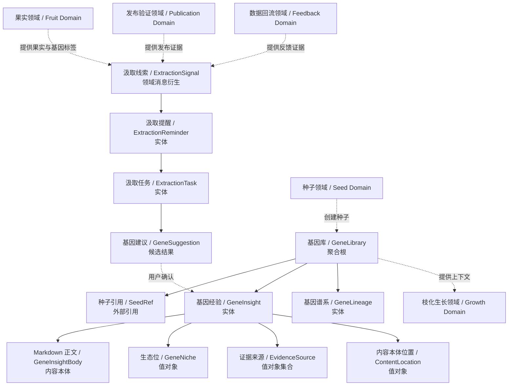
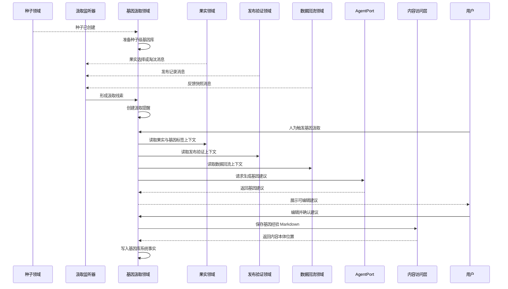
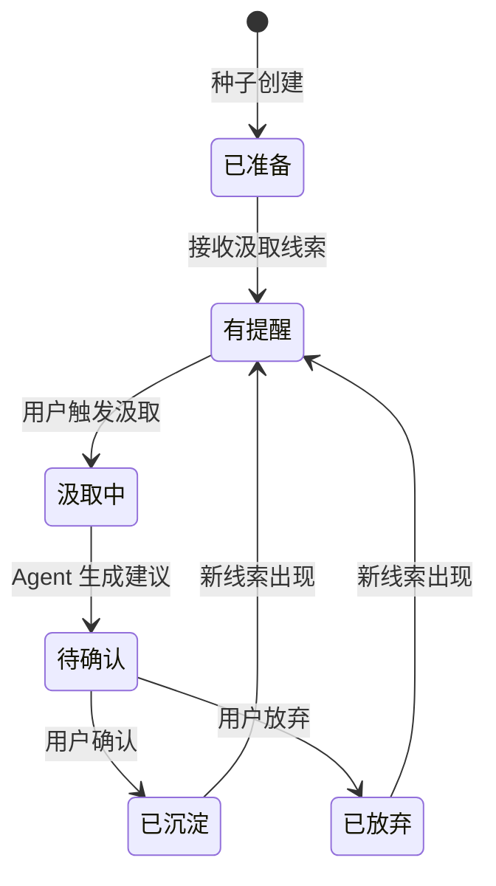

# 基因汲取领域设计 (Domain Design)

## 1. 顶层共识与统一语言 (Ubiquitous Language)

### 1.1 模块职责边界 (Bounded Context)

- **包含**：为每个种子维护种子级基因库，监听选择、淘汰、发布验证、数据回流等领域消息，生成基因汲取提醒，支持用户人为触发基因汲取，调用 Agent 生成基因建议，支持用户编辑、确认或放弃建议，将确认后的基因经验写入该种子的基因库，并为后续枝化生长提供可引用的基因上下文。
- **不包含**：不负责创建种子，不负责创建果实，不负责执行物竞天择，不负责记录发布验证，不负责录入数据快照，不负责营养库资料维护，不自动改写生成器，不自动替用户确认基因，不实现重型遗传算法基础设施，不计算统一适应度分数服务。

基因汲取领域负责把内容森林自己的进化经验沉淀下来。它不是普通资料管理，也不是数据分析报表，而是将果实的表达特征、用户选择、发布验证和反馈数据转化为下一轮生长可复用的种子级经验。

### 1.2 核心业务词汇表 (Glossary)

- **基因库 (Gene Library)**：随种子创建而创建的种子级经验库，用于保存该种子在内容进化中沉淀出的基因经验。
- **种子级基因库 (Seed-scoped Gene Library)**：只服务于某一个种子的基因库，不与其他种子自动共享。
- **基因标签 (Gene Tag)**：枝化生长时为果实识别出的表达特征，如标题结构、情绪钩子、叙事角度、平台格式和受众切口。
- **基因经验 (Gene Insight)**：用户确认后的可复用内容表达特征假设，可以是成功基因、失败教训、适用场景、规避规则或下一轮生长建议。
- **基因假设 (Gene Hypothesis)**：关于某个表达特征在特定种子、平台、受众、目标或内容谱系中可能有效或无效的可验证判断。它不是绝对规则，必须带有证据来源和适用边界。
- **基因谱系 (Gene Lineage)**：围绕某类内容方向持续沉淀的一组相关基因经验，例如情绪价值谱系、小众精品谱系、工具效率谱系。
- **生态位 (Gene Niche)**：基因经验适用的上下文，例如某个种子、平台、内容目标、受众场景或转化目标。
- **证据来源 (Evidence Source)**：支撑某条基因经验的来源，可以来自果实、选择结果、淘汰结果、发布记录或数据快照。
- **汲取线索 (Extraction Signal)**：由其他领域消息形成的可分析线索，例如果实被选择、果实被淘汰、发布记录创建、反馈快照创建。
- **汲取提醒 (Extraction Reminder)**：系统根据汲取线索给用户的提示，表示当前可能值得进行基因汲取。
- **汲取任务 (Extraction Task)**：用户人为触发的一次 Agent 分析过程，用于生成可确认的基因建议。
- **基因建议 (Gene Suggestion)**：Agent 基于证据来源生成的候选经验，尚未成为正式基因经验。
- **确认沉淀 (Confirmed Extraction)**：用户确认某条基因建议，将其写入种子级基因库的动作。
- **基因上下文 (Gene Context)**：枝化生长时可提供给 Agent 的基因库经验集合。
- **汲取监听器 (Extraction Listener)**：消费领域消息并生成汲取线索或提醒的领域协作者。

## 2. 领域模型与聚合关系 (Domain Models & Aggregates)

基因汲取领域的聚合根是 **基因库 (GeneLibrary)**。每个种子拥有一个种子级基因库，用于组织该种子的基因经验、基因谱系和相关证据。

基因经验的正文由 Markdown 承载，系统事实由数据库维护。Markdown 只保存用户可读的经验正文，不保存归属关系、证据关系、状态、索引、生态位或内容位置等 meta 信息。经验正文应清楚说明该基因假设的表达特征、正向或反向作用、证据依据、适用边界和下一轮使用建议。

汲取提醒和汲取任务服务于“人为触发 + 系统提醒”的第一期策略。系统可以提醒用户当前有值得汲取的线索，但是否真正汲取、是否确认沉淀，仍由用户决定。

## 3. 核心业务约束 (Invariants & Business Rules)

- **种子级归属约束**：每个基因库必须归属于一个明确种子；第一期不做跨种子共享基因库。
- **随种子创建约束**：种子创建成功后，系统必须保证该种子的基因库可用。
- **内容本体必备约束**：确认后的基因经验必须关联一个可读取的 Markdown 内容本体位置。
- **Meta 与内容分离约束**：基因经验 Markdown 只保存经验正文，不保存由数据库维护的 meta 信息。
- **证据来源约束**：基因经验必须能追溯到至少一个证据来源，避免变成无来源的主观规则。
- **假设表达约束**：基因经验必须表达为可验证的内容表达特征假设，不能只是泛化标签或无上下文结论。
- **方向性约束**：基因经验应能区分正向成功因子和反向失败因子，反向经验不得被误解释为全局禁止规则。
- **人为确认约束**：Agent 生成的基因建议不能自动成为基因经验，必须经过用户确认。
- **建议可编辑约束**：用户确认前可以编辑基因建议，使其更贴近自己的判断和表达。
- **拒绝不入库约束**：用户放弃或拒绝的建议不进入基因库，也不作为后续枝化生长上下文。
- **领域消息约束**：汲取提醒应基于其他领域发出的领域消息形成，而不是由基因汲取领域主动修改其他领域事实。
- **提醒非执行约束**：系统提醒只表示“可能值得汲取”，不代表已经完成基因沉淀。
- **营养库边界约束**：基因经验不保存到营养库；营养库提供外部资料，基因库沉淀系统进化经验。
- **枝化生长引用约束**：基因库可以作为枝化生长的高价值上下文，但不替代生成器、营养库和用户本次输入。
- **谱系轻量约束**：第一期基因谱系用于组织方向，不做重型遗传算法基础设施、自动繁殖策略或独立适应度评分服务，但保留后续算法模型迭代空间。
- **Agent 边界约束**：Agent 只负责生成基因建议，不直接写文件，不直接写数据库，不直接修改果实、发布记录或反馈快照。

## 4. 核心用例与行为流转 (Core Behaviors)

### 4.1 用户故事 (User Stories)

- **用户故事 1**：作为内容创作者，我希望创建种子后自动拥有该种子的基因库，以便于后续沉淀该种子的进化经验。
  - **验收标准 (AC)**：种子创建成功后，对应种子级基因库可用；基因库不需要用户手动创建。

- **用户故事 2**：作为内容创作者，我希望系统在果实被选择、淘汰或出现数据反馈后提醒我可以汲取基因，以便于不错过值得沉淀的经验。
  - **验收标准 (AC)**：汲取提醒来自领域消息；提醒不会自动执行基因汲取。

- **用户故事 3**：作为内容创作者，我希望人为触发一次基因汲取，以便于让 Agent 基于果实、选择结果、发布验证和数据快照生成经验建议。
  - **验收标准 (AC)**：用户触发后，系统生成可查看的基因建议；Agent 不直接写入基因库。

- **用户故事 4**：作为内容创作者，我希望编辑并确认基因建议，以便于把真正有价值的成功基因或失败教训写入该种子的基因库。
  - **验收标准 (AC)**：只有用户确认后的建议才成为基因经验，并拥有可读取的 Markdown 正文。

- **用户故事 5**：作为内容创作者，我希望一个种子可以沉淀多条不同谱系的基因经验，以便于同时保留多个有效内容方向。
  - **验收标准 (AC)**：同一基因库可以组织多条基因谱系；不同谱系可以基于不同果实分支和证据来源形成。

- **用户故事 6**：作为内容创作者，我希望后续枝化生长可以引用基因库经验，以便于让已验证的表达特征影响下一代果实。
  - **验收标准 (AC)**：枝化生长可以读取该种子基因库中已确认的基因经验作为上下文。

### 4.2 核心领域事件/命令 (Commands & Events)

- **命令 (Command)**：`PrepareGeneLibraryForSeed`（为种子准备基因库）
- **命令 (Command)**：`CreateExtractionReminder`（创建汲取提醒）
- **命令 (Command)**：`StartGeneExtraction`（发起基因汲取）
- **命令 (Command)**：`EditGeneSuggestion`（编辑基因建议）
- **命令 (Command)**：`ConfirmGeneInsight`（确认基因经验）
- **命令 (Command)**：`DismissGeneSuggestion`（放弃基因建议）
- **事件 (Event)**：`GeneLibraryPrepared`（基因库已准备）
- **事件 (Event)**：`ExtractionSignalReceived`（汲取线索已接收）
- **事件 (Event)**：`ExtractionReminderCreated`（汲取提醒已创建）
- **事件 (Event)**：`GeneExtractionStarted`（基因汲取已开始）
- **事件 (Event)**：`GeneSuggestionGenerated`（基因建议已生成）
- **事件 (Event)**：`GeneInsightConfirmed`（基因经验已确认）
- **事件 (Event)**：`GeneSuggestionDismissed`（基因建议已放弃）

### 4.3 核心业务流图 (Behavior Flow)

