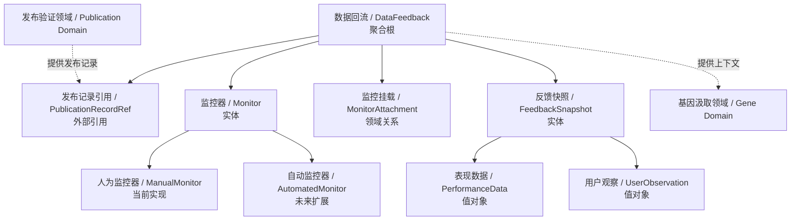
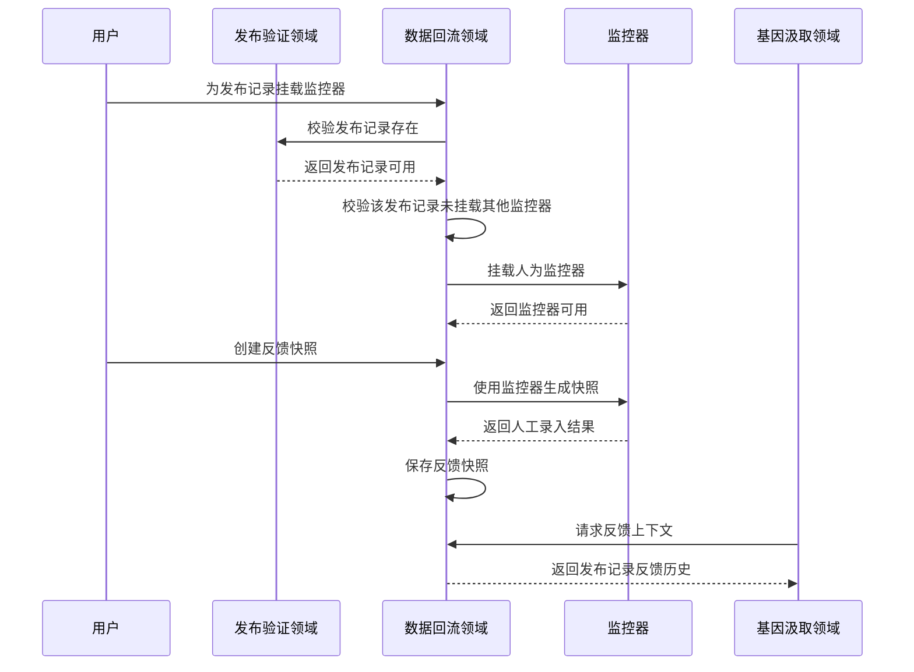
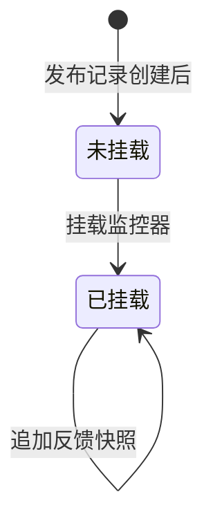

# 数据回流领域设计 (Domain Design)

## 1. 顶层共识与统一语言 (Ubiquitous Language)

### 1.1 模块职责边界 (Bounded Context)

- **包含**：为发布记录挂载监控器，通过监控器创建数据快照，支持人为监控器手动录入表现数据，支持同一发布记录多次追加快照，编辑数据快照，查看反馈历史，并为基因汲取领域提供反馈上下文。
- **不包含**：不创建发布记录，不判断数据好坏，不计算适应度，不提取基因，不修改果实选择状态，不修改发布记录本身，第一期不做自动平台抓取，第一期不做监控器管理页面。

数据回流领域负责让外部平台表现回到内容森林。它的核心不是“填表”，而是通过监控器持续观察一次发布验证，并形成可追溯的数据快照历史。

### 1.2 核心业务词汇表 (Glossary)

- **数据回流 (Data Feedback)**：外部平台表现回到内容森林并被记录为反馈上下文的过程。
- **监控器 (Monitor)**：负责观察外部平台数据并生成数据快照的能力提供者。
- **人为监控器 (Manual Monitor)**：第一期唯一支持的监控器，由用户手动查看平台数据后回填。
- **自动监控器 (Automated Monitor)**：后续版本可能接入的平台数据采集能力。
- **监控挂载 (Monitor Attachment)**：将一个监控器挂载到一条发布记录上，使其成为该发布记录的数据来源。
- **发布记录 (Publication Record)**：数据回流必须依附的发布验证对象。没有发布记录不能产生数据快照。
- **反馈快照 (Feedback Snapshot)**：某个时间点对发布表现的记录。
- **表现数据 (Performance Data)**：平台上可观察到的数据，不在领域层固定具体指标。
- **用户观察 (User Observation)**：用户对评论质量、受众反应、异常现象、主观判断等的补充说明。
- **反馈历史 (Feedback History)**：同一发布记录下的多次反馈快照集合。
- **反馈上下文 (Feedback Context)**：供基因汲取领域分析使用的发布记录、快照和用户观察组合。

## 2. 领域模型与聚合关系 (Domain Models & Aggregates)

数据回流领域的聚合根是 **数据回流 (DataFeedback)**。它围绕一条发布记录组织监控器和反馈快照。

监控器是数据回流领域的核心实体。第一期内置人为监控器，后续可以接入自动监控器，但不改变“监控器负责生成快照”的领域语义。

数据快照不直接挂载到果实，而是挂载到发布记录上。因为一个果实可以被发布多次，每次发布都应拥有独立的数据回流历史。

## 3. 核心业务约束 (Invariants & Business Rules)

- **发布记录必备约束**：数据回流必须基于一条发布记录；没有发布记录不能录入反馈。
- **监控器必备约束**：每条反馈快照必须通过一个监控器创建。
- **单监控器约束**：一条发布记录同一时间只能挂载一个监控器，避免多个数据来源产生冲突。
- **第一期监控器约束**：第一期只支持人为监控器，不做自动平台数据抓取。
- **人为监控器语义约束**：人为监控器不代表系统已自动获取数据，只代表用户手动查看外部平台后回填。
- **多快照约束**：一条发布记录必须支持多次追加反馈快照，用于记录不同时间点的表现变化。
- **快照可编辑约束**：反馈快照允许编辑，以修正人工录入错误或补充观察。
- **快照不可删除约束**：反馈快照不允许删除，避免破坏反馈历史。
- **表现数据自由约束**：表现数据不做固定指标限制，以适配不同平台的数据差异。
- **不判断效果约束**：数据回流领域只记录事实，不判断内容成功或失败，不计算适应度。
- **不修改发布记录约束**：数据回流领域不修改发布记录本身，只引用发布记录并追加反馈历史。
- **不修改果实约束**：数据回流领域不修改果实选择状态，也不编辑果实正文。
- **基因汲取边界约束**：数据回流领域只提供反馈上下文，不负责提取成功基因或失败教训。
- **未来扩展约束**：后续自动监控器接入时，不应改变数据回流领域的上层语义和发布记录关联方式。

## 4. 核心用例与行为流转 (Core Behaviors)

### 4.1 用户故事 (User Stories)

- **用户故事 1**：作为内容创作者，我希望为发布记录挂载人为监控器，以便于手动回填外部平台表现。
  - **验收标准 (AC)**：一条发布记录只能挂载一个监控器；第一期挂载的是人为监控器。

- **用户故事 2**：作为内容创作者，我希望为一次发布记录追加数据快照，以便于记录不同时间点的内容表现。
  - **验收标准 (AC)**：同一发布记录可以追加多条反馈快照。

- **用户故事 3**：作为内容创作者，我希望编辑已录入的数据快照，以便于修正人工填写错误或补充观察。
  - **验收标准 (AC)**：反馈快照允许编辑，但不允许删除。

- **用户故事 4**：作为内容创作者，我希望表现数据不被固定指标限制，以便于适配不同平台的反馈形式。
  - **验收标准 (AC)**：用户可以记录不同平台的表现数据和主观观察，而不受固定指标集合约束。

- **用户故事 5**：作为内容创作者，我希望数据回流能为后续基因汲取提供上下文，以便于让真实反馈影响下一轮内容生长。
  - **验收标准 (AC)**：基因汲取领域可以读取发布记录下的反馈历史和用户观察。

### 4.2 核心领域事件/命令 (Commands & Events)

- **命令 (Command)**：`AttachMonitor`（挂载监控器）
- **命令 (Command)**：`CreateFeedbackSnapshot`（创建反馈快照）
- **命令 (Command)**：`EditFeedbackSnapshot`（编辑反馈快照）
- **事件 (Event)**：`MonitorAttached`（监控器已挂载）
- **事件 (Event)**：`ManualMonitorAttached`（人为监控器已挂载）
- **事件 (Event)**：`FeedbackSnapshotCreated`（反馈快照已创建）
- **事件 (Event)**：`FeedbackSnapshotEdited`（反馈快照已编辑）

### 4.3 核心业务流图 (Behavior Flow)

