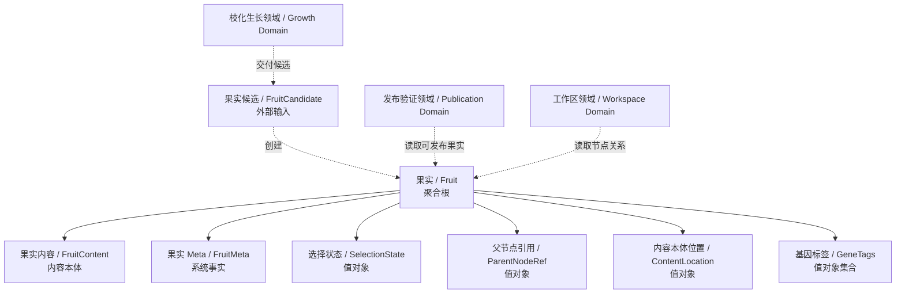
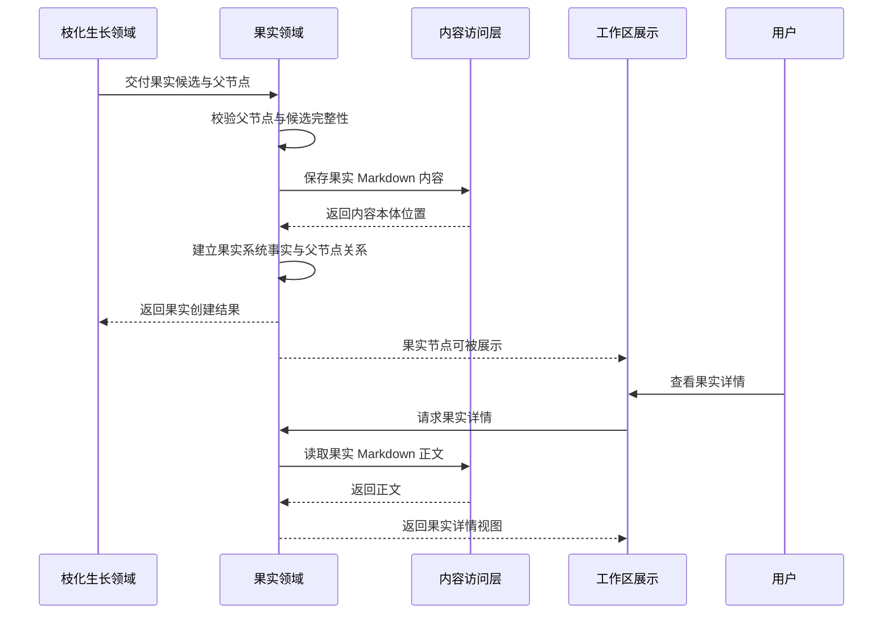
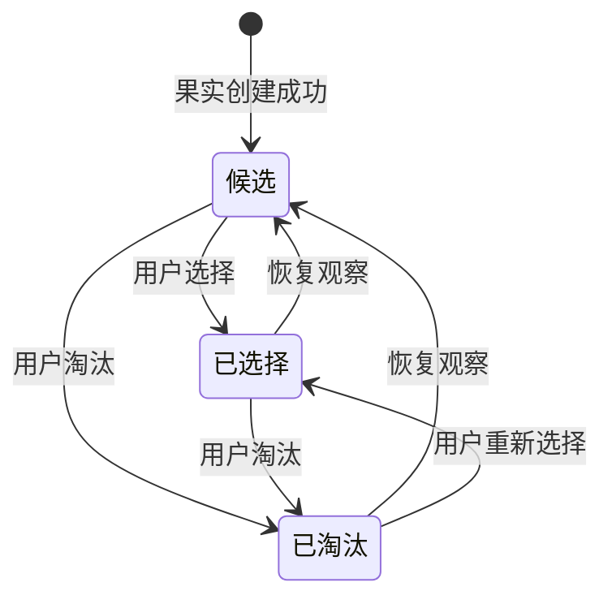

# 果实领域设计 (Domain Design)

## 1. 顶层共识与统一语言 (Ubiquitous Language)

### 1.1 模块职责边界 (Bounded Context)

- **包含**：接收枝化生长交付的果实候选，创建果实，保存果实内容本体，维护果实系统事实，建立果实与父节点的挂载关系，管理果实选择状态，提供果实详情读取入口，并允许用户编辑果实正文。
- **不包含**：不负责调用 Agent，不负责执行生成器，不负责枝化生长任务，不负责生长锁判断，不负责发布验证，不负责数据回流，不负责基因汲取与营养沉淀，不负责整个工作区画布布局。

果实领域是内容森林中承接枝化生长结果的核心落地点。它负责让一个由 Agent 生成出的内容结果成为可展示、可选择、可继续生长、可发布验证的果实节点。

### 1.2 核心业务词汇表 (Glossary)

- **果实 (Fruit)**：一次枝化生长生成的内容成果，是内容树中的一个可操作节点。
- **果实候选 (Fruit Candidate)**：枝化生长模块交付给果实领域、等待创建为正式果实的候选成果。
- **果实内容 (Fruit Content)**：果实的 Markdown 内容本体，是用户真正查看、编辑和发布的正文内容。
- **果实 Meta (Fruit Meta)**：由系统维护的果实事实信息，例如身份、状态、关系、来源、内容本体位置和展示所需摘要信息。Meta 不写入 Markdown。
- **内容本体位置 (Content Location)**：果实内容在内容存储中的位置。果实详情必须通过该位置读取 Markdown 正文。
- **父节点 (Parent Node)**：果实创建时挂载的来源节点，可以是种子，也可以是另一个果实。
- **果实节点 (Fruit Node)**：果实在内容树中的节点表现，用于工作区展示和后续操作。
- **选择状态 (Selection State)**：果实在人为物竞天择中的结果，只能是候选、已选择或已淘汰之一。
- **候选果实 (Candidate Fruit)**：新生成但尚未被明确选择或淘汰的果实。候选状态天然允许用户暂时保留观察。
- **已选择果实 (Selected Fruit)**：用户认为值得发布验证或继续重点使用的果实。
- **已淘汰果实 (Eliminated Fruit)**：用户认为当前不值得继续投入的果实。淘汰不等于删除。
- **可发布果实 (Publishable Fruit)**：在业务上可交给发布验证领域记录发布行为的果实。是否发布不属于果实选择状态。
- **可生长果实 (Growable Fruit)**：可以作为枝化生长来源节点的果实。是否允许当前发起生长由枝化生长领域的生长锁判断。
- **基因标签 (Gene Tags)**：枝化生长为果实识别出的表达特征，用于展示、选择、反馈和后续基因汲取。

## 2. 领域模型与聚合关系 (Domain Models & Aggregates)

果实领域的聚合根是 **果实 (Fruit)**。果实代表内容森林中一个真实存在的内容成果，它必须同时具备内容本体和系统事实。

果实内容由 Markdown 承载，果实 Meta 由数据库维护。Markdown 只保存正文内容，不保存选择状态、父节点关系、发布状态、数据反馈或系统索引。果实详情读取时，需要由系统事实定位内容本体，再读取 Markdown 正文。

果实领域不拥有发布验证、数据回流和基因汲取过程。它只向这些后续领域提供可追溯、可读取、可操作的果实对象。

## 3. 核心业务约束 (Invariants & Business Rules)

- **创建来源约束**：果实只能由果实候选创建，不能凭空创建。
- **父节点必备约束**：每个果实创建时必须关联一个父节点，父节点可以是种子或果实。
- **内容本体必备约束**：每个果实必须关联一个可读取的 Markdown 内容本体位置；没有内容本体的果实不能进入内容树。
- **Meta 与内容分离约束**：果实 Markdown 不保存由数据库维护的 meta 信息；选择状态、父节点关系、来源关系、发布与反馈事实都不写入 Markdown。
- **创建完整性约束**：果实创建必须同时完成内容本体保存、系统事实建立和父节点关系建立；不完整果实禁止进入内容树。
- **默认状态约束**：果实创建成功后默认处于候选状态。
- **选择状态互斥约束**：果实选择状态只能是候选、已选择、已淘汰之一，同一时间不能同时处于多个选择状态。
- **候选即保留约束**：候选状态天然代表暂时保留观察，第一期不单独设置“已保留”状态。
- **不可删除约束**：果实不能被硬删除；不感兴趣的果实只能被标记为已淘汰。
- **淘汰可见约束**：已淘汰果实仍保留在内容树中，可弱化展示，但必须可追溯、可查看。
- **内容可编辑约束**：用户允许编辑果实 Markdown 正文；编辑不改变果实身份、父节点关系或生成来源。
- **发布状态隔离约束**：已发布、已反馈等状态不属于果实选择状态，由发布验证和数据回流相关领域维护或派生。
- **生长能力边界约束**：果实可以作为枝化生长来源节点，但是否允许当前发起生长由枝化生长领域的生长锁判断。
- **生长锁粒度约束**：生长锁作用于当前发起生长的节点本身；某个种子正在生长，不影响其他未加锁果实继续发起枝化生长。
- **Agent 边界约束**：果实领域不调用 Agent，不执行生成器，也不封装生成器 Payload；这些属于枝化生长领域。

## 4. 核心用例与行为流转 (Core Behaviors)

### 4.1 用户故事 (User Stories)

- **用户故事 1**：作为内容创作者，我希望枝化生长完成后能看到新果实挂载到来源节点下，以便于理解内容如何从一个种子或果实继续生长。
  - **验收标准 (AC)**：果实创建成功后必须出现在父节点下；如果内容本体或父节点关系不完整，则不能进入内容树。

- **用户故事 2**：作为内容创作者，我希望新生成的果实默认保持候选状态，以便于稍后再决定选择或淘汰。
  - **验收标准 (AC)**：新果实创建后不强迫用户立即选择；候选果实可长期保留在内容树中。

- **用户故事 3**：作为内容创作者，我希望对果实执行选择或淘汰，以便于表达我对该内容方向的判断。
  - **验收标准 (AC)**：果实同一时间只能处于候选、已选择、已淘汰之一；状态切换后工作区展示同步变化。

- **用户故事 4**：作为内容创作者，我希望编辑果实正文，以便于将生成内容调整为更适合发布的版本。
  - **验收标准 (AC)**：编辑只改变果实 Markdown 正文，不改变果实身份、父节点关系和生成来源。

- **用户故事 5**：作为内容创作者，我希望淘汰果实后仍能在树上看到它，以便于保留内容进化历史。
  - **验收标准 (AC)**：已淘汰果实不被删除，只在工作区弱化展示，并仍可查看详情。

- **用户故事 6**：作为内容创作者，我希望从某个果实继续发起枝化生长，以便于基于已有内容生成下一代果实。
  - **验收标准 (AC)**：果实领域可提供果实作为来源节点；是否当前可生长由枝化生长领域根据该果实是否被加锁判断。

### 4.2 核心领域事件/命令 (Commands & Events)

- **命令 (Command)**：`CreateFruitFromCandidate`（从果实候选创建果实）
- **命令 (Command)**：`SelectFruit`（选择果实）
- **命令 (Command)**：`EliminateFruit`（淘汰果实）
- **命令 (Command)**：`RestoreFruitToCandidate`（恢复为候选）
- **命令 (Command)**：`EditFruitContent`（编辑果实内容）
- **事件 (Event)**：`FruitCreated`（果实已创建）
- **事件 (Event)**：`FruitMountedToParent`（果实已挂载到父节点）
- **事件 (Event)**：`FruitSelected`（果实已选择）
- **事件 (Event)**：`FruitEliminated`（果实已淘汰）
- **事件 (Event)**：`FruitRestoredToCandidate`（果实已恢复为候选）
- **事件 (Event)**：`FruitContentEdited`（果实内容已编辑）

### 4.3 核心业务流图 (Behavior Flow)

