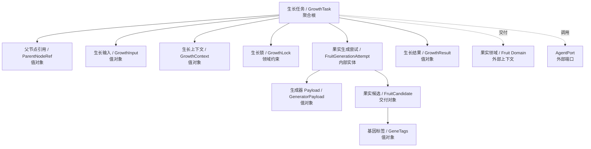
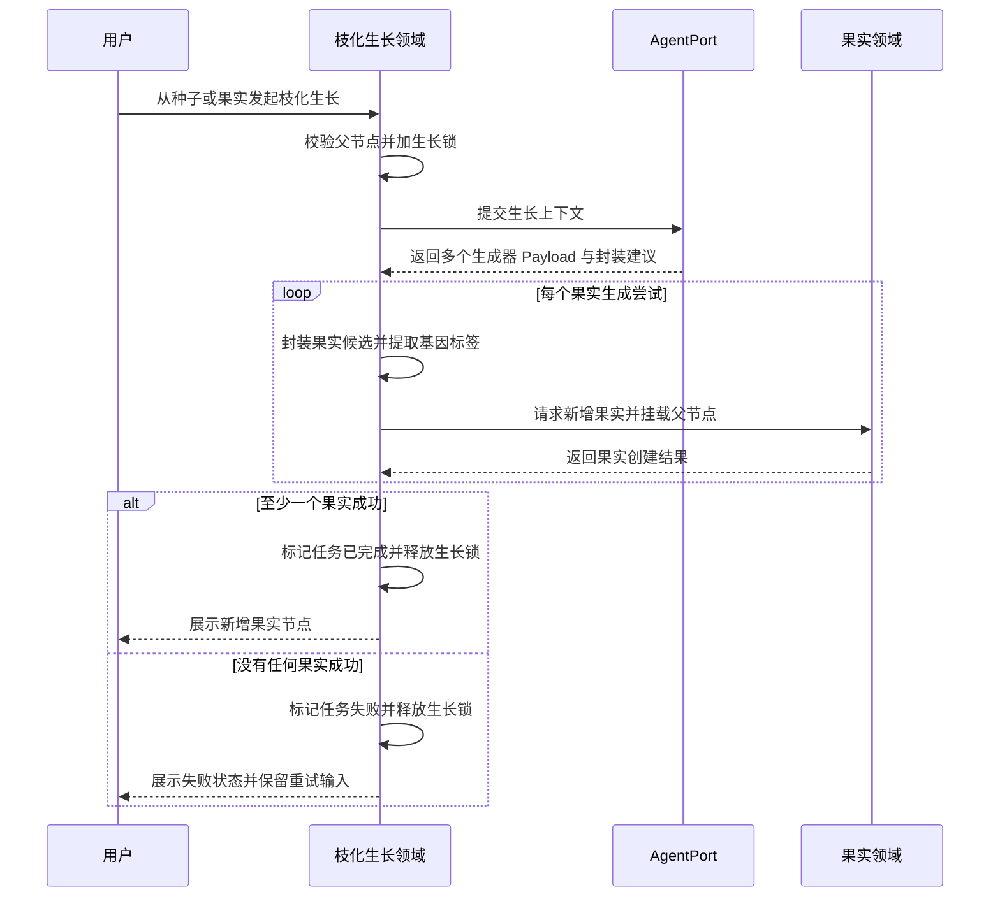
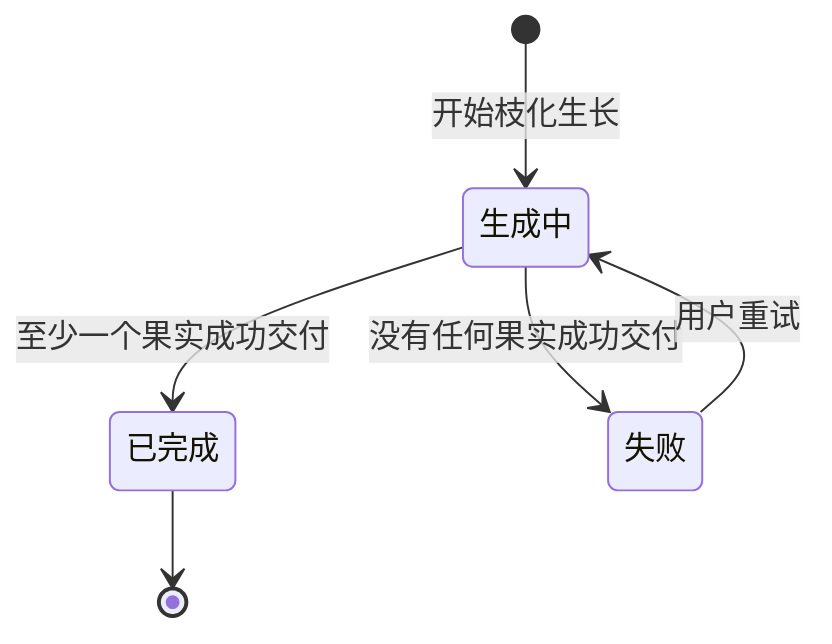

# 枝化生长领域设计 (Domain Design)

## 1. 顶层共识与统一语言 (Ubiquitous Language)

### 1.1 模块职责边界 (Bounded Context)

- **包含**：处理一次枝化生长批次的创建、执行、状态流转、父节点生长锁、生长结果接收、失败重试输入恢复，以及将成功生成的果实候选交付给果实领域进行新增与挂载。
- **不包含**：不负责生成器上传与管理，不负责营养库资料维护，不负责果实领域内部规则，不负责发布验证与数据回流，不负责基因汲取后的沉淀，不直接读写文件或数据库，不直接调用底层 LLM SDK。

枝化生长模块是内容森林第一期闭环中连接“种子/果实上下文、生成器、营养库、Agent 能力、果实新增”的核心业务模块。它不是通用任务系统，只表达一次内容生长批次的业务过程。

### 1.2 核心业务词汇表 (Glossary)

- **枝化生长 (Branch Growth)**：从一个种子或果实出发，基于用户补充想法、生成器、营养资料和生长参数，生成下一批果实的过程。
- **生长任务 (Growth Task)**：一次枝化生长批次的业务记录，负责表达本次生长从哪里开始、是否正在进行、是否成功长出果实，以及失败后能否重试。
- **父节点 (Parent Node)**：本次枝化生长的来源节点，可以是一个种子，也可以是一个果实。任何枝化生长都必须有父节点。
- **生长锁 (Growth Lock)**：父节点在生长任务进行中获得的临时锁。锁定期间，该父节点不能再次发起新的枝化生长。
- **生长输入 (Growth Input)**：用户在悬浮输入框中填写的本次生长补充想法，以及本次生长选择的生成器、营养引用和生长参数。
- **生长上下文 (Growth Context)**：执行枝化生长时提供给 Agent 的上下文组合，包括父节点内容、用户输入、生成器 Skill、营养资料和必要历史信息。
- **果实生成尝试 (Fruit Generation Attempt)**：一次生长任务内部针对单个果实的生成尝试。它不是用户可见的任务对象，只用于表达一次批次中可能有多个独立生成尝试。
- **生成器 Payload (Generator Payload)**：生成器 Skill 产出的自由内容结果。它可以是 Markdown 文本，也可以通过 Markdown 引用图片、视频或其他附件。
- **果实候选 (Fruit Candidate)**：枝化生长 Skill 将生成器 Payload 封装后形成的候选果实结果，包含可交付给果实领域的内容本体和必要 meta。
- **基因标签 (Gene Tags)**：枝化生长过程中识别出的表达特征，如内容角度、标题结构、情绪钩子、平台格式、受众切口等。它们用于后续物竞天择、数据回流和基因汲取。
- **生长结果 (Growth Result)**：一次生长任务结束时产生的结果集合。只要至少一个果实候选成功交付给果实领域，本次生长任务即视为完成。
- **重试 (Retry)**：当一次生长任务没有生成任何果实时，用户可以基于最近失败任务的输入重新发起枝化生长。

## 2. 领域模型与聚合关系 (Domain Models & Aggregates)

枝化生长领域的聚合根是 **生长任务 (GrowthTask)**。它代表一次枝化生长批次，而不是通用后台任务。它内部可以包含多个果实生成尝试，但这些尝试不作为独立用户操作对象暴露。

生长任务不拥有果实。果实属于果实领域。枝化生长模块只在成功得到果实候选后，调用果实领域的新增能力，并提供父节点关系和果实 meta，使新果实能挂载到内容树中。

生成器 Payload 不等于果实。生成器负责不确定的内容创作，枝化生长 Skill 负责将 Payload 转换为内容森林可识别的果实候选和基因标签，果实领域负责最终果实创建和树关系落地。

## 3. 核心业务约束 (Invariants & Business Rules)

- **父节点必备约束**：任何生长任务必须从一个明确父节点发起，父节点可以是种子或果实，不允许无来源枝化生长。
- **父节点生长锁约束**：同一个父节点在同一时间只能存在一个生长中的生长任务。
- **节点可浏览约束**：父节点生长中时，用户仍可查看该节点详情，但不能再次从该节点发起枝化生长。
- **其他节点不受影响约束**：某个父节点处于生长中，不影响用户从其他未锁定的种子或果实发起生长。
- **状态最小化约束**：生长任务只允许表达三类业务状态：生成中、已完成、失败。
- **完成判定约束**：一次生长任务只要至少成功生成并交付一个果实候选，即视为已完成。
- **失败判定约束**：一次生长任务只有在没有任何果实候选成功生成并交付时，才视为失败。
- **不回滚约束**：已经成功交付给果实领域并挂载到父节点下的果实，不会因为同批次后续生成尝试失败而回滚。
- **重试输入恢复约束**：失败任务必须保留用户可感知的失败原因和本次生长输入，用户重试时可以恢复最近失败任务的输入。
- **生成器解耦约束**：生成器只负责产出自由内容 Payload，不需要理解果实、内容树或内容森林系统事实。
- **果实封装约束**：果实候选、基因标签和生长结果由枝化生长 Skill 负责封装，不由生成器直接交付。
- **系统事实归属约束**：生长任务状态、父节点生长锁、果实挂载关系等系统事实由内容森林后端维护，不写入 Markdown 内容本体。
- **Agent 边界约束**：枝化生长模块只通过 AgentPort 使用 Agent 能力，不直接依赖具体 Agent Runtime 或底层 LLM SDK。
- **果实领域边界约束**：枝化生长模块不直接修改内容树展示结果，而是调用果实领域新增能力，由果实领域完成果实创建和父子关系落地。

## 4. 核心用例与行为流转 (Core Behaviors)

### 4.1 用户故事 (User Stories)

- **用户故事 1**：作为内容创作者，我希望从一个种子节点发起枝化生长，以便于围绕原始灵感生成多个内容果实。
  - **验收标准 (AC)**：当种子节点进入生长中状态时，该节点不能再次发起生长；生长完成后，新果实出现在该种子下方。

- **用户故事 2**：作为内容创作者，我希望从一个已有果实继续枝化生长，以便于基于已经产生的内容继续演化下一代果实。
  - **验收标准 (AC)**：生长任务必须带上该果实作为父节点；生成出的新果实必须挂载到该果实下方。

- **用户故事 3**：作为内容创作者，我希望一次枝化生长可以生成多个果实，以便于从多个表达方向中进行物竞天择。
  - **验收标准 (AC)**：只要本次生长至少成功生成一个果实，任务就视为已完成；已经生成的果实不会被后续失败影响。

- **用户故事 4**：作为内容创作者，我希望生长失败时能看到失败状态并恢复上次输入，以便于调整内容后重新尝试。
  - **验收标准 (AC)**：当没有任何果实成功生成时，父节点显示失败反馈；用户点击该节点后，悬浮输入框恢复最近失败任务的输入。

- **用户故事 5**：作为产品维护者，我希望枝化生长与生成器、果实领域保持边界，以便于后续替换生成器、Agent 或果实实现时不影响核心流程。
  - **验收标准 (AC)**：生成器只交付 Payload；枝化生长负责封装果实候选；果实领域负责新增果实和挂载父节点。

### 4.2 核心领域事件/命令 (Commands & Events)

- **命令 (Command)**：`StartGrowth`（开始枝化生长）
- **命令 (Command)**：`RetryGrowth`（重试枝化生长）
- **命令 (Command)**：`DeliverFruitCandidate`（交付果实候选）
- **事件 (Event)**：`GrowthStarted`（生长已开始）
- **事件 (Event)**：`FruitCandidateGenerated`（果实候选已生成）
- **事件 (Event)**：`GrowthCompleted`（生长已完成）
- **事件 (Event)**：`GrowthFailed`（生长已失败）
- **事件 (Event)**：`ParentNodeGrowthLocked`（父节点已进入生长锁定）
- **事件 (Event)**：`ParentNodeGrowthUnlocked`（父节点已解除生长锁定）

### 4.2 核心业务流图 (Behavior Flow)

