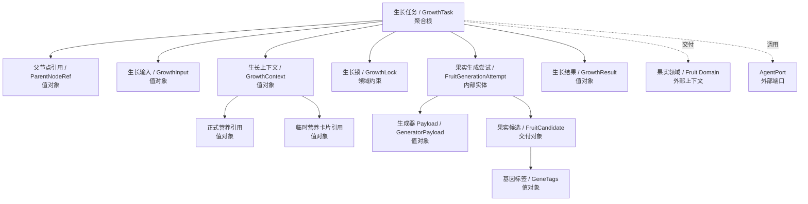
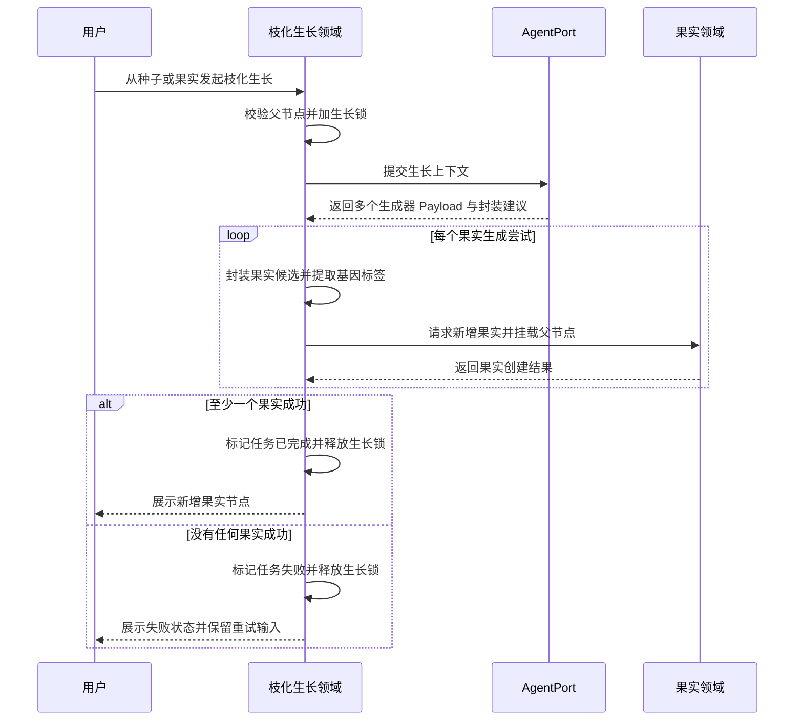
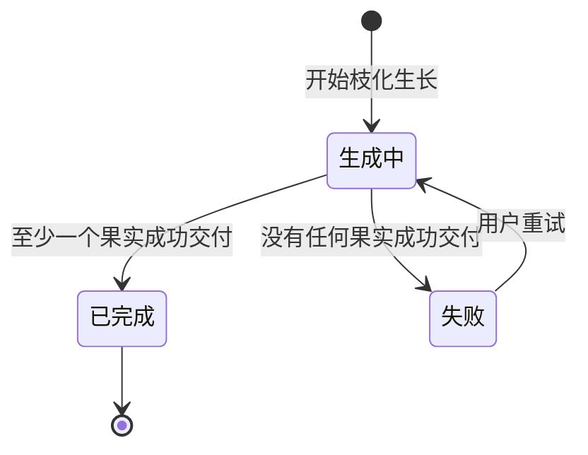

# 枝化生长领域设计 (Domain Design)

## 1. 顶层共识与统一语言 (Ubiquitous Language)

### 1.1 模块职责边界 (Bounded Context)

- **包含**：处理一次枝化生长批次的创建、执行、状态流转、父节点生长锁、生长结果接收、失败重试输入恢复，以及将成功生成的果实候选交付给果实领域进行新增与挂载。
- **不包含**：不负责生成器上传与管理，不负责营养库资料维护，不负责果实领域内部规则，不负责发布验证与数据回流，不负责基因汲取后的沉淀，不直接读写文件或数据库，不直接调用底层 LLM SDK。

枝化生长模块是内容森林第一期闭环中连接“种子/果实上下文、生成器、营养库、Agent 能力、果实新增”的核心业务模块。它不是通用任务系统，只表达一次内容生长批次的业务过程。

### 1.2 核心业务词汇表 (Glossary)

- **枝化生长 (Branch Growth)**：从一个种子或果实出发，基于用户补充想法、生成器、营养资料和生长参数，生成下一批果实的过程。
- **生长任务 (Growth Task)**：一次枝化生长批次的业务记录，负责表达本次生长从哪里开始、是否正在进行、是否成功长出果实，以及失败后能否重试。
- **父节点 (Parent Node)**：本次枝化生长的来源节点，可以是一个种子，也可以是一个果实。任何枝化生长都必须有父节点。
- **生长锁 (Growth Lock)**：父节点在生长任务进行中获得的临时锁。锁定期间，该父节点不能再次发起新的枝化生长。
- **生长输入 (Growth Input)**：用户在悬浮输入框中填写的本次生长补充想法，以及本次生长选择的生成器、营养引用和生长参数。
- **生长上下文 (Growth Context)**：执行枝化生长时提供给 Agent 的上下文组合，包括父节点内容、用户输入、生成器 Skill、正式营养资料、未沉淀营养卡片、基因经验和必要历史信息。
- **正式营养引用 (Formal Nutrient Reference)**：已经沉淀到营养库中的营养内容引用，代表相对稳定、可复用的资料。
- **临时营养卡片引用 (Temporary Nutrient Card Reference)**：本次生长临时引用的未沉淀营养卡片。它用于快速试用候选资料，不会因此自动变成正式营养内容。
- **生长策略 (Growth Strategy)**：枝化生长 Skill 在调用生成器前形成的轻量策略任务书，用于说明本次 attempt 的探索方向、采用证据、继承或规避的基因、目标假设和成功判据。
- **枝化生长管线 (Branch Growth Pipeline)**：枝化生长应用层内部的六层编排结构，包括输入层、上下文补全层、创作搜索层、注意力编排层、生成执行层和结果封装层。它不是独立领域，也不是通用工作流系统。
- **本轮生长简报 (Round Growth Brief)**：一次生长任务开始前临时组装的任务上下文，用于帮助 Agent 理解本轮目标、约束、来源节点和引用资源。它不替代种子主简报，也不作为长期文档持久化。
- **搜索模式 (Search Mode)**：本轮在内容解空间中的探索方式，例如广泛探索、方向强化、局部变异或负反馈规避。搜索模式可以由用户选择，也可以由系统推荐。
- **突变激进程度 (Mutation Intensity)**：本轮探索步长的语义化表达，例如保守、均衡、激进。系统不要求用户输入数字突变率。
- **内容解空间地图 (Content Search Map)**：创作搜索层基于种子、来源节点、用户输入、生成器、正式营养、临时营养卡片、基因和反馈形成的轻量策略地图，用于表达平台、目标、受众、形态、叙事、情绪、证据、风险和候选探索路线。它不是长期领域聚合。
- **平台推断 (Platform Inference)**：本轮对目标平台和内容形态的策略推断。优先级为已选择生成器及其方法论，其次是用户显式要求，最后才是系统从种子、来源节点、营养、基因和反馈中的语义线索推断。
- **探索路线 (Exploration Route)**：分配给单个果实生成尝试的解空间位置，至少说明目标、平台、受众、内容形态、叙事机制、情绪驱动、证据计划、交互方式、风险约束、突变算子和成功信号。
- **参考计划 (Reference Plan)**：说明用户输入、生成器、来源节点、种子主简报、正式营养、临时营养卡片、基因和反馈如何影响本次路线的计划。它必须区分强约束、证据参考、候选证据、继承、强化、组合、变异和规避。
- **参考原子 (Reference Atom)**：从授权资料中拆出的用途明确的参考单元。它记录来源、原子类型、证据强度、来源偏向、允许动作、目标内容槽位、使用边界、禁用用途和风险等级，用于说明“这段资料能在生成中做什么”。
- **参考路由 (Reference Route)**：参考计划中连接参考原子、使用动作和内容槽位的记录。它表达某个原子用于事实落地、约束、结构塑造、话术风格、继承、迁移、组合、变异、批判或规避，而不是表达整份资料的数字权重。
- **参考使用摘要 (Reference Usage Summary)**：记录资料在本次生长中的 provided、planned 和 actual 状态。它用于回答资料是否被提供、被计划路由、被实际使用或无法确认，不自动声明营养造成果实成功或失败。
- **突变算子 (Mutation Operator)**：在选中探索路线内改变变量的动作，例如改变受众、叙事、结构、证据、情绪、互动、转化路径或风险规避方式。突变算子表达“怎么变”，探索路线表达“往哪里找”。
- **突变计划 (Mutation Plan)**：为单个果实生成尝试动态生成的方向计划，说明该 attempt 要继承什么、改变什么、规避什么以及验证什么内容假设。
- **生成路径图 (Growth Path Graph)**：生长任务执行中的用户可见进度结构，由管线固定大阶段和 Agent/生成器主动上报的用户进度子步骤组成，只用于生成中感知。它不是 Agent Trace，也不是 Tool、LLM、Skill 调用日志。
- **证据卡片 (Evidence Card)**：从来源节点、营养资料、基因经验或反馈上下文中整理出的可引用证据摘要，包含来源、相关性理由和建议用途。
- **探索槽位 (Exploration Slot)**：历史兼容摘要或兜底方向示例，例如痛点共鸣、工具价值、反常识观点、案例故事或负反馈规避。新策略不得把它作为核心枚举锁死内容探索。
- **果实生成尝试 (Fruit Generation Attempt)**：一次生长任务内部针对单个果实的生成尝试。它不是用户可见的任务对象，只用于表达一次批次中可能有多个独立生成尝试。
- **生成器 Payload (Generator Payload)**：生成器 Skill 产出的自由内容结果。它可以是 Markdown 文本，也可以通过 Markdown 引用图片、视频或其他附件。
- **果实候选 (Fruit Candidate)**：枝化生长 Skill 将生成器 Payload 封装后形成的候选果实结果，包含可交付给果实领域的内容本体和必要 meta。
- **基因标签 (Gene Tags)**：枝化生长过程中识别出的表达特征，如内容角度、标题结构、情绪钩子、平台格式、受众切口等。它们用于后续物竞天择、数据回流和基因汲取。
- **生长结果 (Growth Result)**：一次生长任务结束时产生的结果集合。只要至少一个果实候选成功交付给果实领域，本次生长任务即视为完成。
- **重试 (Retry)**：当一次生长任务没有生成任何果实时，用户可以基于最近失败任务的输入重新发起枝化生长。

## 2. 领域模型与聚合关系 (Domain Models & Aggregates)

枝化生长领域的聚合根是 **生长任务 (GrowthTask)**。它代表一次枝化生长批次，而不是通用后台任务。它内部可以包含多个果实生成尝试，但这些尝试不作为独立用户操作对象暴露。

生长任务不拥有果实。果实属于果实领域。枝化生长模块只在成功得到果实候选后，调用果实领域的新增能力，并提供父节点关系和果实 meta，使新果实能挂载到内容树中。

生成器 Payload 不等于果实。生成器负责不确定的内容创作，枝化生长 Skill 负责将 Payload 转换为内容森林可识别的果实候选和基因标签，果实领域负责最终果实创建和树关系落地。

生长策略不等于生成器，也不等于果实。它是枝化生长 Skill 的中间产物，用来决定本次 attempt 如何使用来源节点、营养、基因和用户输入。第一期不把生长策略建模为独立领域聚合，也不要求单独持久化，但必须通过 Trace 或日志保留算法版本、平台推断来源、解空间摘要、选中探索路线、参考计划摘要和突变算子，便于后续优化。

内容解空间地图是生长策略的任务级中间产物。它可以保存到生长任务的 JSON 上下文、attempt 的突变计划 JSON 或 Agent Trace 中，但不新增独立路线聚合。选中探索路线是 attempt 级策略输入，突变计划应优先从该路线派生方向、意图、继承、规避和证据摘要。历史任务没有路线元数据时，系统继续使用已有搜索模式、突变激进程度和突变计划解释。

枝化生长可以同时接收正式营养引用和临时营养卡片引用。正式营养引用来自已沉淀营养内容；临时营养卡片引用来自当前种子下仍未沉淀的候选资料。二者都可以进入 Agent 授权范围，但语义必须区分：临时卡片只能作为候选资料试用，不代表已经进入正式营养库。

## 3. 核心业务约束 (Invariants & Business Rules)

- **父节点必备约束**：任何生长任务必须从一个明确父节点发起，父节点可以是种子或果实，不允许无来源枝化生长。
- **父节点生长锁约束**：同一个父节点在同一时间只能存在一个生长中的生长任务。
- **节点可浏览约束**：父节点生长中时，用户仍可查看该节点详情，但不能再次从该节点发起枝化生长。
- **其他节点不受影响约束**：某个父节点处于生长中，不影响用户从其他未锁定的种子或果实发起生长。
- **状态最小化约束**：生长任务只允许表达三类业务状态：生成中、已完成、失败。
- **完成判定约束**：一次生长任务只要至少成功生成并交付一个果实候选，即视为已完成。
- **失败判定约束**：一次生长任务只有在没有任何果实候选成功生成并交付时，才视为失败。
- **不回滚约束**：已经成功交付给果实领域并挂载到父节点下的果实，不会因为同批次后续生成尝试失败而回滚。
- **重试输入恢复约束**：失败任务必须保留用户可感知的失败原因和本次生长输入，用户重试时可以恢复最近失败任务的输入。
- **生成器解耦约束**：生成器只负责产出自由内容 Payload，不需要理解果实、内容树或内容森林系统事实。
- **策略编排约束**：枝化生长 Skill 在调用生成器前应形成生长策略、证据卡片和参考计划，避免把所有资料无差别拼接给模型。
- **参考原子化约束**：注意力编排层必须把用户输入、生成器、来源节点、正式营养、临时营养卡片、基因和反馈整理为用途明确的参考原子。广告主资料、论文、平台案例、评论信号和宣传话术必须保留证据强度、来源偏向、适用边界和禁用用途。
- **约束优先约束**：参考规划必须先应用授权范围、种子事实、用户明确要求、生成器格式、风险约束和负向基因等硬约束，再将可用参考原子路由到标题、开头、正文结构、证明依据、话术风格、转化行动、风险检查或事实检查等内容槽位。
- **差异化探索约束**：一次生长任务包含多个果实生成尝试时，每个尝试应拥有可区分的探索路线；多个路线应尽量在目标、平台、受众、内容形态、叙事机制或互动方式上形成可比较差异。探索槽位只作为历史兼容摘要或兜底。
- **解空间建图约束**：创作搜索层应在本轮生长简报和授权上下文准备之后、attempt 级突变计划生成之前构建内容解空间地图。建图失败时可降级到现有动态突变计划，但必须记录降级原因。
- **平台推断优先级约束**：平台与内容形态推断优先使用已选择生成器的名称、描述和 Skill 方法论；生成器线索不足时使用用户显式要求；仍不足时再从种子、来源节点、营养、临时营养卡片、基因和反馈中进行系统推断。推断结果只属于枝化生长策略上下文，不写回生成器领域事实。
- **参考计划约束**：枝化生长必须通过参考计划说明各类上下文的作用。正式营养是较稳定证据或案例参考；临时营养卡片只能表达为候选证据或低置信参考；正向基因可用于继承、强化、组合或变异；负向基因用于规避但不得扩展为跨生态位全局禁止规则。
- **参考使用追踪约束**：系统必须区分 provided、planned 和 actual 三层参考使用状态。被授权提供的营养不等于已实际使用；计划路由但未落地的原子不得被记录为实际使用；实际使用仍需通过候选输出和本地校验确认。
- **路线与突变分离约束**：探索路线表达本次 attempt 在内容解空间中验证什么内容假设；突变算子表达在该路线内改变哪些变量。搜索模式影响路线选择范围，突变激进程度影响变量变化半径。
- **管线边界约束**：六层管线属于枝化生长应用层内部编排，不扩大为独立领域模块，也不引入重型工作流系统。
- **简报降级约束**：本轮生长简报可以引用种子主简报摘要；当主简报不存在时，枝化生长必须降级为基于种子、来源节点、用户输入和授权资源继续执行。
- **临时营养卡片授权约束**：枝化生长可以接收未沉淀营养卡片作为临时引用，但必须校验卡片归属于当前种子且未归档、未沉淀。其他种子的卡片、已归档卡片和已沉淀卡片都不能作为临时卡片引用进入本次生长。
- **营养语义区分约束**：正式营养引用和临时营养卡片引用必须在 Agent 输入和资源读取结果中保持区分，避免把候选资料误当成已确认的正式营养。
- **语义化突变约束**：突变激进程度使用语义化枚举表达，后端可以映射为内部搜索半径，但不暴露数字突变率给普通用户。
- **动态方向约束**：突变方向必须由本轮上下文动态发现，不得把内容创作锁死在固定突变维度枚举中。
- **路径图边界约束**：生成路径图只用于任务状态展示，不写入果实 Markdown，不影响果实选择、淘汰或恢复状态。路径图步骤必须是用户能理解的实际动作，例如获取输入、补全上下文、发现创作方向、使用生成器、生成文案、生成封面、生成视频、封装候选果实；Agent Trace、Tool 调用、LLM 调用和 Skill 调用等工程事件只能保留在日志或调试信息中，不得直接进入用户可见路径图。
- **果实封装约束**：果实候选、基因标签和生长结果由枝化生长 Skill 负责封装，不由生成器直接交付。
- **系统事实归属约束**：生长任务状态、父节点生长锁、果实挂载关系等系统事实由内容森林后端维护，不写入 Markdown 内容本体。
- **Agent 边界约束**：枝化生长模块只通过 AgentPort 使用 Agent 能力，不直接依赖具体 Agent Runtime 或底层 LLM SDK。
- **果实领域边界约束**：枝化生长模块不直接修改内容树展示结果，而是调用果实领域新增能力，由果实领域完成果实创建和父子关系落地。

## 4. 核心用例与行为流转 (Core Behaviors)

### 4.1 用户故事 (User Stories)

- **用户故事 1**：作为内容创作者，我希望从一个种子节点发起枝化生长，以便于围绕原始灵感生成多个内容果实。
  - **验收标准 (AC)**：当种子节点进入生长中状态时，该节点不能再次发起生长；生长完成后，新果实出现在该种子下方。

- **用户故事 2**：作为内容创作者，我希望从一个已有果实继续枝化生长，以便于基于已经产生的内容继续演化下一代果实。
  - **验收标准 (AC)**：生长任务必须带上该果实作为父节点；生成出的新果实必须挂载到该果实下方。

- **用户故事 3**：作为内容创作者，我希望一次枝化生长可以生成多个果实，以便于从多个表达方向中进行物竞天择。
  - **验收标准 (AC)**：只要本次生长至少成功生成一个果实，任务就视为已完成；已经生成的果实不会被后续失败影响；同批次果实应体现不同探索方向。

- **用户故事 4**：作为内容创作者，我希望生长失败时能看到失败状态并恢复上次输入，以便于调整内容后重新尝试。
  - **验收标准 (AC)**：当没有任何果实成功生成时，父节点显示失败反馈；用户点击该节点后，悬浮输入框恢复最近失败任务的输入。

- **用户故事 5**：作为产品维护者，我希望枝化生长与生成器、果实领域保持边界，以便于后续替换生成器、Agent 或果实实现时不影响核心流程。
  - **验收标准 (AC)**：生成器只交付 Payload；枝化生长负责封装果实候选；果实领域负责新增果实和挂载父节点。

- **用户故事 6**：作为内容创作者，我希望在枝化生长时临时引用未沉淀营养卡片，以便于快速验证新资料是否能改善生成效果。
  - **验收标准 (AC)**：临时引用只允许当前种子下未沉淀营养卡片；卡片会进入 Agent 授权范围并标记为候选资料。

### 4.2 核心领域事件/命令 (Commands & Events)

- **命令 (Command)**：`StartGrowth`（开始枝化生长）
- **命令 (Command)**：`RetryGrowth`（重试枝化生长）
- **命令 (Command)**：`DeliverFruitCandidate`（交付果实候选）
- **事件 (Event)**：`GrowthStarted`（生长已开始）
- **事件 (Event)**：`FruitCandidateGenerated`（果实候选已生成）
- **事件 (Event)**：`GrowthCompleted`（生长已完成）
- **事件 (Event)**：`GrowthFailed`（生长已失败）
- **事件 (Event)**：`ParentNodeGrowthLocked`（父节点已进入生长锁定）
- **事件 (Event)**：`ParentNodeGrowthUnlocked`（父节点已解除生长锁定）
- **事件 (Event)**：`TemporaryNutrientCardReferenced`（未沉淀营养卡片已被本次生长临时引用）

### 4.2 核心业务流图 (Behavior Flow)

