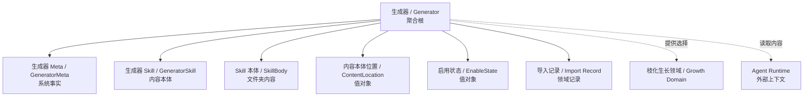
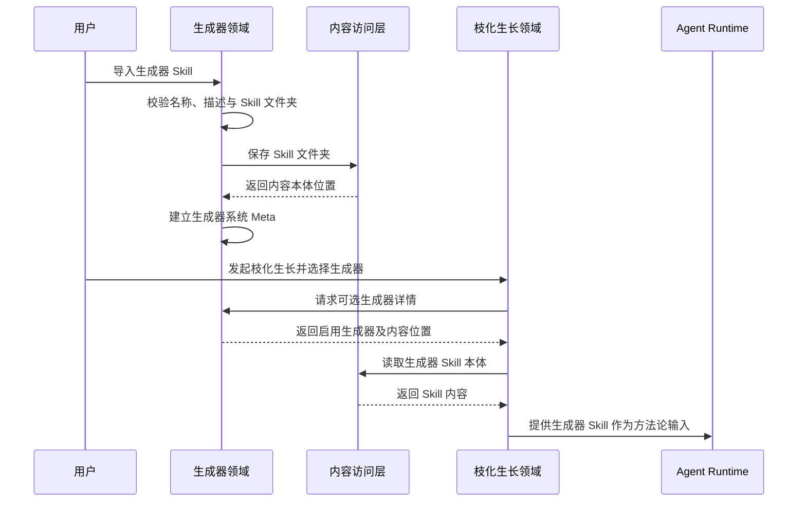
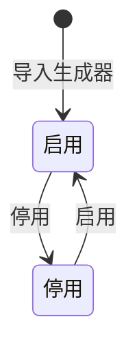

# 生成器领域设计 (Domain Design)

## 1. 顶层共识与统一语言 (Ubiquitous Language)

### 1.1 模块职责边界 (Bounded Context)

- **包含**：导入生成器 Skill 文件夹，维护生成器在内容森林中的系统 meta，记录生成器内容本体位置，查看生成器详情，停用生成器，重新上传生成器，并为枝化生长提供可选择的生成器。
- **不包含**：不执行生成器，不调用 Agent，不封装果实，不解析生成器输出为果实，不要求生成器必须包含内容森林专用 manifest，不要求生成器输出结构化内容，不管理生成器市场、评分、付费、版本分发。

生成器领域的核心职责是把外部内容创作 Skill 作为可管理资源引入内容森林，同时保持 Skill 本体的外部独立性。生成器是内容森林可选择的创作方法论资源，而不是内容森林内部强绑定模板。

### 1.2 核心业务词汇表 (Glossary)

- **生成器 (Generator)**：内容森林中可被选择使用的内容创作方法论资源。
- **生成器 Skill (Generator Skill)**：一个外部可复用的 Skill 文件夹，是生成器的内容本体。
- **Skill 本体 (Skill Body)**：生成器文件夹中的实际内容，可以包含说明文件、示例、附件和其他辅助资料。
- **生成器 Meta (Generator Meta)**：内容森林维护的系统事实，例如名称、描述、内容本体位置和启用状态。Meta 不写入 Skill 本体。
- **生成器策略线索 (Generator Strategy Hint)**：枝化生长在授权范围内从生成器名称、描述和 Skill 正文中推断出的平台、内容形态或方法论线索。它只属于本轮生长策略上下文，不写入生成器 Meta，也不要求生成器提供专用 manifest。
- **生成器媒体能力 (Generator Media Capability)**：生成器 Skill 自身及其可用工具所具备的图片、视频、封面图或素材生成能力。内容森林不要求生成器提前声明该能力，也不把媒体能力写入生成器 Meta。
- **导入 (Import)**：将外部 Skill 文件夹引入内容森林，并建立对应的生成器系统 meta。
- **重新上传 (Re-upload)**：使用新的 Skill 文件夹内容替换当前生成器的内容本体。
- **启用生成器 (Enabled Generator)**：可在枝化生长时被用户选择使用的生成器。
- **停用生成器 (Disabled Generator)**：保留在系统中、可查看，但不可被新的枝化生长选择的生成器。
- **内容本体位置 (Content Location)**：生成器 Skill 文件夹在内容存储中的位置。
- **可选生成器 (Selectable Generator)**：在枝化生长输入中可供用户选择的启用生成器。

## 2. 领域模型与聚合关系 (Domain Models & Aggregates)

生成器领域的聚合根是 **生成器 (Generator)**。它代表一个已被内容森林识别和管理的外部 Skill 资源。

生成器 Skill 本体由文件夹承载，内容森林不强制 Skill 文件夹包含 `generator.json` 或其他专用 manifest。内容森林需要的名称、描述、启用状态和内容本体位置由生成器 Meta 维护，不写入 Skill 本体。

生成器领域不关心生成器执行后的输出形态。生成器只提供内容创作方法论，生成器 Payload 如何被转为果实候选属于枝化生长领域。

枝化生长可以把已选择生成器作为平台与方法论推断的最高优先级线索。例如生成器名称、描述或 Skill 正文清晰指向小红书、B 站、短视频脚本、Reddit 讨论或产品发布方法论时，枝化生长可把这些内容纳入本轮平台推断和探索路线。该推断不改变生成器领域职责：生成器领域不生成探索路线，不判断生长策略，不封装果实，也不把一次推断结果写回生成器系统事实。

## 3. 核心业务约束 (Invariants & Business Rules)

- **Skill 本体必备约束**：每个生成器必须关联一个可读取的 Skill 文件夹。
- **Meta 必备约束**：导入生成器时，用户必须为其补充名称和描述，以便内容森林展示和选择。
- **内容本体位置必备约束**：每个生成器必须关联一个内容本体位置，用于后续读取 Skill 文件夹。
- **Skill 独立性约束**：生成器 Skill 不强制包含内容森林专用 manifest，也不要求为了内容森林修改文件结构。
- **推断非强制约束**：枝化生长可从生成器名称、描述和 Skill 正文推断平台、内容形态或方法论，但不得要求生成器包含 `generator.json`、平台字段或内容森林专用 manifest。推断失败不影响生成器导入、启用或被选择使用。
- **策略归属约束**：生成器线索只能进入生长任务上下文、路线元数据、Trace 或日志，不能成为生成器领域不可验证的系统事实，也不能让生成器领域承担探索路线、突变计划或果实封装职责。
- **Meta 与 Skill 分离约束**：内容森林维护的生成器 Meta 不写入 Skill 本体。
- **输出自由约束**：生成器不被要求输出统一果实结构，也不被要求输出结构化内容。
- **媒体能力自由约束**：生成器可以只输出 Markdown，也可以通过受控工具生成图片、视频或其他媒体产物；生成器领域不得要求 Skill 声明统一媒体能力、专用 manifest 或内容森林专用媒体结构。
- **媒体事实非归属约束**：生成器产生的新媒体只是创作输出产物，不能由生成器领域直接登记为 Media Asset，也不能写入果实挂载关系；正式接管由枝化生长结果封装阶段交给媒体资源能力完成。
- **果实封装边界约束**：生成器不负责交付果实；果实候选、基因标签和生长结果由枝化生长 Skill 负责封装。
- **执行边界约束**：生成器领域不执行生成器，不调用 Agent，不读取底层 LLM。
- **附件允许约束**：生成器 Skill 文件夹允许包含附件、示例和辅助资料。
- **重新上传约束**：第一期不做在线编辑；如需修改生成器内容，只允许重新上传 Skill 文件夹。
- **不可删除约束**：生成器不做硬删除，只允许停用。
- **停用可见约束**：停用后的生成器仍可查看，但不可被新的枝化生长选择。
- **历史不破坏约束**：停用或重新上传生成器不得破坏历史生长任务和历史果实对生成器的追溯关系。
- **选择约束**：只有启用状态的生成器才能作为可选生成器出现在枝化生长输入中。

## 4. 核心用例与行为流转 (Core Behaviors)

### 4.1 用户故事 (User Stories)

- **用户故事 1**：作为内容创作者，我希望导入一个外部生成器 Skill，以便于在内容森林中使用已有内容创作方法论。
  - **验收标准 (AC)**：导入时必须选择 Skill 文件夹，并补充生成器名称和描述。

- **用户故事 2**：作为内容创作者，我希望查看已导入生成器，以便于知道当前有哪些创作方法可用于枝化生长。
  - **验收标准 (AC)**：生成器列表能展示启用和停用的生成器，并能进入详情查看。

- **用户故事 3**：作为内容创作者，我希望在枝化生长前选择一个启用生成器，以便于控制本次内容生成的方法论。
  - **验收标准 (AC)**：只有启用生成器能出现在枝化生长可选列表中。

- **用户故事 4**：作为内容创作者，我希望停用不再使用的生成器，以便于减少枝化生长时的选择干扰。
  - **验收标准 (AC)**：停用后的生成器仍可查看，但不可被新的枝化生长选择。

- **用户故事 5**：作为内容创作者，我希望重新上传生成器内容，以便于替换已有生成器的 Skill 本体。
  - **验收标准 (AC)**：重新上传后，生成器仍作为同一个受管理资源存在；历史生长和历史果实追溯不被破坏。

- **用户故事 6**：作为开发者，我希望生成器保持外部 Skill 独立性，以便于同一个 Skill 脱离内容森林后仍可交给其他 Agent 使用。
  - **验收标准 (AC)**：内容森林不强制生成器 Skill 包含专用 manifest，也不要求生成器输出果实结构。

### 4.2 核心领域事件/命令 (Commands & Events)

- **命令 (Command)**：`ImportGenerator`（导入生成器）
- **命令 (Command)**：`ReuploadGeneratorSkill`（重新上传生成器 Skill）
- **命令 (Command)**：`DisableGenerator`（停用生成器）
- **命令 (Command)**：`EnableGenerator`（启用生成器）
- **事件 (Event)**：`GeneratorImported`（生成器已导入）
- **事件 (Event)**：`GeneratorSkillReuploaded`（生成器 Skill 已重新上传）
- **事件 (Event)**：`GeneratorDisabled`（生成器已停用）
- **事件 (Event)**：`GeneratorEnabled`（生成器已启用）

### 4.3 核心业务流图 (Behavior Flow)

