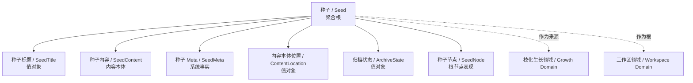
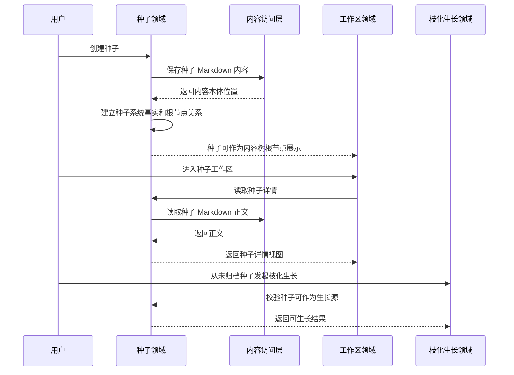
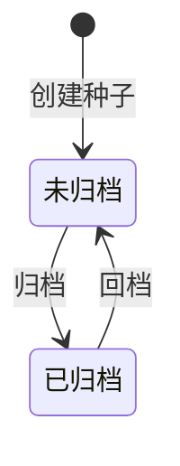

# 种子领域设计 (Domain Design)

## 1. 顶层共识与统一语言 (Ubiquitous Language)

### 1.1 模块职责边界 (Bounded Context)

- **包含**：创建种子，编辑种子标题，编辑种子 Markdown 内容，查看种子详情，作为内容树根节点，作为枝化生长来源节点，归档种子，回档种子，并按未归档/已归档分类查看种子列表。
- **不包含**：不负责种子专属营养库维护，不负责果实管理，不负责枝化生长过程，不负责生长锁判断，不负责发布验证，不负责数据回流，不负责基因汲取，不负责分类、标签或平台方向管理。

种子领域是内容森林最轻量的根节点领域。它只负责让一个灵感以可编辑、可归档、可作为内容树起点的方式存在，不承担后续内容生成和进化过程。

### 1.2 核心业务词汇表 (Glossary)

- **种子 (Seed)**：内容森林中的灵感根节点，承载用户写下的想法、产品、项目或宣传内容。
- **种子标题 (Seed Title)**：用于识别种子的短文本名称。
- **种子内容 (Seed Content)**：种子的 Markdown 内容本体，是用户记录灵感正文的地方。
- **种子 Meta (Seed Meta)**：由系统维护的种子事实信息，例如归档状态、内容本体位置和根节点关系。Meta 不写入 Markdown。
- **内容本体位置 (Content Location)**：种子 Markdown 正文在内容存储中的位置。
- **未归档种子 (Active Seed)**：默认展示在种子库主页面中的种子。
- **已归档种子 (Archived Seed)**：从主种子库隐藏、展示在已归档页面中的种子。
- **回档 (Restore)**：将已归档种子恢复为未归档，使其重新出现在主种子库并允许继续生长。
- **种子节点 (Seed Node)**：种子在内容树中的根节点表现。
- **生长源 (Growth Source)**：可作为枝化生长发起来源的节点。未归档种子可以作为生长源，已归档种子不建议作为新的生长源。

## 2. 领域模型与聚合关系 (Domain Models & Aggregates)

种子领域的聚合根是 **种子 (Seed)**。种子代表一棵内容树的根，它必须具备标题、Markdown 内容本体、内容本体位置和归档状态。

种子内容由 Markdown 承载，种子 Meta 由数据库维护。Markdown 只保存灵感正文，不保存归档状态、根节点关系、系统索引或其他系统事实。种子详情读取时，需要由系统事实定位内容本体，再读取 Markdown 正文。

种子不拥有果实，也不拥有营养库内容。种子只作为根节点和生长源存在。果实由果实领域管理，营养资料由营养库领域管理，生长过程由枝化生长领域管理。

## 3. 核心业务约束 (Invariants & Business Rules)

- **标题必备约束**：每个种子必须有标题。
- **内容本体必备约束**：每个种子必须关联一个可读取的 Markdown 内容本体位置。
- **Meta 与内容分离约束**：种子 Markdown 只保存灵感正文，不保存由数据库维护的 meta 信息。
- **根节点约束**：种子创建后必须成为一棵内容树的根节点，不能挂载到其他父节点下。
- **默认未归档约束**：种子创建后默认处于未归档状态。
- **不可删除约束**：种子不能被硬删除；不再需要展示的种子只能归档。
- **归档展示约束**：已归档种子不在主种子库展示，只在已归档页面展示。
- **归档可查看约束**：已归档种子仍可查看详情和已有内容树。
- **归档生长限制约束**：已归档种子不允许作为新的枝化生长来源；回档后才可继续生长。
- **回档约束**：已归档种子可以随时回档为未归档种子。
- **编辑约束**：种子标题和 Markdown 内容允许编辑；编辑不会改变种子身份、根节点关系或已生成果实的历史关系。
- **状态最小化约束**：种子只维护未归档和已归档两类归档状态，不维护额外业务状态。
- **生长锁边界约束**：种子是否正在生长不属于种子领域，由枝化生长领域基于该种子节点是否被加锁判断。
- **营养库边界约束**：种子专属营养库属于营养库领域；种子领域不维护具体营养内容。
- **扩展克制约束**：第一期种子不管理分类、标签、平台方向或其他筛选属性。

## 4. 核心用例与行为流转 (Core Behaviors)

### 4.1 用户故事 (User Stories)

- **用户故事 1**：作为内容创作者，我希望创建一个种子，以便于把一个想法、产品、项目或宣传内容作为内容树的根。
  - **验收标准 (AC)**：种子创建成功后默认未归档，并能在主种子库中看到。

- **用户故事 2**：作为内容创作者，我希望编辑种子标题和正文，以便于持续补充或修正原始灵感。
  - **验收标准 (AC)**：编辑只改变种子标题或 Markdown 正文，不改变种子身份、根节点关系或历史果实关系。

- **用户故事 3**：作为内容创作者，我希望从未归档种子进入工作区，以便于围绕该种子查看内容树并发起枝化生长。
  - **验收标准 (AC)**：未归档种子可以进入工作区，并可作为枝化生长来源。

- **用户故事 4**：作为内容创作者，我希望归档暂时不用的种子，以便于减少主种子库的展示干扰。
  - **验收标准 (AC)**：归档后种子从主种子库隐藏，并出现在已归档页面。

- **用户故事 5**：作为内容创作者，我希望查看已归档种子的详情和内容树，以便于回顾历史内容资产。
  - **验收标准 (AC)**：已归档种子可以查看详情和已有内容树，但不能作为新的枝化生长来源。

- **用户故事 6**：作为内容创作者，我希望回档已归档种子，以便于重新围绕该种子继续内容生长。
  - **验收标准 (AC)**：回档后种子重新出现在主种子库，并恢复作为枝化生长来源的能力。

### 4.2 核心领域事件/命令 (Commands & Events)

- **命令 (Command)**：`CreateSeed`（创建种子）
- **命令 (Command)**：`EditSeedTitle`（编辑种子标题）
- **命令 (Command)**：`EditSeedContent`（编辑种子内容）
- **命令 (Command)**：`ArchiveSeed`（归档种子）
- **命令 (Command)**：`RestoreSeed`（回档种子）
- **事件 (Event)**：`SeedCreated`（种子已创建）
- **事件 (Event)**：`SeedTitleEdited`（种子标题已编辑）
- **事件 (Event)**：`SeedContentEdited`（种子内容已编辑）
- **事件 (Event)**：`SeedArchived`（种子已归档）
- **事件 (Event)**：`SeedRestored`（种子已回档）

### 4.3 核心业务流图 (Behavior Flow)

