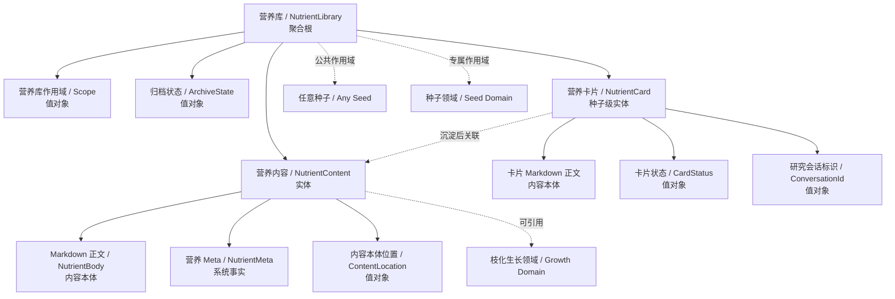
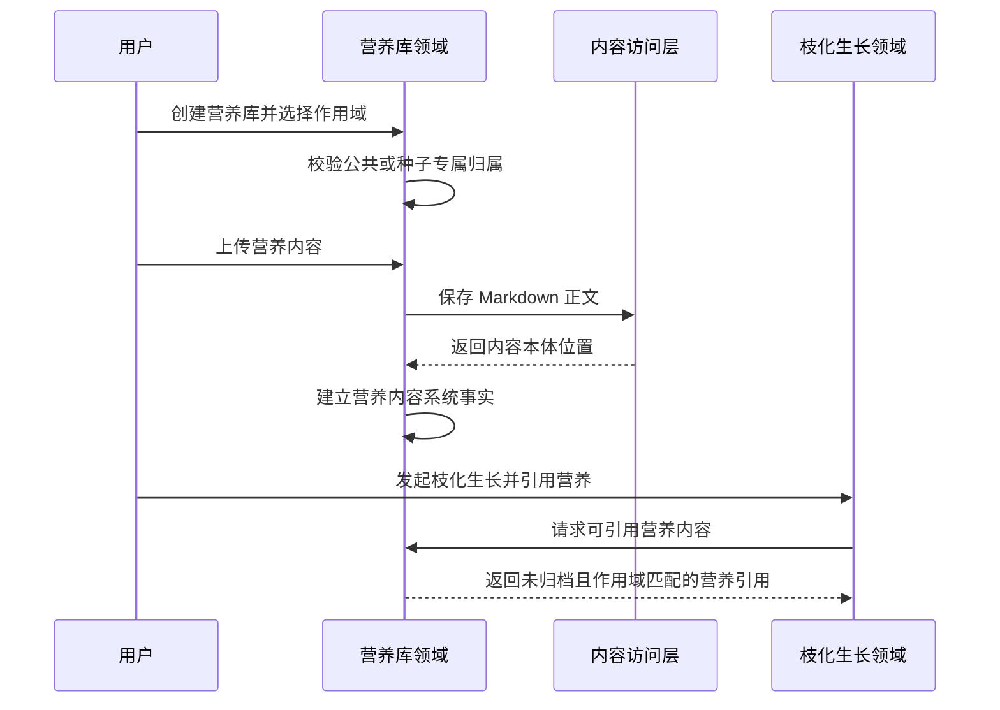
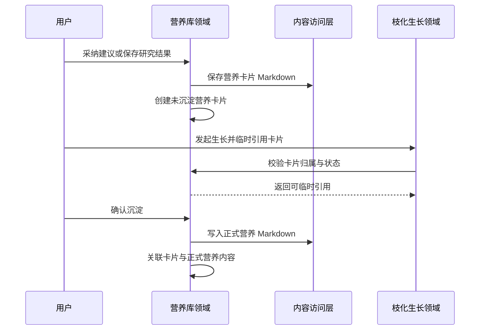
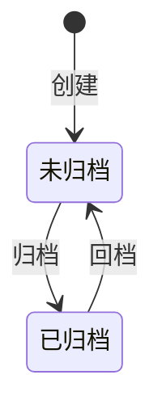
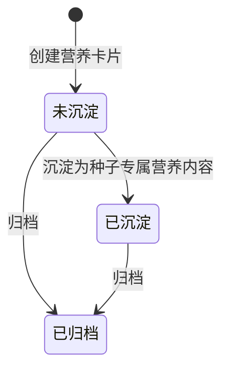

# 营养库领域设计 (Domain Design)

## 1. 顶层共识与统一语言 (Ubiquitous Language)

### 1.1 模块职责边界 (Bounded Context)

- **包含**：创建营养库，区分公共营养库与种子专属营养库，上传营养内容，编辑营养内容，归档营养内容，回档营养内容，查看营养库与营养内容，维护种子工作台中的营养内容生命周期，设置默认带入，绑定营养研究会话，并为枝化生长提供可引用或临时引用的营养资料。
- **不包含**：不负责 Agent 检索策略，不负责向量知识库，不负责自动网页采集，不负责判断营养内容是否有效，不负责枝化生长，不负责基因汲取分析，不负责基因库维护，不负责跨用户共享市场，不直接把系统 meta 写入 Markdown。

营养库领域是内容森林中的资料组织上下文。它负责把爆款案例、平台指南、产品资料、话术、KOL 分析等外部或人工整理资料组织为可被枝化生长引用的营养内容。由内容森林自身选择、淘汰、发布验证和数据回流沉淀出来的成功基因与失败教训，属于基因库领域，不写入营养库。

### 1.2 核心业务词汇表 (Glossary)

- **营养库 (Nutrient Library)**：用于组织营养内容的资料容器，可以是公共作用域，也可以是种子专属作用域。
- **公共营养库 (Public Nutrient Library)**：可被任意种子在枝化生长时引用的营养库，例如小红书平台营养库、推特平台营养库。
- **种子专属营养库 (Seed-scoped Nutrient Library)**：只服务于某个种子的营养库，例如某个项目、产品或脚本种子的专属资料库。
- **营养内容 (Nutrient Content)**：Markdown 格式的资料正文，是 Agent 在内容创作时可参考的素材。
- **营养 Meta (Nutrient Meta)**：由系统维护的营养内容事实信息，例如归属营养库、归档状态和内容本体位置。Meta 不写入 Markdown。
- **营养库作用域 (Nutrient Library Scope)**：营养库的可用范围，分为公共和种子专属。
- **内容本体位置 (Content Location)**：营养内容 Markdown 正文在内容存储中的位置。
- **营养引用 (Nutrient Reference)**：枝化生长时被用户选择或系统传入的营养内容参考。
- **工作台营养内容 (Workbench Nutrient Content)**：归属于某个种子的营养内容工作台形态，用于承接用户投喂、Agent 研究或缺口提醒产生的资料。它的正文仍是 Markdown，系统事实由数据库维护。
- **草稿营养内容 (Draft Nutrient Content)**：仍在研究、整理或验证中的工作台营养内容，可以作为本次枝化生长的临时引用，也可以被删除，但不是正式可复用营养内容。
- **已沉淀营养内容 (Settled Nutrient Content)**：已经被用户确认并写入当前种子专属营养库的营养内容。它保留与正式营养内容的关联。
- **已归档营养内容 (Archived Workbench Nutrient Content)**：保留历史但不可引用的工作台营养内容。
- **默认带入 (Default For Growth)**：已沉淀营养内容上的默认带入标记。它表示工作区在每次枝化生长前默认选中该营养，但用户可以移除；它不是后端强制引用规则。
- **营养内容会话 (Nutrient Content Conversation)**：工作台营养内容与研究对话之间的绑定关系，用于让用户围绕同一份资料持续追问、补充和优化。
- **已归档营养内容 (Archived Nutrient Content)**：不再默认展示或引用的营养内容，可查看和回档，但不可直接用于枝化生长引用。
- **已归档营养库 (Archived Nutrient Library)**：不再默认展示或引用的营养库，可查看和回档，但其中内容不可直接用于枝化生长引用。

## 2. 领域模型与聚合关系 (Domain Models & Aggregates)

营养库领域的聚合根是 **营养库 (NutrientLibrary)**。营养库是资料容器，负责组织一组营养内容，并通过作用域决定其可被哪些种子引用。

营养内容由 Markdown 承载，营养 Meta 由数据库维护。Markdown 只保存资料正文，不保存归属关系、归档状态、引用状态或系统索引。

公共营养库和种子专属营养库不是两套不同模型，而是营养库的两种作用域。公共营养库可被任意种子引用；种子专属营养库必须归属于某个种子，且只服务于该种子。

工作台营养内容不是公共营养库的一部分，它始终归属于一个具体种子。草稿态用于快速承接候选资料和研究过程；沉淀后，系统将其写入当前种子专属营养库中的正式营养内容，并保留工作台形态与正式营养内容之间的关联。这样既能让资料在验证前被临时使用，又能避免 Agent 研究结果直接污染正式营养库。

## 3. 核心业务约束 (Invariants & Business Rules)

- **营养库作用域约束**：每个营养库必须明确属于公共作用域或种子专属作用域。
- **专属归属约束**：种子专属营养库必须归属于一个明确种子；打开种子营养工作台时，系统可以自动确保一个默认种子专属营养库存在，用于降低用户沉淀资料前的配置成本。
- **公共引用约束**：公共营养库可被任意种子的枝化生长引用。
- **专属引用约束**：种子专属营养库只允许被其归属种子的枝化生长引用。
- **内容本体必备约束**：每条营养内容必须关联一个可读取的 Markdown 内容本体位置。
- **Meta 与内容分离约束**：营养内容 Markdown 只保存资料正文，不保存由数据库维护的 meta 信息。
- **编辑约束**：营养内容允许编辑；编辑只改变 Markdown 正文，不改变营养内容身份和所属营养库。
- **不可删除约束**：营养库和已沉淀营养内容不做硬删除，只允许归档；草稿态工作台营养内容允许删除。
- **归档不可引用约束**：已归档营养库或已归档营养内容不可被新的枝化生长引用。
- **工作台归属约束**：工作台营养内容必须归属于一个明确种子，不允许保存到公共营养库。
- **生命周期状态约束**：工作台营养内容只允许处于草稿、已沉淀、已归档三类状态。
- **草稿临时引用约束**：草稿营养内容可以作为当前种子本次枝化生长的临时资料引用，但不能伪装成正式营养内容。
- **草稿删除约束**：只有草稿态工作台营养内容允许硬删除；已沉淀和已归档内容不允许硬删除。
- **沉淀约束**：草稿营养内容沉淀时，只能写入当前种子的种子专属营养库；如果用户没有指定目标库，系统使用默认种子专属营养库。
- **已归档工作台内容不可引用约束**：已归档工作台营养内容不可作为临时引用，也不可通过已沉淀关联进入可引用营养范围。
- **默认带入约束**：只有已沉淀营养内容可以设置为默认带入；默认带入只影响前端默认选中，不代表后端强制引用。
- **会话绑定约束**：工作台营养内容可以绑定一个研究会话标识，但具体 Agent 对话能力不属于营养库领域本身。
- **归档可查看约束**：已归档营养库和已归档营养内容仍可查看，并允许回档。
- **回档约束**：已归档营养库或营养内容回档后，才可重新进入可引用范围。
- **基因库边界约束**：基因汲取确认后的成功基因和失败教训保存到基因库，不保存为营养内容。
- **检索克制约束**：第一期营养库不承担复杂知识库、自动检索策略或向量语义检索，只提供基础组织、查看和引用能力。
- **Agent 边界约束**：营养库领域不调用 Agent，也不决定营养内容在生成时如何被使用。

## 4. 核心用例与行为流转 (Core Behaviors)

### 4.1 用户故事 (User Stories)

- **用户故事 1**：作为内容创作者，我希望创建一个公共营养库，以便于把平台指南、爆款案例和通用创作方法提供给任意种子使用。
  - **验收标准 (AC)**：公共营养库创建后，可在任意种子的枝化生长中被选择引用。

- **用户故事 2**：作为内容创作者，我希望创建一个种子专属营养库，以便于为某个特定种子维护专属资料。
  - **验收标准 (AC)**：种子专属营养库必须归属于一个种子，且只能被该种子的枝化生长引用。

- **用户故事 3**：作为内容创作者，我希望上传营养内容，以便于让 Agent 在枝化生长时参考这些资料。
  - **验收标准 (AC)**：营养内容上传后必须属于某个营养库，并拥有可读取的 Markdown 内容本体。

- **用户故事 4**：作为内容创作者，我希望编辑营养内容正文，以便于持续修正或补充资料。
  - **验收标准 (AC)**：编辑只改变 Markdown 正文，不改变营养内容归属和系统事实。

- **用户故事 5**：作为内容创作者，我希望归档暂时不用的营养内容，以便于减少枝化生长引用时的干扰。
  - **验收标准 (AC)**：已归档营养内容不出现在新的枝化生长引用选择中，但仍可查看和回档。

- **用户故事 6**：作为内容创作者，我希望把 Agent 研究或缺口建议先保存为草稿营养内容，以便于在不污染正式营养库的情况下快速试用资料。
  - **验收标准 (AC)**：草稿营养内容归属于当前种子，可以作为本次枝化生长临时引用，也可以被用户删除，但不会出现在正式可引用营养内容中。

- **用户故事 7**：作为内容创作者，我希望把确认有价值的草稿营养内容沉淀为种子专属营养内容，以便于后续稳定复用。
  - **验收标准 (AC)**：沉淀后工作台营养内容状态变为已沉淀，并关联一条当前种子专属营养内容。

- **用户故事 8**：作为内容创作者，我希望把高频有用的已沉淀营养内容设置为默认带入，以便于每次枝化生长默认带上它。
  - **验收标准 (AC)**：只有已沉淀营养内容可以设置为默认带入；前端默认带入但用户可以移除。

### 4.2 核心领域事件/命令 (Commands & Events)

- **命令 (Command)**：`CreateNutrientLibrary`（创建营养库）
- **命令 (Command)**：`ArchiveNutrientLibrary`（归档营养库）
- **命令 (Command)**：`RestoreNutrientLibrary`（回档营养库）
- **命令 (Command)**：`AddNutrientContent`（新增营养内容）
- **命令 (Command)**：`EditNutrientContent`（编辑营养内容）
- **命令 (Command)**：`ArchiveNutrientContent`（归档营养内容）
- **命令 (Command)**：`RestoreNutrientContent`（回档营养内容）
- **命令 (Command)**：`CreateNutrientCard`（创建营养卡片）
- **命令 (Command)**：`EditNutrientCard`（编辑营养卡片）
- **命令 (Command)**：`SettleNutrientCard`（沉淀营养卡片）
- **命令 (Command)**：`ArchiveNutrientCard`（归档营养卡片）
- **命令 (Command)**：`SetDefaultForGrowth`（设置常驻营养）
- **命令 (Command)**：`ClearDefaultForGrowth`（取消常驻营养）
- **命令 (Command)**：`BindNutrientCardConversation`（绑定营养卡片会话）
- **事件 (Event)**：`NutrientLibraryCreated`（营养库已创建）
- **事件 (Event)**：`NutrientLibraryArchived`（营养库已归档）
- **事件 (Event)**：`NutrientLibraryRestored`（营养库已回档）
- **事件 (Event)**：`NutrientContentAdded`（营养内容已新增）
- **事件 (Event)**：`NutrientContentEdited`（营养内容已编辑）
- **事件 (Event)**：`NutrientContentArchived`（营养内容已归档）
- **事件 (Event)**：`NutrientContentRestored`（营养内容已回档）
- **事件 (Event)**：`NutrientCardCreated`（营养卡片已创建）
- **事件 (Event)**：`NutrientCardSettled`（营养卡片已沉淀）
- **事件 (Event)**：`NutrientCardArchived`（营养卡片已归档）

### 4.3 核心业务流图 (Behavior Flow)

