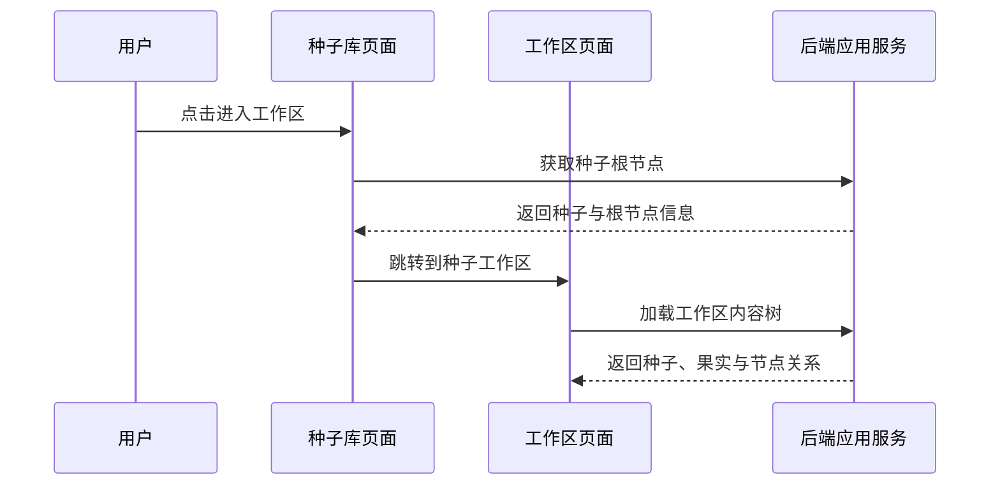
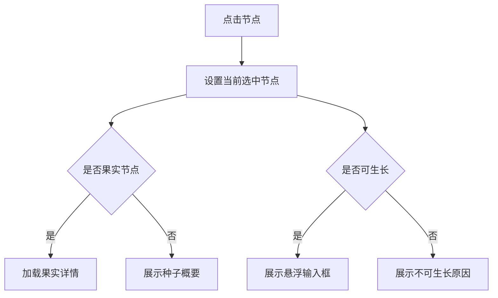
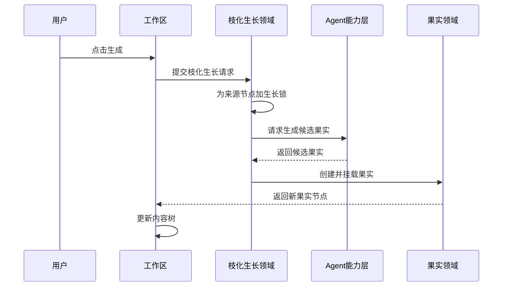

# 内容森林工作区业务设计文档

## 1. 业务定位

内容森林工作区是围绕单个种子组织内容进化闭环的操作空间。它把种子、果实、枝化生长、物竞天择、发布验证、数据回流和基因库经验组织到一棵可操作的内容树中。

工作区本身不是独立领域模块。它更像业务聚合视图和前端操作容器：从多个领域读取系统事实，组合成用户可理解、可操作的工作区状态。

第一期工作区业务目标：

- 从种子进入一个独立工作区。
- 加载该种子的内容树。
- 支持查看节点详情。
- 支持从节点发起枝化生长。
- 支持对果实执行物竞天择操作。
- 支持从果实进入发布验证和数据回流。
- 支持引用营养库和基因库作为生长上下文。

## 2. 业务边界

### 2.1 工作区包含

- 根据种子加载内容树。
- 展示种子节点和果实节点。
- 展示节点综合状态。
- 管理当前选中节点。
- 调用果实详情能力。
- 调用枝化生长能力。
- 调用果实选择、淘汰、恢复能力。
- 调用发布验证和数据回流入口。
- 处理工作区只读状态。
- 处理生成中、失败、重试等用户可感知状态。

### 2.2 工作区不包含

- 不维护种子正文。
- 不维护果实正文。
- 不直接创建果实。
- 不直接执行 Agent。
- 不直接读写 Markdown 文件。
- 不直接写数据库。
- 不定义果实选择状态。
- 不定义发布器、监控器、基因库等领域规则。
- 不允许用户手动改变内容树父子关系。

## 3. 核心业务对象

工作区主要消费以下对象：

- **种子**：内容树根节点。
- **果实**：内容树中的内容节点。
- **内容树节点**：工作区展示单位，引用种子或果实。
- **节点关系**：种子与果实、果实与果实之间的父子关系。
- **生长锁**：表示某个节点正在枝化生长。
- **生长任务**：一次枝化生长的业务批次。
- **果实详情**：果实正文、状态、基因标签和相关信息。
- **发布记录**：已选择果实的发布验证记录。
- **数据快照**：发布记录下的数据回流记录。
- **营养引用**：本次生长引用的营养资料。
- **基因引用**：本次生长引用的种子级基因库经验。

## 4. 核心业务流程

### 4.1 进入工作区

用户从种子卡片或种子详情进入工作区。

业务规则：

- 必须从明确种子进入工作区。
- 已归档种子可以进入工作区，但工作区应进入只读语义。
- 工作区不得跨种子加载内容树。

### 4.2 加载内容树

进入工作区后，前端调用后端能力加载该种子的内容树。

加载结果应支持构建：

- 根种子节点。
- 所有果实节点。
- 父子关系。
- 节点选择状态。
- 节点生长状态。
- 发布和反馈标记。

工作区只消费后端返回的系统事实，不在前端推断真实业务状态。

### 4.3 点击节点

用户点击任意节点后：

- 该节点成为当前选中节点。
- 工作区高亮节点与相关路径。
- 若节点是果实，调用果实详情能力获取完整内容。
- 若节点可生长，展示悬浮输入框。
- 若节点不可生长，展示原因提示。

### 4.4 果实详情与物竞天择

果实卡片调用果实领域能力获取详情。

果实卡片第一层支持：

- 查看果实 Markdown 正文。
- 查看基因标签。
- 查看当前选择状态。
- 执行选择。
- 执行淘汰。
- 恢复为候选。

业务规则：

- 果实选择状态互斥。
- 候选果实可以被选择或淘汰。
- 已选择果实可以恢复候选或淘汰。
- 已淘汰果实可以恢复候选或重新选择。
- 果实不被删除，淘汰只改变状态和展示。

工作区执行操作后，应刷新当前节点状态和树上标记。

### 4.5 发布验证入口

只有已选择果实可以进入发布验证。

果实卡片中的发布器按钮用于创建或查看发布记录。第一期发布器实现为人为发布：

- 用户在外部平台手动发布。
- 回到内容森林记录发布信息。
- 发布记录挂载到对应果实。

工作区不实现自动发布能力，只承载发布验证入口和状态展示。

### 4.6 数据反馈入口

发布记录创建后，用户可以通过监控器入口录入数据反馈。第一期监控器实现为人为监控：

- 用户手动查看外部平台表现。
- 回到内容森林录入反馈快照。
- 一个发布记录只能挂载一个监控器。
- 一个发布记录可以有多次反馈快照。

工作区只展示果实是否已有反馈，不计算内容成功或失败。

### 4.7 发起枝化生长

用户选中可生长节点后，通过悬浮输入框发起枝化生长。

提交内容包括：

- 来源节点。
- 用户本次输入。
- 生成器选择。
- 果实数量。
- 引用的营养内容。
- 引用的基因经验。
- 枝化生成详情参数。

业务规则：

- 来源节点必须是种子或果实。
- 生成器必须选择。
- 果实数量必须填写，默认 3。
- 当前来源节点被加生长锁后，不能再次发起生长。
- 其他未加锁节点仍可继续发起生长。
- 已归档种子的工作区不允许发起新的枝化生长。

### 4.8 生成失败与重试

若本次枝化生成一个果实都没有生成成功，则认为该次生长失败。

失败处理：

- 来源节点解除生长锁。
- 节点显示失败提示。
- 用户点击该节点时，悬浮输入框恢复上次失败输入和参数。
- 用户可调整后重试。

若部分果实已经生成成功，不回滚已生成果实。

## 5. @ 引用业务规则

悬浮输入框中的 `@` 引用用于为本次枝化生长添加上下文。

第一期支持：

- 引用营养库或营养内容。
- 引用当前种子的基因库经验。

业务规则：

- 已归档营养内容不可引用。
- 只能引用当前种子允许访问的资源。
- 基因库引用限定在当前种子的种子级基因库。
- 引用内容作为本次生长上下文，不改变原资源。
- 用户在详情栏中可以查看和移除已引用资源。

## 6. 工作区只读规则

当种子已归档时：

- 可以进入工作区。
- 可以查看种子、果实、发布记录和反馈记录。
- 不允许发起新的枝化生长。
- 不建议执行会改变内容树的操作。
- 可以保留查看详情、复制内容、回顾历史的能力。

如用户需要继续生长，应先回档种子。

## 7. 状态协作

工作区展示的是多个领域状态的组合：

- 种子归档状态来自种子领域。
- 果实选择状态来自果实领域。
- 生长中状态来自枝化生长领域。
- 发布状态来自发布验证领域。
- 反馈状态来自数据回流领域。
- 基因提醒来自基因汲取领域。

工作区不拥有这些状态，只负责聚合展示。

## 8. 接口协作边界

工作区需要后端提供应用能力，而不是直接访问底层数据。

建议能力分组：

- **加载工作区树**：按种子返回内容树视图。
- **读取节点详情**：读取种子或果实详情。
- **执行物竞天择操作**：选择、淘汰、恢复果实。
- **发起枝化生长**：提交来源节点、生成器、数量、引用和参数。
- **查询生长状态**：获取生成中、完成、失败等状态。
- **读取引用资源**：搜索或列出可引用营养和基因。
- **发布验证操作**：创建或查看发布记录。
- **数据回流操作**：创建或查看反馈快照。

前端不应绕过后端应用服务直接读取文件、数据库或调用 Agent。

## 9. 第一期开工建议

建议按以下顺序实现：

1. 工作区路由承接与基础布局。
2. 内容树加载接口对接。
3. 树布局与拖拽浏览。
4. 节点点击与果实详情抽屉。
5. 果实物竞天择操作。
6. 悬浮输入框基础生成能力。
7. `@` 引用营养与基因。
8. 生长中动效、失败恢复和重试。
9. 发布器与监控器入口。

该顺序可以先把“看见树”和“从节点继续生长”跑通，再补充发布反馈与更高级体验。

