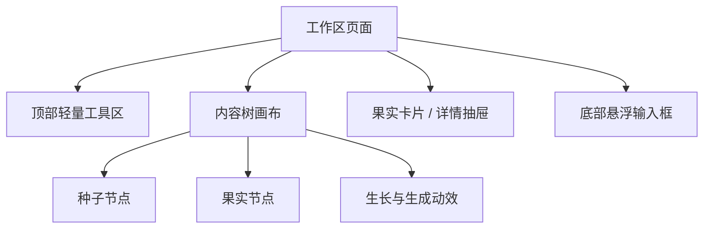

# 内容森林工作区前端设计文档

## 1. 设计目标

内容森林工作区是用户围绕一个种子培育内容树的核心界面。它不是普通后台详情页，而是一张可浏览、可选择、可继续生长的内容树画布。

第一期工作区前端目标：

- 从种子卡片或种子详情进入工作区。
- 加载种子与所有果实，构建内容树。
- 用“从种子向上生长”的动效表达树加载过程。
- 支持拖拽浏览、节点点击、果实详情查看。
- 支持从任意可生长节点唤起悬浮输入框。
- 支持通过果实卡片执行物竞天择、发布验证和数据反馈入口。
- 支持通过 `@` 引用营养库和基因库资源。

## 2. 页面入口

工作区从种子库进入。用户在种子卡片或种子详情中点击进入工作区后，前端跳转到该种子的工作区页面。

现有一期实现中，工作区路由已经承接：

```text
/seeds/{seedId}/workspace
```

若种子已归档，工作区可以进入只读模式。只读模式下允许查看内容树和节点详情，但不建议允许发起新的枝化生长。

## 3. 页面整体结构

工作区由四个主要区域组成：

- **内容树画布**：承载种子节点、果实节点、连线、生长动效和生成状态。
- **果实卡片/节点详情层**：点击节点后展示详情，第一期建议使用右侧抽屉为主。
- **悬浮输入框**：点击可生长节点后在底部出现，用于发起枝化生长。
- **顶部轻量工具区**：承载返回种子库、当前种子标题、视图控制、只读状态提示等。



## 4. 内容树画布设计

### 4.1 树的空间方向

第一期建议采用 **种子在底部偏中，果实向上枝化扩散** 的布局。

原因：

- 符合“种子向上生长为树”的核心隐喻。
- 加载动效可以从底部种子节点开始，向上生成枝干与果实。
- 后续多代果实更容易形成层级感。

### 4.2 加载动效

进入工作区后，前端先展示种子节点，然后模拟内容树逐步生长：

1. 种子节点在画布底部出现。
2. 主枝从种子节点向上延展。
3. 果实节点按层级逐批出现。
4. 节点状态、发布标记、反馈标记逐步补全。
5. 加载完成后进入可交互状态。

该动效用于表达“树正在从种子中长出来”，而不是普通骨架屏。

### 4.3 画布交互

画布应支持：

- 鼠标或触控板拖拽浏览。
- 缩放视图。
- 点击节点选中。
- 点击空白区域取消选择。
- 自动聚焦根种子或当前选中节点。
- 在生成新果实时，将视图轻微引导到新生长区域。

第一期不做：

- 自由白板绘图。
- 用户手动改变节点父子关系。
- 跨种子树合并。
- 多人实时协同光标。

## 5. 节点设计

### 5.1 节点类型

第一期节点类型只需要：

- **种子节点**：内容树根节点。
- **果实节点**：枝化生长生成的内容节点。

### 5.2 节点状态

节点视觉状态建议至少覆盖：

- **候选果实**：默认状态，表示生成后暂未选择或淘汰。
- **已选择果实**：用户认为值得发布验证或继续投入。
- **已淘汰果实**：保留在树上但弱化展示。
- **生长中节点**：当前节点被生长锁锁定，正在生成子果实。
- **生成失败提示**：最近一次从该节点生长失败，可提示用户重试。
- **已发布标记**：该果实存在发布记录。
- **有反馈标记**：该果实存在数据快照或反馈记录。
- **只读状态**：归档种子的工作区节点不可发起生长。

节点状态应以图标、颜色、微动效和透明度组合表达，不建议依赖大段文字。

### 5.3 节点信息层级

节点本身只展示轻量信息：

- 标题或摘要。
- 状态标记。
- 是否有发布/反馈。
- 是否正在生长。

完整内容、基因标签、发布记录、数据反馈等信息放入果实卡片或详情抽屉。

## 6. 果实卡片设计

### 6.1 展示方式

第一期建议采用：

- **右侧抽屉**：承载完整果实详情、物竞天择、发布验证、数据反馈、更多信息。
- **节点附近轻量浮层**：可作为未来增强，用于快速预览摘要。

右侧抽屉更适合第一期，因为果实详情后续会承载较多业务动作。

### 6.2 第一层信息

果实卡片第一层应优先展示：

- 果实标题或摘要。
- 当前选择状态。
- 果实正文 Markdown 渲染。
- 基因标签。
- 物竞天择操作：选择、淘汰、恢复。
- 发布器入口。
- 监控器/数据反馈入口。

物竞天择操作应位于第一层，不能藏在更多菜单中。

### 6.3 更多信息

更多按钮中可以查看：

- 发布记录列表。
- 数据反馈快照历史。
- 生成来源。
- 参考营养。
- 参考基因。
- 生成器信息。

第一期可以先用分区或 Tab 表达，不需要做复杂报表。

## 7. 悬浮输入框设计

### 7.1 出现时机

用户点击一个可生长的种子节点或果实节点后，底部出现悬浮输入框。

如果工作区只读、节点被生长锁锁定，或节点不允许生长，则输入框进入禁用或提示状态。

### 7.2 核心组成

悬浮输入框包含：

- **主输入框**：用户输入本次枝化生长想法，可为空。
- **@ 引用能力**：支持引用营养库和基因库内容。
- **生成器选项**：必须选择。
- **果实数量选项**：默认 3，必须填写。
- **枝化生成详情栏**：展开后配置更多生成细节。
- **生成按钮**：提交枝化生长。

### 7.3 @ 引用交互

用户输入 `@` 时出现资源提示面板，类似 Codex 输入框中的 `@` 命令。

第一期支持：

- `@营养`：引用营养库或营养内容。
- `@基因`：引用当前种子的基因库经验。

资源提示面板应支持：

- 键盘上下选择。
- 回车确认引用。
- 鼠标点击选择。
- 已引用资源在输入框或详情栏中可见。
- 已引用资源可移除。

第一期按标题或摘要匹配即可，不做复杂语义检索。

### 7.4 枝化生成详情栏

详情栏用于承载更完整的生成配置：

- 已引用营养列表。
- 已引用基因列表。
- 参考营养库列表。
- 参考基因库经验列表。
- 突变概率。
- 后续可扩展杂交、高级筛选、目标平台、生成风格等能力。

详情栏默认折叠，避免打扰高频输入。

### 7.5 草稿与失败恢复

建议每个节点维护独立输入草稿。

- 用户切换节点后，再切回原节点，应恢复该节点草稿。
- 若某次枝化生长失败，点击该节点时应恢复最近失败任务的输入内容和参数。
- 成功生成后，可清空该节点本次输入草稿，但保留历史任务记录。

## 8. 生成过程动效

用户点击生成后：

1. 当前来源节点进入生长中状态。
2. 来源节点周围出现发芽、枝条延展或能量流动动效。
3. 若请求生成多个果实，可以逐个出现生成中的果实占位。
4. 果实生成成功后，占位转为正式果实节点。
5. 若全部失败，来源节点显示失败提示，允许用户重试。

动效风格建议：

- 保持暗色工作台基调。
- 使用有机线条、生长轨迹、微光粒子表达树的生长。
- 避免纯装饰性大面积渐变或炫光。
- 动效要服务状态理解，而不是遮挡内容。

## 9. 视觉方向

整体视觉可以大胆，但仍需保持专业创作工具的可用性。

建议方向：

> 暗色工作台 + 有机生长动效 + 精密节点信息层。

关键词：

- 内容树像活体系统，而不是静态流程图。
- 果实节点有轻微生命感，但信息表达清晰。
- 输入框像创作指令台，而不是普通评论框。
- 右侧详情像研究样本卡，而不是传统后台表单。

不建议：

- 做成营销首页。
- 大量说明性文案占据界面。
- 节点文字过多导致树不可读。
- 用纯炫技动效牺牲操作效率。

## 10. 前端边界

前端负责：

- 工作区交互状态。
- 画布拖拽与缩放。
- 加载、生成中、失败等动效表达。
- 节点选中与详情展示。
- 输入框草稿和 `@` 引用交互。
- 调用后端应用能力。

前端不负责：

- 判断领域事实。
- 直接读取本地文件。
- 直接调用 LLM。
- 创建果实系统事实。
- 写入基因库或营养库。
- 绕过后端修改发布记录或反馈快照。

