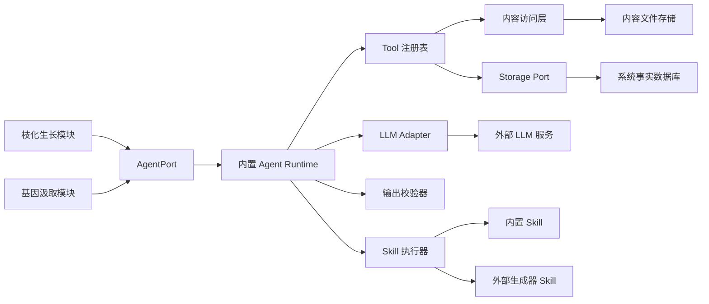
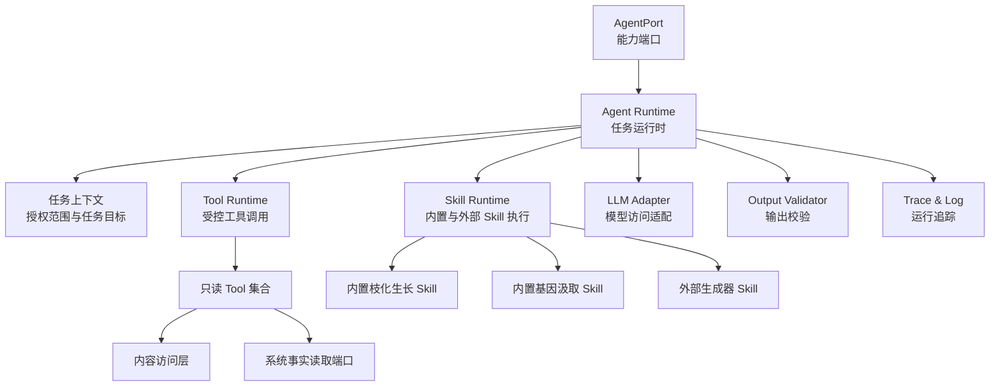
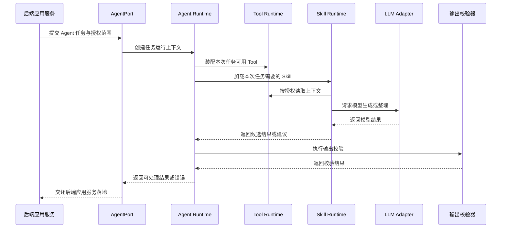
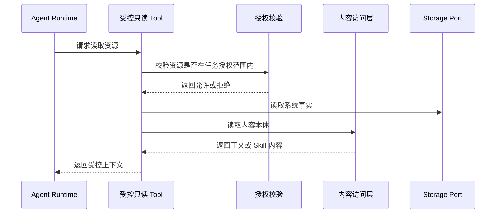
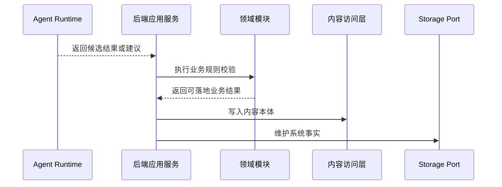
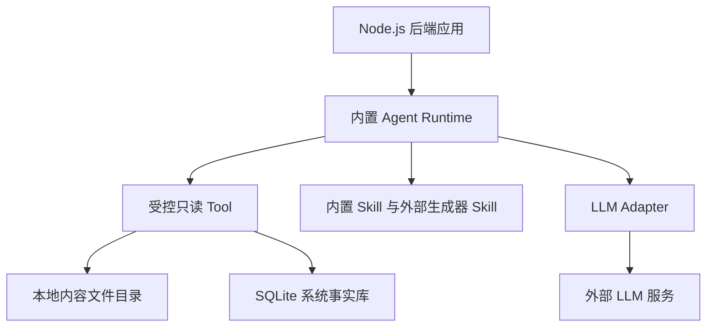

# 内容森林Agent架构设计文档

## 1. 架构引言与业务上下文 (Introduction & Context)

内容森林 Agent 是内容森林第一期的智能生产力层。它不是通用 Agent 平台，也不是独立业务领域，而是服务于“灵感种子 → 枝化生长 → 物竞天择 → 发布验证 → 数据回流 → 迭代进化”闭环的轻量 Agent Runtime。

第一期 Agent 的核心目标是：在保持系统边界清晰的前提下，让内容森林具备可控的 AI 内容生成与经验汲取能力。Agent 负责理解任务、调用受控 Tool、执行内置 Skill、调用外部生成器 Skill、整理 LLM 输出，并将候选结果或建议交还后端应用服务。后端应用服务负责校验、保存、状态流转和领域事件落地。

本系统 Agent 层的核心架构原则是：

- **AgentPort 解耦**：业务模块只依赖 AgentPort，不直接绑定具体 Agent 框架、模型供应商或第三方 Agent 产品。
- **任务授权优先**：Agent 只能访问本次任务授权范围内的资源，不能扫描全局内容，也不能直接读取本地文件路径。
- **Tool 受控读取**：文件内容读取由 Agent 通过 Tool 自主完成，但 Tool 必须由内容森林封装并受权限约束。
- **第一期 Tool 只读**：Agent 可以读取种子、果实、生成器、营养、基因、发布和反馈上下文，但不能写文件、写数据库或修改状态。
- **联网数据受控获取**：联网搜索、网页抓取、浏览器观察和平台专项数据读取必须通过内容森林封装的 Provider Router，不允许 Skill 直接绑定外部搜索服务、浏览器命令或平台爬取实现。
- **Skill 边界清晰**：内置 Skill 是 Agent 系统能力，外部生成器 Skill 是用户上传的方法论资源。
- **输出不直接落地**：Agent 输出只是候选结果或建议，必须由后端应用服务校验后才能进入内容森林系统事实。
- **算法策略可观测**：内置 Skill 应记录内容进化算法版本、策略编排、证据组织、生成和校验阶段，便于后续持续优化算法模型。

### 1.1 系统上下文 (System Context)

Agent 层位于业务模块、内容访问层、存储系统、外部 LLM 服务之间。它向上通过 AgentPort 提供内容森林所需的智能能力，向下通过受控 Tool 读取内容上下文，并通过 LLM Adapter 调用模型能力。

系统对象关系如下：

- **业务模块**：通过 AgentPort 请求枝化生长或基因汲取，不直接调用 LLM、不直接控制 Agent Runtime。
- **AgentPort**：定义内容森林需要的 Agent 能力边界，屏蔽具体 Runtime 实现。
- **内置 Agent Runtime**：第一期默认实现，负责任务运行、Tool 调用、Skill 执行、LLM 调用、输出整理和错误返回。
- **Tool 注册表**：向 Agent 暴露内容森林允许调用的受控读取能力。
- **内容访问层**：负责读取 Markdown、Skill 文件夹等内容本体，不向 Agent 暴露真实绝对路径。
- **存储系统**：负责系统事实读取，Agent 不拥有数据库写权限。
- **LLM 服务**：只通过 LLM Adapter 访问，业务模块不得直接调用模型 SDK。

### 1.2 场景视图 (+1 View / Scenarios)

#### 场景一：Agent 支撑枝化生长能力

业务模块向 AgentPort 发起枝化生长请求，并提供本次任务授权范围。Agent Runtime 在授权范围内通过 Tool 读取种子或果实内容、生成器 Skill、营养资料和基因库经验，再通过内置枝化生长 Skill 将上下文整理为证据卡片和生长策略，编排生成器 Skill 与 LLM 能力，最终返回候选果实、候选内容和基因标签建议。Agent 不创建果实，不写内容文件，不维护内容树关系。

第二期枝化生长调用会额外携带本轮生长简报、搜索模式、突变激进程度和 attempt 级突变计划。AgentPort 只接收这些由业务模块编排出的任务语义，不负责维护长期简报或系统事实。Agent 执行过程中可以通过专门的用户进度事件上报生成路径子步骤，后端应用服务负责把这些用户进度事件汇总到任务状态响应中。普通 Agent Trace 仍然只服务工程调试，不直接展示给用户。

#### 场景二：Agent 支撑基因汲取能力

业务模块向 AgentPort 发起基因汲取请求，并提供本次任务可访问的果实、发布验证、反馈快照和基因库上下文。Agent Runtime 通过 Tool 读取授权范围内的证据内容，执行内置基因汲取 Skill，生成成功基因、失败教训或谱系建议。用户确认前，这些结果只是建议；确认后的基因经验由后端应用服务写入基因库。

#### 场景三：后续替换 Agent 实现

当内容森林后续需要替换为第三方 Agent、独立 Agent 服务或更成熟 Agent 框架时，上层业务模块仍通过 AgentPort 访问能力。只要新实现遵守任务授权、Tool 受控读取、输出不直接落地等边界，就可以尽量减少对业务模块的影响。

## 2. 逻辑视图：系统结构与模块边界 (Logical View)

内容森林 Agent 层采用“端口 + Runtime + Tool + Skill + Adapter”的轻量分层。第一期不建设通用 Agent 平台，不引入多 Agent 协作和长期记忆系统，只实现内容森林闭环所需的最小智能执行能力。

### 2.1 AgentPort

AgentPort 是业务模块访问 Agent 能力的唯一入口。第一期只暴露两类业务能力：

- **枝化生长能力**：支持内容森林从种子或果实出发生成候选果实。
- **基因汲取能力**：支持内容森林基于选择、发布和反馈证据生成基因经验建议。

AgentPort 不暴露底层模型调用，不暴露 Tool 细节，不暴露具体 Agent 框架。它表达的是内容森林需要的能力，而不是某个实现库的 API。

### 2.2 Agent Runtime

Agent Runtime 是 AgentPort 的第一期默认实现。它负责任务级运行控制，包括接收任务上下文、装配可用 Tool、加载相关 Skill、调用 LLM、整理输出、执行校验并返回结果。

第一期 Agent Runtime 不做以下事情：

- 不做多 Agent 协作。
- 不做长期记忆系统。
- 不做自主规划器。
- 不做工具市场。
- 不自动选择最优生成器。
- 不自动改写生成器。
- 不直接写数据库或文件。

### 2.3 任务上下文与授权范围

每次 Agent 任务都必须带有任务上下文。任务上下文不是把所有内容全文塞给 Agent，而是定义本次任务允许访问的资源范围、任务目标和运行约束。

任务上下文应表达以下架构语义：

- 当前任务属于枝化生长还是基因汲取。
- 本次任务允许访问哪些种子、果实、生成器、营养内容、基因库经验、发布记录和反馈快照。
- 本次任务的用户输入、选择参数和目标约束是什么。
- 本次任务禁止访问哪些范围外内容。

Agent 调用 Tool 时必须受任务上下文约束。未被授权的资源，即使物理上存在，也不能被 Agent 读取。

### 2.4 Tool Runtime 与只读 Tool

文件内容读取应作为 Tool 提供给 Agent 自己调用。这样 Agent 可以根据任务需要动态读取上下文，而不是依赖后端预先拼接一个巨大 Prompt。

第一期 Tool 只提供受控读取能力，最小集合包括：

- **读取种子内容**：读取授权范围内的种子 Markdown 正文。
- **读取果实内容**：读取授权范围内的果实 Markdown 正文。
- **读取生成器 Skill**：读取授权范围内的外部生成器 Skill 内容。
- **读取营养内容**：读取授权范围内的营养资料正文。
- **列出种子基因库经验**：列出授权种子基因库中可用的基因经验。
- **读取基因经验**：读取授权范围内的基因经验 Markdown 正文。
- **读取发布验证上下文**：读取授权范围内的发布记录上下文。
- **读取数据快照上下文**：读取授权范围内的反馈快照和观察信息。
- **联网研究上下文**：在营养汲取任务中，通过联网数据获取 Tool 取得平台资料、案例和网页观察结果。该 Tool 只返回参考资料，不写营养库。

Tool 不向 Agent 暴露真实文件路径，不允许 Agent 自行拼接路径，不允许 Agent 直接使用数据库客户端。Tool 内部通过内容访问层和存储端口读取内容与系统事实。

联网数据获取 Tool 底层使用 Provider Router，而不是绑定单一搜索服务。Provider 可以包括通用 Web 搜索、网页正文抓取、浏览器观察和平台专项数据源。营养汲取使用研究模式：先通过查询规划器拆分用户请求，再归一化、去重、新鲜度标记和排序，最终将研究上下文包交给 Agent 总结。

浏览器观察 Provider 第一版通过 `agent-browser.dev` CLI 访问真实网页。它必须使用任务级 session，禁止多个任务共享默认 session；同一 session 内操作串行执行，不同任务通过全局并发池限制同时运行数量。浏览器 Provider 必须受域名白名单、最大步骤数、超时时间、截图数量和返回正文长度约束。

### 2.5 Skill Runtime

Skill Runtime 负责组织内置 Skill 与外部生成器 Skill 的执行边界。

内置 Skill 是内容森林 Agent 系统能力，第一期包括：

- **枝化生长 Skill**：负责将种子/果实、用户输入、生成器、营养、基因库经验等上下文组织为证据卡片和生长策略，并将生成器 payload 整理为候选果实结果。
- **基因汲取 Skill**：负责基于果实、基因标签、选择结果、发布验证和数据反馈生成可复用的基因假设建议。

外部 Skill 是用户上传的生成器：

- 生成器只负责内容创作方法论和内容 payload。
- 生成器不负责创建果实。
- 生成器不负责果实 meta。
- 生成器不负责基因库沉淀。
- 生成器不需要遵守内容森林专用输出契约。

### 2.6 LLM Adapter

LLM Adapter 隔离具体模型供应商、模型版本、鉴权方式和调用细节。Agent Runtime 通过 LLM Adapter 请求模型能力，业务模块不允许绕过 AgentPort 直接调用模型 SDK。

第一期 LLM Adapter 只需要支持内容森林当前任务所需的文本生成和整理能力，不需要构建通用模型网关。

### 2.7 输出校验器

Agent 输出不能直接信任。输出校验器负责在结果交给业务模块前进行基本可用性检查。

校验重点包括：

- 输出是否为空。
- 输出是否能形成候选内容或基因建议。
- 输出是否明显偏离本次任务目标。
- 输出是否包含不可落地或越权操作意图。
- 输出是否需要转为用户可理解的错误。

输出校验不负责业务最终落地。通过校验的结果仍然只是候选结果或建议，必须由后端应用服务完成领域规则校验和系统事实维护。

### 2.8 Trace 与可观测性

Agent 任务属于长耗时和高不确定性操作，必须具备可追踪能力。

第一期至少需要保留以下运行信息：

- Agent 任务开始、完成、失败。
- Tool 调用记录。
- LLM 调用结果摘要。
- 输出校验结果。
- 失败原因和可重试提示。
- 内容进化算法版本、策略编排阶段、证据组织摘要和探索方向。
- 枝化生长工程运行细节，例如生成器读取、Tool 调用、LLM 调用和输出校验。
- 联网研究阶段，例如查询规划、Provider 路由、Provider 调用、结果归一化、降级路径和总结阶段。

用户可见生成路径图与工程 Trace 必须分离：

- **用户可见路径图**：只描述用户能理解的实际创作任务，例如补全上下文、发现创作方向、使用生成器、生成文案、生成封面、生成视频和封装候选果实。
- **工程 Trace**：记录 task_started、skill_called、tool_called、llm_called、output_validated 等运行时事件，只进入日志、调试信息或运维排查通道。
- **用户进度事件**：Agent 或生成器如需影响前端路径图，必须显式上报用户进度语义，不得依赖工程事件名称被后端自动翻译。

可观测性用于调试和问题定位，不应用来绕过系统边界或暴露用户内容给不必要的外部系统。

## 3. 过程视图：运行时与数据流 (Process View)

### 3.1 Agent 任务运行数据流

这条数据流只描述 Agent 层通用运行方式，不定义枝化生长或基因汲取的具体业务流程。具体业务流程由对应领域模块和应用服务编排负责。

### 3.2 Tool 授权读取数据流

Agent 通过 Tool 读取内容，但 Tool 始终由内容森林控制。Tool 的目标不是让 Agent 获得文件系统能力，而是让 Agent 在受限范围内获得必要上下文。

### 3.3 输出交付与落地边界

Agent 不拥有落地权限。无论是候选果实还是基因建议，都必须由后端应用服务和对应领域模块确认后，才能写入文件和数据库。

## 4. 物理视图：基础设施与部署 (Physical View)

第一期 Agent Runtime 内置在 Node.js 后端应用中，作为模块化单体的一部分。它不单独部署，不作为独立服务暴露，也不承担跨应用通用 Agent 平台职责。

### 4.1 第一阶段部署形态

- **运行位置**：Agent Runtime 运行在后端应用内部。
- **能力入口**：业务模块通过 AgentPort 调用 Agent 能力。
- **Tool 访问**：Tool 通过内容访问层和存储端口读取内容，不直接暴露文件系统。
- **联网访问**：联网数据获取通过受控 Provider Router 执行，Skill 不接收 API Key、浏览器登录态、本地 Profile 路径或 Provider 私有配置。
- **Skill 来源**：内置 Skill 随后端应用发布；外部生成器 Skill 来源于用户上传并由生成器模块管理。
- **模型访问**：Agent Runtime 通过 LLM Adapter 访问外部 LLM 服务。
- **日志追踪**：Agent 任务、Tool 调用、LLM 调用和输出校验应进入后端日志体系。

### 4.2 后续演进形态

后续可以在不改变业务模块核心调用方式的前提下演进 Agent 层：

- 将内置 Runtime 替换为第三方 Agent 框架。
- 将 Agent Runtime 从后端应用拆分为独立服务。
- 增加更多 Tool 类型，但仍需保持授权范围和读写边界。
- 增强 LLM Adapter，支持更多模型供应商。
- 增强输出校验和运行追踪能力。

这些演进不应改变第一期确立的核心边界：业务模块依赖 AgentPort，Agent 通过受控 Tool 读取上下文，Agent 输出不直接落地。

## 5. 关键架构决策与权衡 (Design Decisions & Trade-offs)

### 决策一：Agent 层定位为架构能力层，而非业务领域

- **背景**：Agent 负责智能执行能力，但不拥有种子、果实、营养库、基因库等业务对象。
- **决策**：Agent 层作为架构能力层设计，通过 AgentPort 为业务模块提供能力。
- **理由**：这能避免 Agent 侵入领域模型，使业务事实仍由领域模块和后端应用服务维护。
- **后果**：Agent 文档重点描述能力边界、运行机制和架构约束，而不描述具体业务实体字段。

### 决策二：第一期只支持枝化生长与基因汲取两类能力

- **背景**：内容森林第一期目标是跑通内容进化闭环，不是构建全能 Agent。
- **决策**：AgentPort 第一期只面向枝化生长和基因汲取提供能力。
- **理由**：这两类能力直接支撑内容生成和经验沉淀，是第一期闭环的最小智能能力集合。
- **后果**：自动发布、自动监控、自动选择、自动改写生成器等能力暂不纳入 Agent 范围。

### 决策三：文件内容读取由 Agent 通过 Tool 自主完成

- **背景**：如果后端预先把所有上下文拼接给 Agent，容易形成巨大 Prompt，也会降低 Agent 根据任务动态选择资料的能力。
- **决策**：将种子、果实、生成器、营养、基因库、发布和反馈上下文读取封装为 Tool，由 Agent 在任务中自主调用。
- **理由**：Tool 化读取更符合 Agent Runtime 的工作方式，也为后续扩展检索、过滤和上下文选择保留空间。
- **后果**：必须建立严格授权机制，防止 Agent 越权读取不属于本次任务的资源。

### 决策四：第一期 Tool 全部只读

- **背景**：Agent 输出具有不确定性，如果允许 Agent 直接写文件或数据库，会破坏系统事实边界。
- **决策**：第一期 Agent Tool 只允许读取，不允许写入、删除、修改状态或创建业务对象。
- **理由**：只读 Tool 能让 Agent 获得必要上下文，同时保证系统事实仍由后端应用服务维护。
- **后果**：Agent 任务完成后必须由后端应用服务负责落地，不能把 Agent 当成数据库操作者。

### 决策五：使用任务授权范围约束 Tool 访问

- **背景**：内容森林中存在大量种子、果实、营养和基因库内容，Agent 不应拥有全局扫描能力。
- **决策**：每次 Agent 任务都必须携带授权范围，Tool 调用必须先校验资源是否被授权。
- **理由**：授权范围可以降低越权读取、Prompt Injection 和误用上下文的风险。
- **后果**：业务模块在发起 Agent 任务时必须明确本次任务可访问的资源集合。

### 决策六：内置 Skill 与外部生成器 Skill 分离

- **背景**：枝化生长和基因汲取是内容森林系统能力，生成器是外部可复用的内容创作方法论。
- **决策**：枝化生长 Skill、基因汲取 Skill 作为内置 Skill；用户上传的生成器作为外部 Skill。
- **理由**：这能让生成器保持独立可迁移，同时由内置 Skill 承担内容森林需要的确定性封装与建议整理。
- **后果**：生成器不需要遵守内容森林专用契约，但内置 Skill 必须承担输出整理与边界校准责任。

### 决策七：Agent 输出必须经过校验后交给后端落地

- **背景**：LLM 输出可能为空、偏题、不完整或包含不可执行建议。
- **决策**：Agent Runtime 必须设置输出校验器，校验通过后仍只把结果交给后端应用服务。
- **理由**：校验可以提升结果可用性，后端落地可以保护领域规则和系统事实。
- **后果**：Agent 层会增加一定运行复杂度，但能显著降低错误内容直接进入系统的风险。

### 决策八：保留失败处理与可观测性，但不建设重型任务系统

- **背景**：枝化生长和基因汲取都是耗时操作，可能因为 Tool、LLM 或输出校验失败。
- **决策**：第一期保留运行中、完成、失败、可重试等最小任务语义，并记录关键运行日志。
- **理由**：这足以支撑用户感知和问题定位，同时避免过早建设复杂任务调度系统。
- **后果**：第一期不支持复杂队列、优先级、分布式任务调度或多阶段编排。

### 决策九：Prompt Injection 作为 Agent 层安全边界处理

- **背景**：生成器、营养内容、果实内容和基因经验都可能包含影响模型行为的文本。
- **决策**：Agent Runtime 必须坚持系统指令优先级，并通过任务授权和只读 Tool 限制外部文本对系统行为的影响。
- **理由**：内容森林会大量读取用户和外部资料，必须把不可信内容视为数据，而不是系统指令。
- **后果**：Agent Prompt、Tool 调用和输出校验都需要体现安全边界，不能把外部内容当成可执行系统命令。
