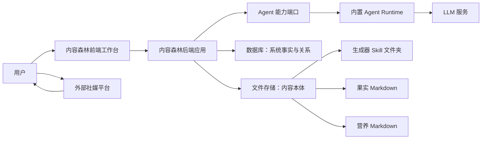
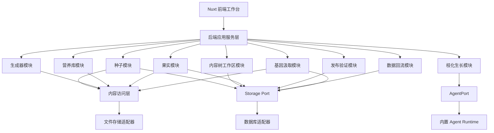
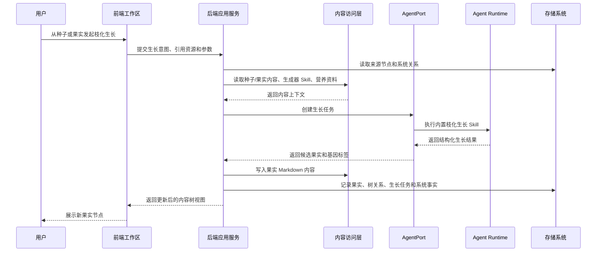
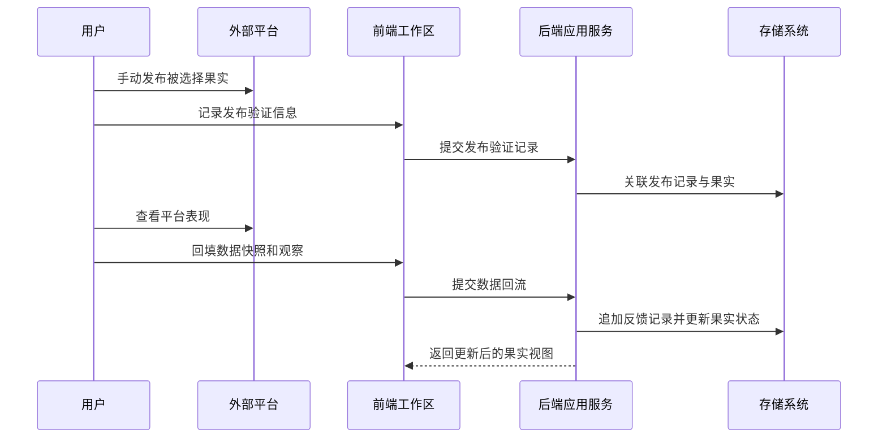
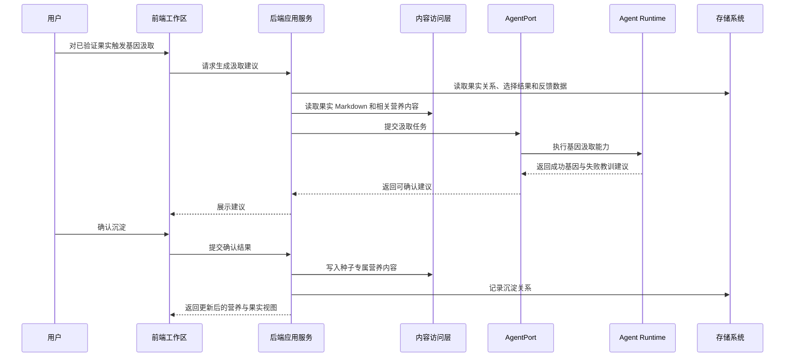
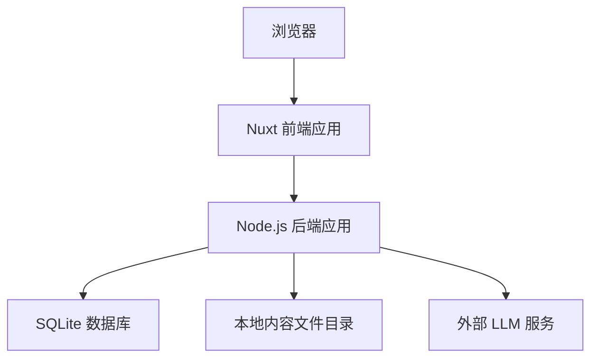

# 内容森林架构设计文档

## 1. 架构引言与业务上下文 (Introduction & Context)

内容森林第一期采用轻量化、模块化单体架构，目标是在不引入过重基础设施的前提下，跑通“灵感种子 → 枝化生长 → 物竞天择 → 发布验证 → 数据回流 → 迭代进化”的核心闭环。架构重点不是追求复杂分布式能力，而是把前端体验、业务模块、存储系统、Agent 能力和内容文件之间的边界划清楚，为后续 SaaS 化、存储替换和 Agent 替换保留空间。

本系统的核心架构原则是：

- **内容本体文件化**：生成器 Skill、果实内容、营养内容以文件形式保存，保持可读、可迁移、可外部编辑。
- **系统事实数据库化**：对象身份、状态、关系、索引、数据快照和内容位置由数据库维护，Markdown 不承载数据库负责的 meta 信息。
- **Agent 能力端口化**：内容森林只依赖 Agent 抽象能力，不绑定某个具体 Agent 实现。
- **生成器自由，果实确定**：生成器只负责生成内容 payload；枝化生长 Skill 负责果实封装、基因标签和生长结果结构化；内容森林负责系统事实落地。

### 1.1 系统上下文 (System Context)

内容森林位于用户、外部创作资源、Agent 能力和本地/未来云端存储之间，第一期主要面向单用户或小团队的轻量工作流。

系统与外部对象的关系如下：

- **用户**：创建种子、上传生成器、维护营养库、在工作区发起枝化生长、执行人为物竞天择、手动记录发布和数据反馈。
- **外部社媒平台**：第一期不直接集成，用户手动发布内容并回填发布验证和数据快照。
- **LLM 服务**：为内置 Agent Runtime 提供内容生成、结构化整理和基因汲取能力。
- **生成器 Skill**：作为外部可导入的内容创作方法论存在，不要求为内容森林定制输出结构。
- **文件存储**：承载生成器、果实正文、营养资料等内容本体。
- **数据库**：承载内容森林自身的系统事实，负责组织文件内容之间的关系和状态。

### 1.2 场景视图 (+1 View / Scenarios)

#### 场景一：从种子发起枝化生长

用户在种子工作区点击一个种子或果实，补充本次生长想法，选择生成器、营养资料和生长参数。后端创建一次生长任务，读取来源节点内容、生成器 Skill、营养资料和历史上下文，交给 Agent Runtime。Agent Runtime 通过内置枝化生长 Skill 调用生成器完成内容生成，再由枝化生长 Skill 封装果实 meta、提取基因标签，并把结构化生长结果交还后端。后端写入果实内容文件，并在数据库中维护果实、树节点和生长关系。

#### 场景二：人为物竞天择与发布验证

用户在内容树中查看生成出的果实，阅读果实 Markdown 内容和基因标签，然后对果实执行选择、保留或淘汰。被选择的果实可以被用户手动发布到外部平台。发布后，用户回到系统中记录发布平台、链接、时间、人工修改说明和数据快照。系统将这些验证结果挂载到对应果实，作为后续基因汲取和迭代进化的依据。

#### 场景三：基因汲取与下一代生长

果实有选择结果或发布反馈后，用户触发基因汲取。Agent Runtime 读取果实内容、基因标签、选择结果、发布验证和数据反馈，生成成功基因与失败教训建议。用户确认后，系统将这些内容写入种子专属营养库。下一次从同一种子或果实继续枝化生长时，系统会把这些已沉淀营养作为上下文之一，使下一代果实受到上一代验证结果的影响。

## 2. 逻辑视图：系统结构与模块边界 (Logical View)

内容森林第一期采用模块化单体结构。单体不是把所有逻辑混在一起，而是在一个后端应用内明确划分业务模块、Agent 端口、内容访问层和基础设施适配层。

### 2.1 前端工作台

前端负责承载用户可感知的交互体验，包括种子库、生成器页面、营养库页面、内容树画布、悬浮生长输入框、果实详情、发布验证记录和基因汲取确认。第一期前端以交互型工作台为核心，重点支持复杂画布交互和异步生成状态展示。

前端不承担系统事实判断，不直接读取本地文件，不直接调用 LLM。它只通过后端提供的应用能力读取工作区状态、提交生长任务、展示果实内容和更新用户操作结果。

### 2.2 后端应用服务层

后端应用服务层负责协调用户动作、业务模块、Agent 端口和存储系统。它是系统事实的入口，所有会改变内容树、果实状态、发布验证、数据回流和基因沉淀的动作，都必须经过后端应用服务层。

后端应用服务层不把 Agent 视为数据库操作者。Agent 只返回候选内容、封装建议和基因建议；后端负责校验结果、写入内容文件、维护数据库事实和更新内容树。

### 2.3 核心业务模块

- **种子模块**：负责灵感种子的创建、查看和进入工作区。它不关心果实如何生成，只负责提供生长源头。
- **生成器模块**：负责上传、管理和选择生成器 Skill。它不要求生成器遵守内容森林的果实结构，只把生成器作为可供 Agent 阅读和执行的内容创作方法论。
- **营养库模块**：负责公共营养和种子专属营养的组织。它不承担复杂知识库能力，第一期只提供资料沉淀和引用入口。
- **内容树工作区模块**：负责组织种子与果实的树状关系、节点状态和工作区展示所需的整体视图。它不关心具体内容如何生成。
- **枝化生长模块**：负责一次生长任务的业务编排，是种子/果实、生成器、营养库和 Agent 能力之间的协调者。它不直接实现底层 LLM 调用。
- **果实模块**：负责果实内容的展示入口、果实状态和果实与内容树的关系。果实正文由文件承载，果实系统事实由数据库承载。
- **发布验证模块**：负责把用户手动发布到外部平台的验证结果挂回果实。它不负责自动发布。
- **数据回流模块**：负责用户手动记录外部平台表现和观察信息。它不负责自动抓取平台数据。
- **基因汲取模块**：负责将果实内容、选择结果和反馈数据转化为可确认的成功基因与失败教训。它不自动改写生成器，也不自动替用户决定沉淀内容。

### 2.4 Agent 能力层

Agent 能力层由 **AgentPort** 和具体 Agent Runtime 组成。内容森林业务模块只依赖 AgentPort 所暴露的能力，不依赖某个具体 Agent 框架、模型供应商或第三方 Agent 产品。

第一期内置 Agent Runtime 是内容森林的一部分，包含内容森林内置 Skill，尤其是枝化生长 Skill。枝化生长 Skill 不是生成器，也不是用户上传资源，而是 Agent 系统内部流程能力。它负责把来源节点、用户输入、生成器 Skill、营养资料和历史上下文组织起来，驱动生成器产出内容 payload，并进一步完成果实封装和基因标签提取。

### 2.5 内容访问层

内容访问层隔离业务模块和实际文件存储。业务模块通过内容访问层读取或写入生成器 Skill、果实 Markdown、营养 Markdown 等内容本体，而不是直接依赖本地文件路径。

这一层的核心价值是为未来迁移保留空间：第一期可以使用本地文件系统，后续可以替换为对象存储、远程文件服务或其他内容存储方案，而不影响上层业务模块和 AgentPort。

### 2.6 存储适配层

存储适配层负责数据库访问和文件存储访问的具体实现。第一期数据库用于维护系统事实，文件系统用于保存内容本体。后续从 SQLite 迁移到 MySQL，或从本地文件迁移到对象存储时，应尽量只替换适配层实现，而不改变业务模块边界。

## 3. 过程视图：运行时与数据流 (Process View)

### 3.1 枝化生长数据流

这一过程体现三层责任边界：

- 生成器负责产生不受强结构约束的内容 payload。
- 枝化生长 Skill 负责把 payload 封装为内容森林可理解的果实候选，并提取基因标签。
- 内容森林后端负责保存内容本体、维护系统事实和更新内容树。

### 3.2 发布验证与数据回流数据流

第一期不把外部平台纳入自动化集成范围。发布验证和数据回流是人工输入，但系统必须保证这些反馈可以追溯到具体果实，并为后续基因汲取提供上下文。

### 3.3 基因汲取与迭代进化数据流

基因汲取不是自动修改系统的黑箱过程。Agent 只生成建议，用户确认后，后端才将其写入种子专属营养库并维护关系。这样既保留 AI 杠杆，也保留人的判断力。

## 4. 物理视图：基础设施与部署 (Physical View)

第一期物理部署保持极简，优先服务本地开发和轻量使用场景。

### 4.1 第一阶段部署形态

- **前端**：采用 Nuxt 构建交互式工作台。第一期核心页面是登录后工作区，不依赖搜索引擎曝光，因此推荐以客户端交互优先，避免 SSR 为内容树画布和复杂状态同步带来额外复杂度。
- **后端**：采用 Node.js 模块化单体。它同时承载应用服务、业务模块、AgentPort 和基础设施适配层。
- **数据库**：第一期使用 SQLite 维护系统事实。后续正式 SaaS 化时，可通过存储适配层替换为 MySQL 等集中式数据库。
- **文件存储**：第一期使用本地文件目录保存生成器 Skill、果实 Markdown、营养 Markdown 和相关内容附件。后续可替换为对象存储或远程内容服务。
- **Agent Runtime**：第一期内置在后端应用中，作为 AgentPort 的默认实现。后续可替换为第三方 Agent 或独立 Agent 服务。

### 4.2 后续演进形态

后续 SaaS 化时，架构可以演进为：

- 前端继续作为交互工作台，也可拆分公开页面和工作台页面。
- 后端应用可从 Node.js 替换为 Go 或 Spring Boot，但需保持应用能力边界和端口契约。
- 数据库从本地 SQLite 迁移到集中式数据库。
- 文件存储从本地目录迁移到对象存储。
- Agent Runtime 从内置实现迁移为独立服务或第三方 Agent 平台。

这些演进不要求改变内容森林的核心业务模型：内容本体仍由内容存储承载，系统事实仍由数据库维护，Agent 能力仍通过端口访问。

## 5. 关键架构决策与权衡 (Design Decisions & Trade-offs)

### 决策一：采用模块化单体，而不是微服务

- **背景**：第一期目标是验证内容进化闭环，不是支撑高并发多团队 SaaS。
- **决策**：后端采用 Node.js 模块化单体，在一个应用内划分清晰业务模块和基础设施适配层。
- **理由**：模块化单体能降低开发、调试和部署成本，同时通过模块边界保留后续拆分空间。
- **后果**：第一期无法获得微服务级别的独立扩缩容能力，但避免了过早分布式带来的复杂性。

### 决策二：Nuxt 工作台第一期不以 SSR 为核心

- **背景**：内容森林第一期核心体验是内容树画布、悬浮输入框、节点状态和生成动效，属于强交互工作台。
- **决策**：第一期前端以客户端交互体验为优先，不把 SSR 作为核心要求。
- **理由**：工作台页面不依赖 SEO，SSR 会增加渲染一致性、状态同步和部署复杂度。
- **后果**：公开展示页或营销页如果后续需要 SEO，可单独引入 SSR/SSG 策略，而不影响工作台架构。

### 决策三：采用“文件为内容本体，数据库为系统事实”的混合存储

- **背景**：生成器是 Skill 文件夹，果实和营养内容天然适合用 Markdown 表达；但内容树关系、状态和反馈记录不适合放在文本中维护。
- **决策**：生成器 Skill、果实 Markdown、营养 Markdown 等内容本体存储在文件系统；数据库维护身份、状态、关系、索引、内容位置、发布验证和反馈等系统事实。
- **理由**：文件保持创作内容可读、可迁移、可外部编辑；数据库保证系统关系可查询、可追溯、可演进。
- **后果**：需要维护文件与数据库之间的一致性。第一期应通过内容访问层统一读写，避免业务模块绕过存储边界直接操作文件。

### 决策四：Markdown 不保存数据库维护的 meta 信息

- **背景**：如果 Markdown 同时保存正文和系统 meta，会导致数据库与文件出现双事实来源。
- **决策**：Markdown 只保存内容本体，不保存由数据库维护的对象状态、关系、索引、发布反馈和系统统计。
- **理由**：单一事实来源可以降低同步错误和迁移成本，也让 Agent 读取内容时不会混入系统控制信息。
- **后果**：读取完整果实视图时，需要同时从数据库获取系统事实，并从内容访问层读取 Markdown 正文。

### 决策五：生成器 Skill 不强制内容森林专用契约

- **背景**：生成器本质上是外部可复用 Skill，不应为了内容森林强制包含专用 manifest 或结构化输出。
- **决策**：生成器只作为内容创作方法论输入，不强制要求其输出统一果实结构。内容森林可在导入时维护生成器系统 meta，但不把这些 meta 写回生成器本体。
- **理由**：这保证生成器可以从外部引入，也可以被其他 Agent 使用，避免生成器与内容森林强绑定。
- **后果**：生成器输出具有不确定性，需要由内置枝化生长 Skill 承担规范化、果实封装和基因提取责任。

### 决策六：枝化生长 Skill 负责确定性封装

- **背景**：生成器输出可能是文本、图文、脚本、分镜或多模态引用，不能假设固定结构。
- **决策**：内置枝化生长 Skill 负责接收生成器 payload，并产出内容森林可理解的果实候选、基因标签和生长结果。
- **理由**：这将不确定性交给生成器，将确定性交给枝化生长，将系统事实交给内容森林。
- **后果**：枝化生长 Skill 成为 Agent 系统的核心内置能力，第一期不建议开放替换，以免核心闭环不稳定。

### 决策七：Agent 层通过 AgentPort 解耦

- **背景**：本期希望自研一个轻量 Agent 以学习 Agent 流程，但后续可能替换为第三方 Agent 或独立 Agent 服务。
- **决策**：业务层只依赖 AgentPort，不直接依赖某个 Agent 框架或供应商。
- **理由**：AgentPort 可以隔离底层 Agent 实现，使生长任务、基因汲取等业务能力保持稳定。
- **后果**：第一期需要认真定义 AgentPort 的能力边界，但不需要建设通用 Agent 平台、长期记忆系统或复杂多 Agent 协作。

### 决策八：第一期营养库保持轻量资料库形态

- **背景**：营养库未来可能演进为知识库，但第一期目标是跑通闭环。
- **决策**：第一期营养库只承担资料上传、组织、引用和沉淀能力，不引入复杂知识库问答或向量检索作为前提。
- **理由**：轻量资料库足以支持 Agent 在生长时引用公共知识和种子专属知识，同时降低实现成本。
- **后果**：第一期的营养检索能力较弱，但后续可在内容访问层和搜索端口下逐步增强。
